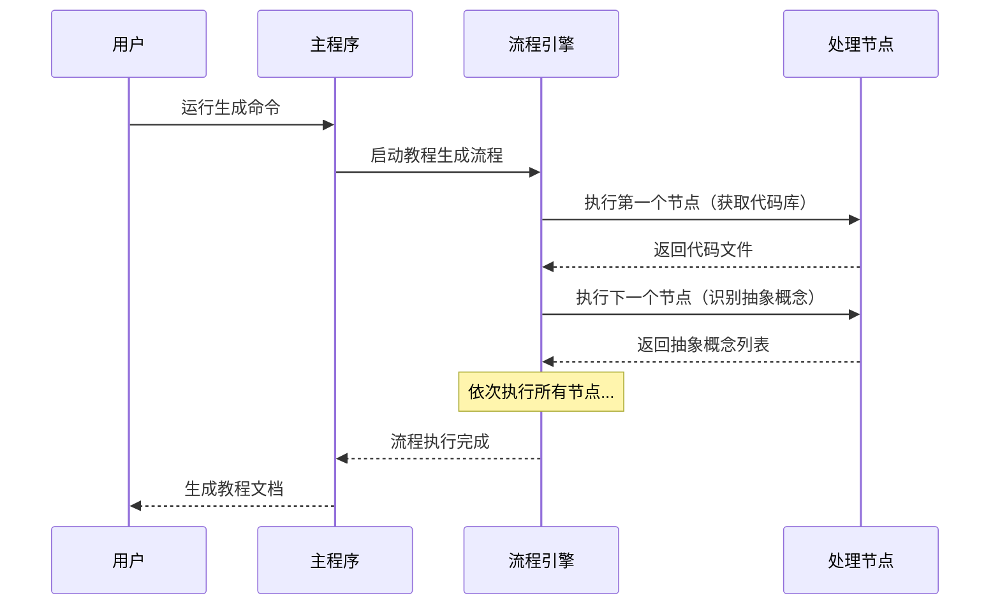

# Chapter 1: 教程生成流程


欢迎来到 PocketFlow 教程代码库知识系列的第一章！在这一章中，我们将学习整个系统的核心——**教程生成流程**。无论你是编程新手还是经验丰富的开发者，理解这个流程都将帮助你掌握整个系统的工作原理。

## 为什么需要教程生成流程？

想象一下你要为朋友的生日制作一个蛋糕。你需要按照特定的顺序执行多个步骤：准备材料、搅拌面糊、烘烤、装饰等。如果顺序错了（比如先装饰再烘烤），结果就会一塌糊涂！

教程生成流程就像是一位经验丰富的糕点师傅，它负责协调所有"制作教程"的步骤，确保每个环节都按照正确的顺序执行。它解决了"如何将零散的代码文件变成结构清晰的教程文档"这个核心问题。

## 流程的核心概念

让我们通过一个简单的比喻来理解教程生成流程的三个关键概念：

1. **节点** - 就像制作蛋糕的每个步骤（搅拌、烘烤等）
2. **连接** - 定义步骤之间的顺序关系
3. **数据流** - 在步骤之间传递的"材料"（代码文件、分析结果等）

## 如何使用教程生成流程？

让我们看看如何在实际中使用这个流程。主要的代码位于 `flow.py` 文件中：

```python
# 从 nodes.py 导入所有节点类
from nodes import (
    FetchRepo, IdentifyAbstractions, AnalyzeRelationships,
    OrderChapters, WriteChapters, CombineTutorial
)

def create_tutorial_flow():
    """创建并返回代码库教程生成流程"""
    
    # 实例化各个处理节点
    fetch_repo = FetchRepo()
    identify_abstractions = IdentifyAbstractions(max_retries=5, wait=20)
    analyze_relationships = AnalyzeRelationships(max_retries=5, wait=20)
    order_chapters = OrderChapters(max_retries=5, wait=20)
    write_chapters = WriteChapters(max_retries=5, wait=20)  # 这是一个批量处理节点
    combine_tutorial = CombineTutorial()
```

这段代码导入了所有需要的"处理步骤"（节点），并为每个步骤创建了具体的实例。每个节点都代表教程生成过程中的一个特定任务。

接下来，我们需要定义这些步骤的执行顺序：

```python
# 按照设计连接节点，形成处理流水线
fetch_repo >> identify_abstractions
identify_abstractions >> analyze_relationships
analyze_relationships >> order_chapters
order_chapters >> write_chapters
write_chapters >> combine_tutorial

# 创建以 FetchRepo 为起点的流程
tutorial_flow = Flow(start=fetch_repo)
return tutorial_flow
```

这里的 `>>` 操作符就像是在说："先执行左边的步骤，然后将结果传递给右边的步骤"。这样就构建了一个完整的处理流水线。

## 流程是如何工作的？

让我们通过一个简单的序列图来可视化整个流程：



当你在命令行运行程序时，`main.py` 文件会设置初始参数并启动流程：

```python
def main():
    # 解析命令行参数
    parser = argparse.ArgumentParser(description="为GitHub代码库或本地目录生成教程")
    
    # 设置参数（源代码路径、输出目录等）
    # ...
    
    # 初始化共享数据字典
    shared = {
        "repo_url": args.repo,
        "local_dir": args.dir,
        "project_name": args.name,
        # ... 更多配置参数
    }
    
    # 创建流程实例并运行
    tutorial_flow = create_tutorial_flow()
    tutorial_flow.run(shared)
```

流程引擎会按照预设的顺序依次调用每个节点，并将前一个节点的输出作为下一个节点的输入，就像流水线一样高效工作。

## 总结

通过本章的学习，我们了解了教程生成流程的核心作用：

- 🏗️ **协调者角色**：流程负责将各个处理节点组织成有序的工作流
- 🔄 **顺序控制**：确保每个步骤都按正确顺序执行
- 📦 **数据传递**：在节点之间传递处理结果

教程生成流程就像是一个智能的流水线指挥官，它知道何时该调用哪个处理模块，如何传递数据，以及如何处理异常情况。

在下一章中，我们将深入了解第一个重要的处理节点：[配置参数处理器](02_配置参数处理器_.md)，学习如何准备和验证生成教程所需的各种配置参数。让我们继续这个有趣的学习旅程！

---

Generated by [AI Codebase Knowledge Builder](https://github.com/The-Pocket/Tutorial-Codebase-Knowledge)