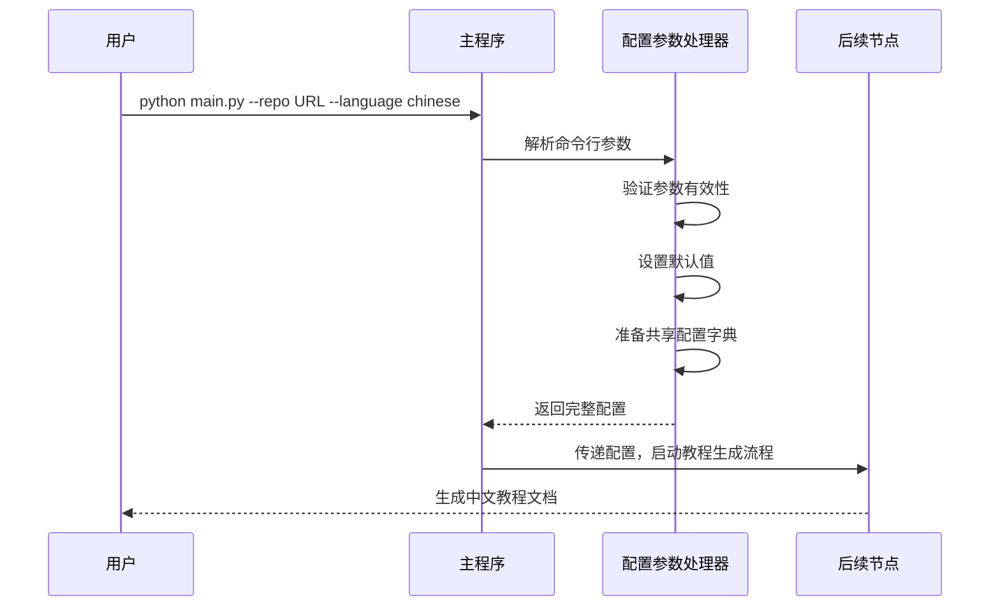

# Chapter 2: 配置参数处理器

欢迎来到 PocketFlow 教程代码库知识系列的第二章！在上一章中，我们学习了教程生成流程如何协调各个处理节点，就像一个智能的流水线指挥官。本章我们将深入了解第一个重要的处理节点——**配置参数处理器**，它就像是整个系统的"配置管理员"。

## 为什么需要配置参数处理器？

想象一下你要使用一台复杂的咖啡机。如果每次都需要手动设置水温、咖啡粉量、牛奶比例等所有参数，不仅麻烦还容易出错。配置参数处理器就像是咖啡机的智能控制面板，它帮你：

- 📝 **收集设置**：自动获取你的偏好配置
- ✅ **验证参数**：确保设置合理有效  
- 🔧 **设置默认值**：为缺失参数提供智能默认值
- 🎯 **统一管理**：为整个系统提供一致的配置接口

## 配置参数处理器的工作原理

让我们通过一个简单的例子来理解它是如何工作的。当你运行教程生成命令时，`main.py` 文件中的参数解析部分就是配置参数处理器的核心：

```python
def main():
    parser = argparse.ArgumentParser(description="为GitHub代码库或本地目录生成教程")
    
    # 创建互斥的源选择组
    source_group = parser.add_mutually_exclusive_group(required=True)
    source_group.add_argument("--repo", help="GitHub仓库的URL")
    source_group.add_argument("--dir", help="本地目录路径")
    
    parser.add_argument("-n", "--name", help="项目名称（可选，如未提供则从仓库/目录派生）")
    parser.add_argument("-t", "--token", help="GitHub个人访问令牌")
    # ... 更多参数设置
```

这段代码定义了我们能够接收的所有配置选项。当用户运行命令时，配置参数处理器就开始工作了。

## 核心功能详解

### 1. 参数收集与验证

配置参数处理器首先收集用户输入的所有参数，并进行基本验证：

```python
# 解析命令行参数
args = parser.parse_args()

# 验证GitHub令牌（如果使用仓库）
github_token = None
if args.repo:
    github_token = args.token or os.environ.get('GITHUB_TOKEN')
    if not github_token:
        print("警告：未提供GitHub令牌，访问公开仓库可能会受到限制")
```

这确保了必要的参数都存在且有效，就像咖啡机检查是否有足够的水和咖啡豆一样。

### 2. 设置默认值

对于用户没有明确设置的参数，配置参数处理器会提供智能默认值：

```python
# 默认文件包含模式
DEFAULT_INCLUDE_PATTERNS = {
    "*.py", "*.js", "*.jsx", "*.ts", "*.tsx", "*.go", "*.java",
    "*.md", "*.rst", "*Dockerfile", "*Makefile", "*.yaml", "*.yml"
}

# 默认排除模式（跳过测试文件、构建目录等）
DEFAULT_EXCLUDE_PATTERNS = {
    "*test*", "*tests/*", "*examples/*", "*dist/*", "*build/*",
    "*node_modules/*", ".git/*", ".github/*"
}

# 在共享字典中设置配置
shared = {
    "include_patterns": set(args.include) if args.include else DEFAULT_INCLUDE_PATTERNS,
    "exclude_patterns": set(args.exclude) if args.exclude else DEFAULT_EXCLUDE_PATTERNS,
    "max_file_size": args.max_size if args.max_size else 100000,
    "language": args.language if args.language else "english",
    "use_cache": not args.no_cache,  # 默认启用缓存
    "max_abstraction_num": args.max_abstractions if args.max_abstractions else 10
}
```

### 3. 多语言支持

配置参数处理器还负责处理语言设置，确保生成的教程符合用户的语言偏好：

```python
# 设置生成语言
shared["language"] = args.language

# 显示启动信息
print(f"开始为以下目标生成教程：{args.repo or args.dir}，语言：{args.language}")
print(f"LLM缓存：{'已禁用' if args.no_cache else '已启用'}")
```

## 实际工作流程

让我们通过一个序列图来看看配置参数处理器在完整流程中的角色：



## 配置参数处理器的内部实现

虽然配置参数处理器主要位于 `main.py` 中，但它的设计思想贯穿整个系统。每个处理节点在准备阶段都会从共享字典中获取配置：

```python
class FetchRepo(Node):
    def prep(self, shared):
        # 从共享配置中获取参数
        repo_url = shared.get("repo_url")
        local_dir = shared.get("local_dir")
        include_patterns = shared["include_patterns"]  # 使用配置的参数
        exclude_patterns = shared["exclude_patterns"]
        max_file_size = shared["max_file_size"]
        
        return {
            "repo_url": repo_url,
            "local_dir": local_dir,
            "include_patterns": include_patterns,
            "exclude_patterns": exclude_patterns,
            "max_file_size": max_file_size
        }
```

这种设计确保了配置的一致性和可维护性。就像建筑工地的项目经理，配置参数处理器确保每个工人都使用正确的工具和材料。

## 实际使用示例

假设我们要为一个Python项目生成中文教程，可以这样使用：

```bash
python main.py --repo https://github.com/example/project.git \
              --language chinese \
              --name "我的项目" \
              --include "*.py" "*.md" \
              --exclude "tests/*" "docs/*"
```

配置参数处理器会将这些参数转换为系统内部的标准格式，确保后续所有处理节点都能正确理解和使用这些配置。

## 总结

通过本章的学习，我们了解了配置参数处理器的核心作用：

- 🎛️ **配置收集器**：统一管理所有用户输入和系统配置
- 🛡️ **参数验证器**：确保配置的合理性和有效性  
- 🔧 **默认值提供者**：为缺失参数提供智能默认值
- 🌐 **多语言支持者**：处理语言偏好设置
- 🔄 **配置分发者**：为整个系统提供一致的配置接口

配置参数处理器就像是教程生成系统的"守门人"，它确保所有后续处理都在正确的配置环境下进行，为生成高质量的教程文档奠定了坚实基础。

在下一章中，我们将探索[代码库获取器](03_代码库获取器_.md)，学习系统如何从GitHub仓库或本地目录获取源代码文件。让我们继续这个精彩的学习之旅！

---

Generated by [AI Codebase Knowledge Builder](https://github.com/The-Pocket/Tutorial-Codebase-Knowledge)