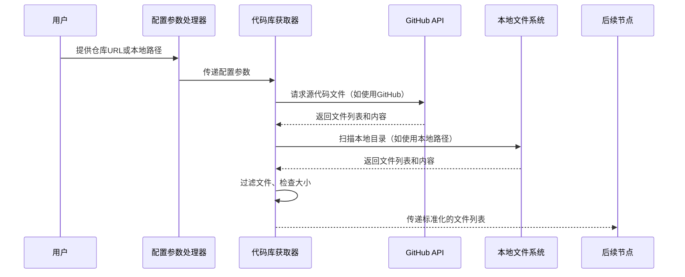

# Chapter 3: 代码库获取器

欢迎来到 PocketFlow 教程代码库知识系列的第三章！在上一章中，我们学习了[配置参数处理器](02_配置参数处理器_.md)如何收集和验证生成教程所需的各种配置参数。本章我们将深入了解**代码库获取器**，它就像是整个系统的"数据收集员"，负责从GitHub仓库或本地目录获取源代码文件。

## 为什么需要代码库获取器？

想象一下你要为朋友准备一份生日礼物，但你需要先知道他们喜欢什么。代码库获取器就像是你的"礼物侦察员"，它帮你：

- 📂 **收集材料**：从GitHub仓库或本地目录获取源代码文件
- 🎯 **智能筛选**：根据文件类型和大小过滤文件
- 🗂️ **整理归类**：为后续处理提供标准化的文件结构
- 🔐 **处理权限**：管理GitHub认证和访问权限

## 代码库获取器的工作原理

让我们通过一个简单的例子来理解代码库获取器是如何工作的。主要的代码位于 `nodes.py` 文件的 `FetchRepo` 类中：

```python
class FetchRepo(Node):
    def prep(self, shared):
        # 从共享配置中获取参数
        repo_url = shared.get("repo_url")
        local_dir = shared.get("local_dir")
        include_patterns = shared["include_patterns"]
        exclude_patterns = shared["exclude_patterns"]
        max_file_size = shared["max_file_size"]
        
        return {
            "repo_url": repo_url,
            "local_dir": local_dir,
            "token": shared.get("github_token"),
            "include_patterns": include_patterns,
            "exclude_patterns": exclude_patterns,
            "max_file_size": max_file_size,
            "use_relative_paths": True,
        }
```

这段代码展示了代码库获取器的准备工作阶段。它从共享配置字典中获取所有必要的参数，就像侦察员收集任务指令一样。

## 核心功能详解

### 1. 智能文件筛选

代码库获取器能够根据文件模式智能筛选文件：

```python
# 默认包含的文件类型（如Python、JavaScript、Markdown等）
DEFAULT_INCLUDE_PATTERNS = {
    "*.py", "*.js", "*.jsx", "*.ts", "*.tsx", "*.go", "*.java",
    "*.md", "*.rst", "*Dockerfile", "*Makefile", "*.yaml", "*.yml"
}

# 默认排除的文件类型（如测试文件、构建目录等）
DEFAULT_EXCLUDE_PATTERNS = {
    "*test*", "*tests/*", "*examples/*", "*dist/*", "*build/*",
    "*node_modules/*", ".git/*", ".github/*"
}
```

这确保了只获取与教程相关的源代码文件，避免处理不必要的文件。

### 2. 文件大小控制

为了防止处理过大的文件，代码库获取器会检查文件大小：

```python
def exec(self, prep_res):
    if prep_res["repo_url"]:
        result = crawl_github_files(
            repo_url=prep_res["repo_url"],
            token=prep_res["token"],
            include_patterns=prep_res["include_patterns"],
            exclude_patterns=prep_res["exclude_patterns"],
            max_file_size=prep_res["max_file_size"],  # 控制文件大小
            use_relative_paths=prep_res["use_relative_paths"],
        )
```

### 3. 相对路径映射

代码库获取器支持相对路径映射，为后续处理提供标准化的文件结构：

```python
# 启用相对路径映射
use_relative_paths=True

# 示例：将完整路径转换为相对路径
# 原始路径：/home/user/project/src/main.py
# 相对路径：src/main.py
```

## 实际工作流程

让我们通过一个序列图来看看代码库获取器在完整流程中的角色：



## 代码库获取器的内部实现

### GitHub仓库获取

当处理GitHub仓库时，代码库获取器使用 `crawl_github_files` 函数：

```python
def crawl_github_files(repo_url, token=None, max_file_size=1024*1024, 
                      use_relative_paths=False, include_patterns=None, 
                      exclude_patterns=None):
    """
    从GitHub仓库获取文件
    
    Args:
        repo_url: GitHub仓库URL
        token: GitHub访问令牌（用于私有仓库）
        max_file_size: 最大文件大小（字节）
        use_relative_paths: 是否使用相对路径
        include_patterns: 包含的文件模式
        exclude_patterns: 排除的文件模式
    """
```

这个函数会：
1. 解析GitHub URL，提取仓库所有者、仓库名等信息
2. 使用GitHub API获取文件列表
3. 根据配置过滤文件
4. 下载文件内容并返回

### 本地目录获取

当处理本地目录时，代码库获取器使用 `crawl_local_files` 函数：

```python
def crawl_local_files(directory, include_patterns=None, 
                     exclude_patterns=None, max_file_size=None,
                     use_relative_paths=True):
    """
    从本地目录获取文件
    
    Args:
        directory: 本地目录路径
        include_patterns: 包含的文件模式
        exclude_patterns: 排除的文件模式
        max_file_size: 最大文件大小
        use_relative_paths: 是否使用相对路径
    """
```

这个函数会：
1. 检查目录是否存在
2. 递归扫描目录中的所有文件
3. 根据.gitignore文件和配置模式过滤文件
4. 读取文件内容并返回

## 实际使用示例

假设我们要获取一个Python项目的源代码文件：

```python
# 从GitHub仓库获取文件
result = crawl_github_files(
    repo_url="https://github.com/example/project.git",
    include_patterns={"*.py", "*.md"},  # 只获取Python和Markdown文件
    exclude_patterns={"tests/*", "docs/*"},  # 排除测试和文档目录
    max_file_size=100000,  # 最大文件大小100KB
    use_relative_paths=True  # 使用相对路径
)

# 处理结果
files_list = list(result.get("files", {}).items())
print(f"成功获取 {len(files_list)} 个文件")
```

## 错误处理和重试机制

代码库获取器内置了错误处理机制：

```python
try:
    if prep_res["repo_url"]:
        result = crawl_github_files(...)
    else:
        result = crawl_local_files(...)
        
    files_list = list(result.get("files", {}).items())
    if len(files_list) == 0:
        raise ValueError("未能获取到文件")
        
except Exception as e:
    print(f"获取文件时出错: {e}")
    # 这里会触发节点的重试机制
```

## 总结

通过本章的学习，我们了解了代码库获取器的核心作用：

- 🎯 **智能文件收集器**：从GitHub或本地目录获取源代码文件
- 🔍 **精确过滤器**：根据文件类型、大小和模式智能筛选文件
- 📁 **标准化组织者**：提供统一的文件结构供后续处理使用
- 🛡️ **错误处理专家**：内置重试机制和错误处理

代码库获取器就像是教程生成系统的"材料采购员"，它确保后续所有处理节点都能获得高质量、标准化的源代码文件，为生成高质量的教程文档奠定了数据基础。

在下一章中，我们将探索[节点处理单元](04_节点处理单元_.md)，学习系统如何处理和分析获取到的源代码文件。让我们继续这个精彩的学习之旅！

---

Generated by [AI Codebase Knowledge Builder](https://github.com/The-Pocket/Tutorial-Codebase-Knowledge)