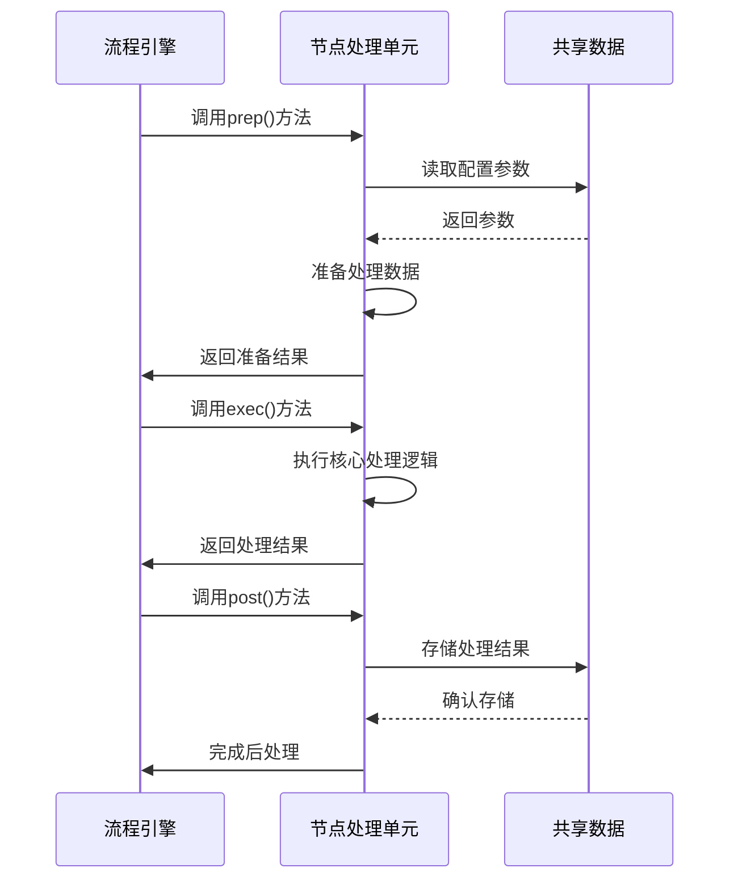

# Chapter 4: 节点处理单元

欢迎来到 PocketFlow 教程代码库知识系列的第四章！在上一章中，我们学习了[代码库获取器](03_代码库获取器_.md)如何从GitHub仓库或本地目录获取源代码文件。本章我们将深入了解**节点处理单元**，它就像是整个系统的"专业工作站"，负责执行具体的处理任务。

## 为什么需要节点处理单元？

想象一下一个现代化的汽车制造工厂。整个工厂有多个专业工作站：焊接站负责焊接车身，喷漆站负责上漆，装配站负责安装零部件。每个工作站都专注于自己的专业任务，但又协同工作。

节点处理单元就是这样的专业工作站！它解决了"如何将复杂的处理任务分解成可管理的单元"这个问题。每个节点都：

- 🎯 **专注特定任务**：只负责一个明确的功能
- 🔄 **支持重试机制**：遇到错误时自动重试
- 💾 **提供缓存控制**：避免重复处理相同内容
- 📦 **标准化输入输出**：确保数据在节点间顺畅流动

## 节点处理单元的核心概念

让我们通过一个简单的比喻来理解节点的三个关键特性：

1. **专业化分工** - 就像工厂的不同工作站，每个节点只做自己最擅长的事
2. **容错能力** - 内置重试机制，就像工作站有备用设备
3. **效率优化** - 支持缓存，避免重复劳动

## 节点处理单元的内部结构

每个节点处理单元都继承自 `Node` 基类，并实现三个核心方法：

```python
class MyCustomNode(Node):
    def prep(self, shared):
        """准备工作：从共享数据中提取所需参数"""
        # 从shared字典获取配置参数
        param1 = shared.get("param1")
        param2 = shared.get("param2")
        return {"param1": param1, "param2": param2}
    
    def exec(self, prep_res):
        """执行阶段：完成具体的处理任务"""
        # 使用准备好的参数执行任务
        result = do_something(prep_res["param1"], prep_res["param2"])
        return result
    
    def post(self, shared, prep_res, exec_res):
        """后处理：将结果存回共享数据"""
        shared["processed_data"] = exec_res
```

这种三阶段设计让每个节点都清晰明了，易于理解和维护。

## 实际工作流程

让我们通过一个序列图来看看节点处理单元在完整流程中的角色：



## 重试机制：节点的安全网

节点处理单元内置了强大的重试机制，确保处理过程的稳定性：

```python
# 在节点实例化时设置重试参数
identify_abstractions = IdentifyAbstractions(
    max_retries=5,    # 最大重试次数
    wait=20           # 重试间隔（秒）
)

# 当处理失败时，节点会自动重试
try:
    result = self.do_processing()
except Exception as e:
    if self.cur_retry < self.max_retries:
        print(f"处理失败，第{self.cur_retry+1}次重试...")
        time.sleep(self.wait)
        self.cur_retry += 1
        return self.exec(prep_res)  # 重新执行
    else:
        raise e  # 重试次数用尽，抛出异常
```

这种机制就像是有经验的工人遇到问题时不会轻易放弃，而是会尝试不同的方法。

## 缓存控制：避免重复劳动

节点支持缓存功能，可以显著提高处理效率：

```python
def exec(self, prep_res):
    # 检查是否启用缓存，且不是重试状态
    use_cache = prep_res.get("use_cache", True)
    if use_cache and self.cur_retry == 0:
        # 尝试从缓存获取结果
        cached_result = get_from_cache(self.cache_key)
        if cached_result:
            print("使用缓存结果")
            return cached_result
    
    # 执行实际处理
    result = do_processing()
    
    # 存储到缓存
    if use_cache and self.cur_retry == 0:
        save_to_cache(self.cache_key, result)
    
    return result
```

这就像是聪明的工人会记录下解决过的问题，下次遇到类似问题时直接参考之前的解决方案。

## 实际代码示例

让我们看看 `nodes.py` 中一个具体的节点实现：

```python
class FetchRepo(Node):
    def prep(self, shared):
        """准备阶段：收集代码库获取所需参数"""
        repo_url = shared.get("repo_url")
        local_dir = shared.get("local_dir")
        include_patterns = shared["include_patterns"]
        
        return {
            "repo_url": repo_url,
            "local_dir": local_dir,
            "include_patterns": include_patterns
        }
    
    def exec(self, prep_res):
        """执行阶段：实际获取代码文件"""
        if prep_res["repo_url"]:
            # 从GitHub获取
            result = crawl_github_files(prep_res["repo_url"])
        else:
            # 从本地目录获取
            result = crawl_local_files(prep_res["local_dir"])
        
        return result
    
    def post(self, shared, prep_res, exec_res):
        """后处理：存储获取的文件列表"""
        shared["files"] = exec_res
        print(f"成功获取 {len(exec_res)} 个文件")
```

这个 `FetchRepo` 节点完美展示了节点处理单元的工作模式：准备参数 → 执行任务 → 存储结果。

## 节点的类型多样性

PocketFlow 系统中有多种类型的节点，各司其职：

1. **普通节点** (`Node`) - 基本的处理单元
2. **批量节点** (`BatchNode`) - 处理多个相似项目，如 `WriteChapters`
3. **特殊功能节点** - 具有特定功能的节点

例如，`WriteChapters` 是一个批量节点，它可以一次性生成所有章节：

```python
class WriteChapters(BatchNode):
    def prep(self, shared):
        """准备所有需要编写的章节"""
        chapter_order = shared["chapter_order"]
        items_to_process = []
        
        for i, abstraction_index in enumerate(chapter_order):
            items_to_process.append({
                "chapter_num": i + 1,
                "abstraction_index": abstraction_index
            })
        
        return items_to_process  # 返回可迭代的项目列表
    
    def exec(self, item):
        """为单个章节生成内容"""
        chapter_content = generate_chapter(item)
        return chapter_content
```

## 错误处理最佳实践

节点处理单元提供了完善的错误处理机制：

```python
class IdentifyAbstractions(Node):
    def exec(self, prep_res):
        try:
            # 尝试处理
            response = call_llm(prompt)
            
            # 验证LLM输出格式
            yaml_str = extract_yaml(response)
            abstractions = yaml.safe_load(yaml_str)
            
            if not isinstance(abstractions, list):
                raise ValueError("LLM输出格式错误")
                
            return abstractions
            
        except Exception as e:
            print(f"识别抽象概念时出错: {e}")
            # 这里会触发重试机制
            raise e
```

## 实际使用场景

假设我们要处理一个Python项目，节点处理单元会这样协作：

```python
# 创建节点实例
fetch_repo = FetchRepo()
identify_abstractions = IdentifyAbstractions(max_retries=3, wait=10)

# 连接节点形成流程
fetch_repo >> identify_abstractions

# 运行流程
result = tutorial_flow.run(shared_config)
```

每个节点都像流水线上的工人，接收上游的"半成品"，加工后传递给下游。

## 总结

通过本章的学习，我们了解了节点处理单元的核心作用：

- 🔧 **专业处理器**：每个节点专注于特定的处理任务
- 🔄 **容错专家**：内置重试机制，确保处理稳定性
- 💾 **效率优化师**：支持缓存，避免重复处理
- 📦 **数据传递者**：标准化接口确保数据流畅传递

节点处理单元就像是教程生成系统的"专业工人团队"，每个成员都精通自己的领域，但又协同工作，共同完成复杂的教程生成任务。

在下一章中，我们将探索[LLM调用管理器](05_llm调用管理器_.md)，学习系统如何与大型语言模型交互来生成教程内容。让我们继续这个精彩的学习之旅！

---

Generated by [AI Codebase Knowledge Builder](https://github.com/The-Pocket/Tutorial-Codebase-Knowledge)