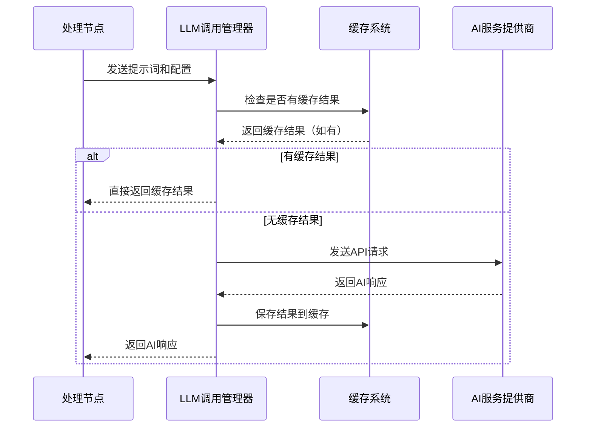

# Chapter 5: LLM调用管理器

欢迎来到 PocketFlow 教程代码库知识系列的第五章！在上一章中，我们学习了[节点处理单元](04_节点处理单元_.md)如何作为系统的"专业工作站"，执行具体的处理任务。本章我们将深入了解**LLM调用管理器**，它就像是整个系统的"AI对话专家"，负责与大型语言模型进行智能交互。

## 为什么需要LLM调用管理器？

想象一下你要与一位非常聪明的外国专家合作，但你们语言不通。你需要一位专业的翻译官来帮助你：

- 🗣️ **沟通桥梁**：在系统和AI模型之间建立顺畅的通信
- 🔄 **错误处理**：当网络不稳定或AI响应异常时自动重试
- 💾 **智能缓存**：避免重复询问相同的问题，节省时间和资源
- 📊 **日志记录**：详细记录每次对话，便于调试和优化

LLM调用管理器就是这样的"AI翻译官"，它确保系统能够高效、稳定地与各种大型语言模型进行交互。

## LLM调用管理器的工作原理

让我们通过一个简单的例子来理解LLM调用管理器是如何工作的。主要的代码位于 `utils/call_llm.py` 文件中：

```python
def call_llm(prompt: str, use_cache: bool = True) -> str:
    # 记录提示词
    logger.info(f"PROMPT: {prompt}")
    
    # 如果启用缓存，先检查缓存
    if use_cache:
        cache = load_cache()
        if prompt in cache:
            logger.info(f"RESPONSE: {cache[prompt]}")
            return cache[prompt]  # 直接返回缓存结果
    
    # 根据配置选择LLM提供商
    provider = get_llm_provider()
    if provider == "GEMINI":
        response_text = _call_llm_gemini(prompt)
    else:
        response_text = _call_llm_provider(prompt)
    
    # 记录响应
    logger.info(f"RESPONSE: {response_text}")
    
    # 如果启用缓存，保存结果
    if use_cache:
        cache = load_cache()
        cache[prompt] = response_text
        save_cache(cache)
    
    return response_text
```

这段代码展示了LLM调用管理器的核心工作流程：检查缓存 → 选择提供商 → 调用API → 记录日志 → 保存缓存。

## 核心功能详解

### 1. 多提供商支持

LLM调用管理器支持多种AI模型提供商，就像多语种翻译官：

```python
def get_llm_provider():
    provider = os.getenv("LLM_PROVIDER")
    if not provider and (os.getenv("GEMINI_PROJECT_ID") or os.getenv("GEMINI_API_KEY")):
        provider = "GEMINI"  # 默认使用Google Gemini
    return provider
```

系统通过环境变量来配置使用哪个AI服务，支持Google Gemini、OpenAI兼容的API等。

### 2. 智能缓存机制

为了避免重复调用相同的提示词，LLM调用管理器实现了智能缓存：

```python
def load_cache():
    try:
        with open(cache_file, 'r') as f:
            return json.load(f)  # 从文件加载缓存
    except:
        logger.warning("无法加载缓存")
    return {}

def save_cache(cache):
    try:
        with open(cache_file, 'w') as f:
            json.dump(cache, f)  # 保存缓存到文件
    except:
        logger.warning("无法保存缓存")
```

这就像聪明的翻译官会记录下已经翻译过的内容，下次遇到相同的问题直接给出答案。

### 3. 完善的错误处理

LLM调用管理器内置了多种错误处理机制：

```python
try:
    response = requests.post(url, headers=headers, json=payload)
    response.raise_for_status()  # 检查HTTP状态码
    return response.json()["choices"][0]["message"]["content"]
except requests.exceptions.HTTPError as e:
    error_message = f"HTTP错误: {e}"
    # 详细错误信息处理...
except requests.exceptions.ConnectionError:
    raise Exception("无法连接到API，请检查网络连接")
except requests.exceptions.Timeout:
    raise Exception("请求超时")
```

这种设计确保了即使在网络不稳定或服务异常的情况下，系统也能优雅地处理错误。

## 实际工作流程

让我们通过一个序列图来看看LLM调用管理器在完整流程中的角色：



## LLM调用管理器的内部实现

### Google Gemini 集成

对于Google Gemini服务，LLM调用管理器使用专门的函数：

```python
def _call_llm_gemini(prompt: str) -> str:
    # 配置Gemini客户端
    if os.getenv("GEMINI_PROJECT_ID"):
        client = genai.Client(vertexai=True, project=os.getenv("GEMINI_PROJECT_ID"))
    else:
        client = genai.Client(api_key=os.getenv("GEMINI_API_KEY"))
    
    # 调用模型生成内容
    model = os.getenv("GEMINI_MODEL", "gemini-2.5-pro-exp-03-25")
    response = client.models.generate_content(model=model, contents=[prompt])
    return response.text
```

### 通用API提供商支持

对于其他OpenAI兼容的API提供商，使用通用方法：

```python
def _call_llm_provider(prompt: str) -> str:
    # 从环境变量获取配置
    provider = os.environ.get("LLM_PROVIDER")
    model = os.environ.get(f"{provider}_MODEL")
    base_url = os.environ.get(f"{provider}_BASE_URL")
    api_key = os.environ.get(f"{provider}_API_KEY", "")
    
    # 构建请求URL和参数
    url = f"{base_url.rstrip('/')}/v1/chat/completions"
    headers = {"Content-Type": "application/json"}
    if api_key:
        headers["Authorization"] = f"Bearer {api_key}"
    
    payload = {
        "model": model,
        "messages": [{"role": "user", "content": prompt}],
        "temperature": 0.7,  # 控制创造性程度
    }
    
    # 发送请求并返回结果
    response = requests.post(url, headers=headers, json=payload)
    return response.json()["choices"][0]["message"]["content"]
```

## 日志记录系统

LLM调用管理器还包含完善的日志记录功能：

```python
# 配置日志系统
log_directory = os.getenv("LOG_DIR", "logs")
os.makedirs(log_directory, exist_ok=True)
log_file = os.path.join(log_directory, f"llm_calls_{datetime.now().strftime('%Y%m%d')}.log")

logger = logging.getLogger("llm_logger")
logger.setLevel(logging.INFO)
file_handler = logging.FileHandler(log_file, encoding='utf-8')
file_handler.setFormatter(logging.Formatter("%(asctime)s - %(levelname)s - %(message)s"))
logger.addHandler(file_handler)
```

每次调用都会详细记录提示词和响应，便于后续分析和优化。

## 实际使用示例

在节点处理单元中，LLM调用管理器被这样使用：

```python
class IdentifyAbstractions(Node):
    def exec(self, prep_res):
        # 准备提示词
        prompt = f"""
分析代码库上下文...
识别核心抽象概念...
"""
        
        # 调用LLM（启用缓存，除非正在重试）
        response = call_llm(prompt, use_cache=(use_cache and self.cur_retry == 0))
        
        # 处理响应
        yaml_str = response.strip().split("```yaml")[1].split("```")[0].strip()
        abstractions = yaml.safe_load(yaml_str)
        
        return abstractions
```

## 配置环境变量

要使用LLM调用管理器，需要配置相应的环境变量：

```bash
# 使用Google Gemini
export LLM_PROVIDER=GEMINI
export GEMINI_API_KEY=your_api_key_here
export GEMINI_MODEL=gemini-2.5-pro-exp-03-25

# 或者使用OpenAI兼容的API
export LLM_PROVIDER=OLLAMA
export OLLAMA_MODEL=llama3.1
export OLLAMA_BASE_URL=http://localhost:11434
```

## 错误处理和重试机制

LLM调用管理器与节点处理单元的重试机制完美配合：

```python
# 在节点中，LLM调用失败时会触发重试
class IdentifyAbstractions(Node):
    def __init__(self, max_retries=5, wait=20):
        super().__init__(max_retries, wait)  # 继承重试配置
    
    def exec(self, prep_res):
        try:
            response = call_llm(prompt, use_cache=True)
            # 处理响应...
        except Exception as e:
            print(f"LLM调用失败: {e}")
            if self.cur_retry < self.max_retries:
                print(f"第{self.cur_retry+1}次重试...")
                time.sleep(self.wait)
                self.cur_retry += 1
                return self.exec(prep_res)  # 重试
            else:
                raise e  # 重试次数用尽
```

## 总结

通过本章的学习，我们了解了LLM调用管理器的核心作用：

- 🌐 **多语言专家**：支持多种AI服务提供商，灵活适配不同需求
- 💾 **智能记忆官**：通过缓存机制避免重复调用，提高效率
- 🛡️ **可靠通信员**：完善的错误处理和重试机制确保稳定性
- 📊 **详细记录者**：完整的日志系统便于调试和优化
- 🔧 **配置管理师**：通过环境变量轻松配置不同AI服务

LLM调用管理器就像是教程生成系统的"AI对话专家"，它确保每个处理节点都能高效、可靠地与大型语言模型进行交互，为生成高质量的教程内容提供强大的AI能力支持。

在下一章中，我们将探索[抽象概念识别器](06_抽象概念识别器_.md)，学习系统如何分析代码库并识别出核心的抽象概念。让我们继续这个精彩的学习之旅！

---

Generated by [AI Codebase Knowledge Builder](https://github.com/The-Pocket/Tutorial-Codebase-Knowledge)