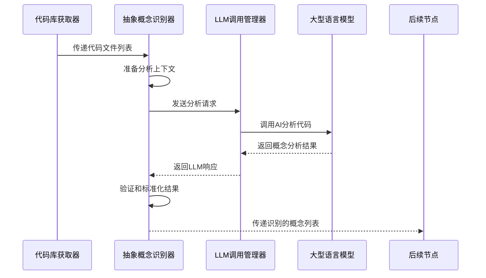

# Chapter 6: 抽象概念识别器

欢迎来到 PocketFlow 教程代码库知识系列的第六章！在上一章中，我们学习了[LLM调用管理器](05_llm调用管理器_.md)如何作为系统的"AI对话专家"，与大型语言模型进行高效交互。本章我们将深入了解**抽象概念识别器**，它就像是整个系统的"代码阅读专家"，能够智能分析代码库并识别出最重要的核心概念。

## 为什么需要抽象概念识别器？

想象一下你第一次走进一个巨大的图书馆，里面有成千上万本书。如果你不知道从哪里开始，可能会感到不知所措。抽象概念识别器就像是你的"图书管理员"，它帮你：

- 🔍 **发现重点**：从海量代码中找出最重要的核心概念
- 🎯 **简化理解**：为初学者提供清晰的架构概览  
- 📚 **组织知识**：将复杂的代码结构转化为易于理解的概念
- 🌐 **多语言支持**：用你熟悉的语言解释技术概念

## 抽象概念识别器的工作原理

让我们通过一个简单的例子来理解抽象概念识别器是如何工作的。主要的代码位于 `nodes.py` 文件的 `IdentifyAbstractions` 类中：

```python
class IdentifyAbstractions(Node):
    def prep(self, shared):
        files_data = shared["files"]
        project_name = shared["project_name"]
        language = shared.get("language", "english")
        use_cache = shared.get("use_cache", True)
        max_abstraction_num = shared.get("max_abstraction_num", 10)
        
        # 准备LLM分析所需的上下文
        context, file_info = create_llm_context(files_data)
        return (context, file_listing, file_count, project_name, 
                language, use_cache, max_abstraction_num)
```

这段代码展示了抽象概念识别器的准备工作阶段。它收集所有必要的参数，为后续的智能分析做好准备。

## 核心功能详解

### 1. 智能代码分析

抽象概念识别器使用LLM技术来理解代码的结构和功能：

```python
def exec(self, prep_res):
    # 准备给LLM的提示词
    prompt = f"""
分析代码库上下文...
识别5-{max_abstraction_num}个最重要的核心抽象概念...
为每个概念提供名称、描述和相关文件索引...
"""
    
    # 调用LLM进行分析
    response = call_llm(prompt, use_cache=True)
    
    # 解析LLM的响应
    yaml_str = response.strip().split("```yaml")[1].split("```")[0].strip()
    abstractions = yaml.safe_load(yaml_str)
```

这就像是一位经验丰富的代码审查专家在仔细阅读你的代码库。

### 2. 多语言概念识别

抽象概念识别器支持多语言输出，确保概念名称和描述符合用户的语言偏好：

```python
# 如果不是英语，添加语言指令
if language.lower() != "english":
    language_instruction = f"用**{language.capitalize()}**生成概念名称和描述"
    name_lang_hint = f"（用{language.capitalize()}）"
    desc_lang_hint = f"（用{language.capitalize()}）"
```

这样，中文用户就能看到用中文描述的技术概念，大大降低了学习门槛。

### 3. 验证和标准化输出

识别器会严格验证LLM的输出格式，确保数据的准确性：

```python
# 验证每个抽象概念的格式
validated_abstractions = []
for item in abstractions:
    if not all(k in item for k in ["name", "description", "file_indices"]):
        raise ValueError(f"概念缺少必要字段: {item}")
    
    # 验证文件索引的有效性
    validated_indices = []
    for idx_entry in item["file_indices"]:
        idx = int(idx_entry.split("#")[0].strip())
        if not (0 <= idx < file_count):
            raise ValueError(f"无效的文件索引: {idx}")
```

这种严格的验证确保了生成的概念数据是可靠和可用的。

## 实际工作流程

让我们通过一个序列图来看看抽象概念识别器在完整流程中的角色：



## 抽象概念识别器的内部实现

### 上下文准备阶段

识别器首先需要为LLM准备合适的分析上下文：

```python
def create_llm_context(files_data):
    context = ""
    file_info = []
    
    # 为每个文件创建格式化的上下文条目
    for i, (path, content) in enumerate(files_data):
        entry = f"--- 文件索引 {i}: {path} ---\n{content}\n\n"
        context += entry
        file_info.append((i, path))
    
    return context, file_info
```

这种方法确保了LLM能够获得完整的代码库视图，就像给专家提供了所有相关的文档一样。

### 智能提示词设计

识别器使用精心设计的提示词来引导LLM进行有效的概念识别：

```python
prompt = f"""
为项目 `{project_name}` 分析代码库：

代码库上下文：
{context}

{language_instruction}分析代码库上下文，识别5-{max_abstraction_num}个对代码库新手最重要的核心抽象概念。

为每个抽象概念提供：
1. 简洁的`名称`{name_lang_hint}
2. 初学者友好的`描述`，用简单的类比解释它是什么{desc_lang_hint}  
3. 相关的`文件索引`列表

格式化为YAML字典列表：
```yaml
- name: |
    查询处理{name_lang_hint}
  description: |
    解释这个抽象概念的功能。
    它就像是一个中央调度器，负责路由请求。{desc_lang_hint}
  file_indices:
    - 0 # 路径/到/文件1.py
    - 3 # 路径/到/相关文件.py
```
"""
```

这种提示词设计确保了LLM能够产生结构化、高质量的响应。

### 结果验证和处理

识别器会仔细验证LLM的输出，并转换为内部标准格式：

```python
# 验证抽象概念列表格式
if not isinstance(abstractions, list):
    raise ValueError("LLM输出不是列表格式")

# 处理每个抽象概念
validated_abstractions = []
for item in abstractions:
    # 提取和验证文件索引
    validated_indices = []
    for idx_entry in item["file_indices"]:
        idx = int(idx_entry.split("#")[0].strip())
        validated_indices.append(idx)
    
    # 创建标准化的概念对象
    validated_abstractions.append({
        "name": item["name"],        # 可能已翻译的名称
        "description": item["description"],  # 可能已翻译的描述
        "files": sorted(list(set(validated_indices)))  # 去重并排序的文件索引
    })
```

## 实际使用示例

假设我们有一个简单的Web应用项目，抽象概念识别器可能会识别出以下概念：

```yaml
- name: |
    请求路由器
  description: |
    负责将HTTP请求分发到相应的处理函数。
    它就像餐厅的接待员，根据客人的需求引导到合适的座位。
  file_indices:
    - 0 # src/router.py
    - 1 # src/handlers/user_handler.py

- name: |
    数据库连接器  
  description: |
    管理应用与数据库之间的连接和通信。
    类似于电话接线员，确保通话线路畅通。
  file_indices:
    - 2 # src/database.py
    - 3 # src/models/user.py
```

这些概念为后续的教程生成提供了坚实的基础。

## 错误处理和重试机制

抽象概念识别器内置了完善的错误处理：

```python
try:
    response = call_llm(prompt, use_cache=True)
    # 处理响应...
except Exception as e:
    print(f"识别抽象概念时出错: {e}")
    if self.cur_retry < self.max_retries:
        print(f"第{self.cur_retry+1}次重试...")
        time.sleep(self.wait)
        self.cur_retry += 1
        return self.exec(prep_res)  # 重试
    else:
        raise e  # 重试次数用尽
```

这种机制确保了即使在网络不稳定或LLM服务异常的情况下，识别过程也能顺利完成。

## 多语言支持的实际效果

对于中文用户，抽象概念识别器会生成中文的概念描述：

```python
# 中文输出的示例
抽象概念列表 = [
    {
        "name": "配置管理器",
        "description": "负责读取和管理应用程序的配置设置。就像汽车的仪表盘，可以调整各种参数来优化性能。", 
        "files": [4, 5]
    },
    {
        "name": "日志记录器",
        "description": "记录应用程序的运行状态和错误信息。类似于飞机的黑匣子，帮助开发者诊断问题。",
        "files": [6, 7]
    }
]
```

这种本地化的描述大大提高了教程的可读性和实用性。

## 总结

通过本章的学习，我们了解了抽象概念识别器的核心作用：

- 🔍 **智能代码阅读器**：使用LLM技术深度分析代码结构和功能
- 🎯 **概念提取专家**：从复杂代码中识别出最重要的核心概念  
- 🌐 **多语言支持者**：用用户熟悉的语言描述技术概念
- ✅ **质量保证员**：严格验证输出格式，确保数据准确性
- 🔄 **容错处理器**：内置重试机制，保证识别过程的稳定性

抽象概念识别器就像是教程生成系统的"架构分析师"，它为后续的教程内容提供了清晰的概念框架，让初学者能够快速理解代码库的核心思想。

在下一章中，我们将探索[关系分析器](07_关系分析器_.md)，学习系统如何分析各个抽象概念之间的相互作用和依赖关系。让我们继续这个精彩的学习之旅！

---
Generated by [AI Codebase Knowledge Builder](https://github.com/The-Pocket/Tutorial-Codebase-Knowledge)

---

Generated by [AI Codebase Knowledge Builder](https://github.com/The-Pocket/Tutorial-Codebase-Knowledge)