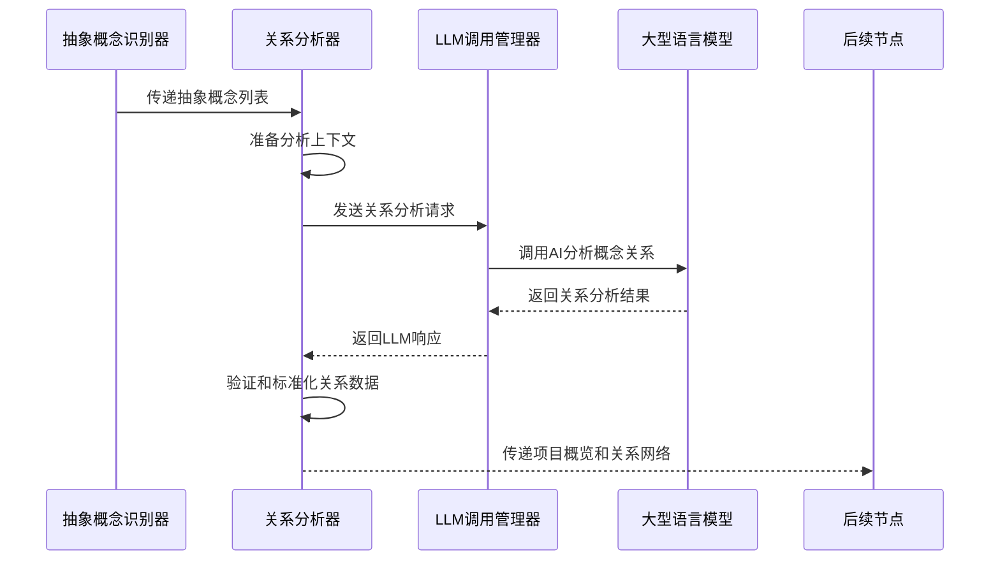
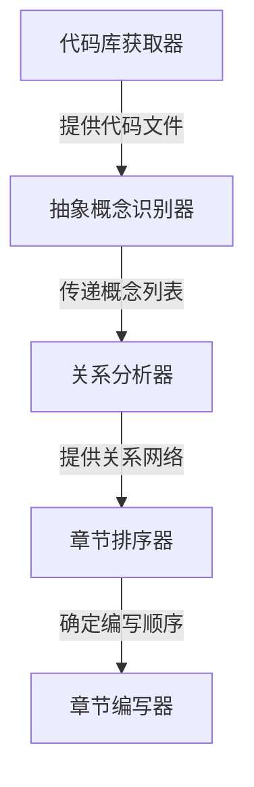

# Chapter 7: 关系分析器

欢迎来到 PocketFlow 教程代码库知识系列的第七章！在上一章中，我们学习了[抽象概念识别器](06_抽象概念识别器_.md)如何像一位"代码阅读专家"一样，从复杂的代码库中识别出最重要的核心概念。本章我们将深入了解**关系分析器**，它就像是整个系统的"架构侦探"，专门负责分析各个抽象概念之间的相互作用和依赖关系。

## 为什么需要关系分析器？

想象一下你要了解一个新城市的交通系统。你知道有地铁站、公交站、火车站等重要地点（抽象概念），但如果不了解它们之间的连接关系，你还是无法有效地在城市中导航。

关系分析器就是这样的"交通规划师"，它帮你：

-  🔗 **发现连接**：找出概念之间的调用、继承、使用等关系
-  ️ **构建网络**：将孤立的抽象概念连接成有机的系统
-   **提供概览**：生成项目的高层架构视图
-  🔄 **理解流程**：揭示数据和控制流在系统中的传递路径

## 关系分析器的工作原理

让我们通过一个简单的例子来理解关系分析器是如何工作的。主要的代码位于 `nodes.py` 文件的 `AnalyzeRelationships` 类中：

```python
class AnalyzeRelationships(Node):
    def prep(self, shared):
        abstractions = shared["abstractions"]  # 获取已识别的抽象概念
        files_data = shared["files"]  # 获取代码文件数据
        project_name = shared["project_name"]
        language = shared.get("language", "chinese")
        use_cache = shared.get("use_cache", True)
        
        # 创建分析上下文：包含概念信息和相关代码片段
        context = "已识别的抽象概念：\n"
        all_relevant_indices = set()
        
        for i, abstr in enumerate(abstractions):
            file_indices_str = ", ".join(map(str, abstr["files"]))
            info_line = f"- 索引 {i}: {abstr['name']} (相关文件索引: [{file_indices_str}])\n  描述: {abstr['description']}"
            context += info_line + "\n"
            all_relevant_indices.update(abstr["files"])
        
        # 添加相关代码片段
        context += "\n相关代码片段（按索引和路径引用）：\n"
        relevant_files_content_map = get_content_for_indices(
            files_data, sorted(list(all_relevant_indices))
        )
        
        return (context, len(abstractions), project_name, language, use_cache)
```

这段代码展示了关系分析器的准备工作阶段。它收集所有已识别的抽象概念和相关代码片段，为后续的关系分析提供充分的上下文信息。

## 核心功能详解

### 1. 智能关系发现

关系分析器使用LLM技术来分析概念之间的交互关系：

```python
def exec(self, prep_res):
    context, num_abstractions, project_name, language, use_cache = prep_res
    
    # 准备多语言提示词
    language_instruction = ""
    if language.lower() != "english":
        language_instruction = f"重要：用**中文**生成项目概览和关系标签\n\n"
    
    prompt = f"""
基于以下抽象概念和代码片段分析项目 `{project_name}`：

上下文（概念、描述、代码）：
{context}

{language_instruction}请提供：
1. 项目的高层`概览`，用几句初学者友好的句子描述项目的主要目的和功能
2. 描述这些抽象概念之间关键交互的`关系`列表

格式化为YAML：
```yaml
summary: |
  项目的简要描述...
relationships:
  - from_abstraction: 0 # 概念名称1
    to_abstraction: 1 # 概念名称2  
    label: "管理"
```
"""
    response = call_llm(prompt, use_cache=use_cache)
```

### 2. 关系验证和标准化

分析器会严格验证LLM的输出，确保关系的准确性：

```python
# 验证关系数据结构
if not isinstance(relationships_data, dict) or not all(
    k in relationships_data for k in ["summary", "relationships"]
):
    raise ValueError("LLM输出格式错误")

# 验证每个关系的格式
validated_relationships = []
for rel in relationships_data["relationships"]:
    if not all(k in rel for k in ["from_abstraction", "to_abstraction", "label"]):
        raise ValueError(f"关系项缺少必要字段: {rel}")
    
    # 验证索引有效性
    from_idx = int(str(rel["from_abstraction"]).split("#")[0].strip())
    to_idx = int(str(rel["to_abstraction"]).split("#")[0].strip())
    
    if not (0 <= from_idx < num_abstractions and 0 <= to_idx < num_abstractions):
        raise ValueError(f"关系中的索引无效")
```

### 3. 确保完整性

关系分析器确保每个抽象概念都至少参与一个关系：

```python
# 检查是否所有概念都出现在关系中
all_indices = set(range(num_abstractions))
involved_indices = set()

for rel in validated_relationships:
    involved_indices.add(rel["from"])
    involved_indices.add(rel["to"])

missing_indices = all_indices - involved_indices
if missing_indices:
    print(f"警告：以下概念未参与任何关系: {missing_indices}")
```

## 实际工作流程

让我们通过一个序列图来看看关系分析器在完整流程中的角色：



## 关系分析器的内部实现

### 上下文构建策略

关系分析器需要为LLM提供充分的上下文信息：

```python
def create_analysis_context(abstractions, files_data):
    """构建关系分析所需的上下文"""
    context = "已识别的抽象概念：\n"
    all_relevant_indices = set()
    
    # 添加每个概念的详细信息
    for i, abstraction in enumerate(abstractions):
        file_indices = abstraction["files"]
        context += f"- 索引 {i}: {abstraction['name']}\n"
        context += f"  描述: {abstraction['description']}\n"
        context += f"  相关文件: {file_indices}\n\n"
        all_relevant_indices.update(file_indices)
    
    # 添加相关代码片段
    context += "相关代码片段：\n"
    for idx in sorted(all_relevant_indices):
        if idx < len(files_data):
            path, content = files_data[idx]
            # 只显示代码的前几行作为上下文
            preview = "\n".join(content.split("\n")[:10])
            context += f"--- 文件 {idx}: {path} ---\n{preview}...\n\n"
    
    return context
```

### 智能提示词设计

关系分析器使用精心设计的提示词来引导LLM：

```python
prompt = f"""
基于以下项目`{project_name}`的抽象概念和代码片段：

{context}

请分析这些抽象概念之间的交互关系，重点关注：
- 调用关系：一个概念调用另一个概念的方法
- 继承关系：类之间的继承层次
- 使用关系：一个概念使用另一个概念的服务
- 数据流：概念之间的数据传递

为每个重要关系提供：
- 源概念索引和目标概念索引
- 简短的关系标签（如"调用"、"继承"、"使用"等）
- 确保每个概念都至少出现在一个关系中

项目概览应该简洁明了，帮助新手理解系统的整体架构。
"""
```

### 多语言支持

关系分析器完全支持中文输出：

```python
# 中文关系标签示例
relationships = [
    {
        "from": 0,
        "to": 1, 
        "label": "调用"  # 而不是"calls"
    },
    {
        "from": 1,
        "to": 2,
        "label": "继承"  # 而不是"inherits"
    },
    {
        "from": 2, 
        "to": 3,
        "label": "使用"  # 而不是"uses"
    }
]

# 中文项目概览示例
summary = "这是一个Web应用框架，主要包含**请求路由器**、**数据库连接器**和**配置管理器**等核心组件。请求路由器负责分发HTTP请求，数据库连接器管理数据存取，配置管理器处理应用设置。"
```

## 实际使用示例

假设我们有一个简单的Web应用项目，关系分析器可能会生成以下分析结果：

```yaml
summary: |
  PocketFlow教程生成系统是一个智能文档生成工具，包含**代码库获取器**、**抽象概念识别器**和**关系分析器**等核心组件。系统按照流水线方式工作，每个组件处理特定任务并将结果传递给下一个组件。

relationships:
  - from_abstraction: 0 # 代码库获取器
    to_abstraction: 1   # 抽象概念识别器
    label: "提供代码文件"
    
  - from_abstraction: 1 # 抽象概念识别器  
    to_abstraction: 2   # 关系分析器
    label: "传递概念列表"
    
  - from_abstraction: 2 # 关系分析器
    to_abstraction: 3   # 章节排序器
    label: "提供关系网络"
```

这样的分析结果清晰地展示了系统组件之间的数据流和依赖关系。

## 错误处理和重试机制

关系分析器内置了完善的错误处理：

```python
try:
    response = call_llm(prompt, use_cache=use_cache)
    relationships_data = yaml.safe_load(response)
    
    # 验证输出格式
    if not validate_relationships(relationships_data, num_abstractions):
        raise ValueError("关系分析结果格式验证失败")
        
except Exception as e:
    print(f"关系分析失败: {e}")
    if self.cur_retry < self.max_retries:
        print(f"第{self.cur_retry+1}次重试...")
        time.sleep(self.wait)
        self.cur_retry += 1
        return self.exec(prep_res)  # 重试
    else:
        raise e
```

## 可视化关系网络

关系分析器的结果可以用于生成可视化图表：



这样的图表帮助用户直观理解系统的架构和数据流动。

## 在实际项目中的应用

关系分析器在教程生成流程中起着承上启下的关键作用：

```python
# 在流程中连接关系分析器
identify_abstractions >> analyze_relationships
analyze_relationships >> order_chapters

# 关系分析器接收抽象概念列表，输出关系网络
# 为后续的章节排序提供重要依据
```

通过分析概念之间的关系，系统能够确定教程章节的最佳讲解顺序，确保学习路径的逻辑性和连贯性。

## 总结

通过本章的学习，我们了解了关系分析器的核心作用：

-  🔍 **架构侦探**：深入分析抽象概念之间的交互关系
-  🕸️ **网络构建师**：将孤立的概念连接成有机的系统架构
-  📊 **概览提供者**：生成项目的高层功能描述
-  🔄 **流程揭示者**：展示数据和控制流在系统中的传递路径
-  🌐 **多语言专家**：用中文清晰描述复杂的技术关系

关系分析器就像是教程生成系统的"系统架构师"，它确保生成的教程不仅介绍单个概念，还能展现概念之间的有机联系，帮助学习者建立完整的系统理解。

在下一章中，我们将探索[章节排序器](08_章节排序器_.md)，学习系统如何根据关系分析结果确定教程章节的最佳讲解顺序。让我们继续这个精彩的学习之旅！

---
Generated by [AI Codebase Knowledge Builder](https://github.com/The-Pocket/Tutorial-Codebase-Knowledge)

---

Generated by [AI Codebase Knowledge Builder](https://github.com/The-Pocket/Tutorial-Codebase-Knowledge)