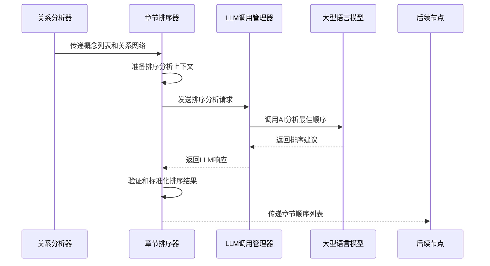

# Chapter 8: 章节排序器

欢迎来到 PocketFlow 教程代码库知识系列的第八章！在上一章中，我们学习了[关系分析器](07_关系分析器_.md)如何像一位"架构侦探"一样，深入分析各个抽象概念之间的相互作用和依赖关系。本章我们将深入了解**章节排序器**，它就像是整个系统的"教学计划制定者"，负责根据概念的重要性和依赖关系确定教程章节的最佳讲解顺序。

## 为什么需要章节排序器？

想象一下你要学习一门新的编程语言。如果教程一开始就讲解高级特性，而把基础语法放在后面，你肯定会感到困惑和挫败。好的学习路径应该从简单到复杂，从基础到高级。

章节排序器就是这样的"学习路径规划师"，它帮你：

-  📚 **逻辑排序**：按照概念之间的依赖关系安排讲解顺序
-  🎯 **循序渐进**：确保学习曲线平缓，适合初学者
-  🔄 **依赖优先**：先讲解被依赖的概念，再讲解依赖他人的概念
-  🌟 **重要性优先**：将核心和基础概念放在前面讲解

## 章节排序器的工作原理

让我们通过一个简单的例子来理解章节排序器是如何工作的。主要的代码位于 `nodes.py` 文件的 `OrderChapters` 类中：

```python
class OrderChapters(Node):
    def prep(self, shared):
        abstractions = shared["abstractions"]  # 获取已识别的抽象概念（可能已翻译）
        relationships = shared["relationships"]  # 获取关系分析结果（可能已翻译）
        project_name = shared["project_name"]
        language = shared.get("language", "chinese")
        use_cache = shared.get("use_cache", True)
        
        # 为LLM准备上下文信息
        abstraction_info_for_prompt = []
        for i, a in enumerate(abstractions):
            abstraction_info_for_prompt.append(f"- {i} # {a['name']}")
        
        abstraction_listing = "\n".join(abstraction_info_for_prompt)
        
        # 构建关系上下文
        context = f"项目概览：\n{relationships['summary']}\n\n"
        context += "概念之间的关系：\n"
        for rel in relationships["details"]:
            from_name = abstractions[rel["from"]]["name"]
            to_name = abstractions[rel["to"]]["name"]
            context += f"- 从 {rel['from']} ({from_name}) 到 {rel['to']} ({to_name}): {rel['label']}\n"
        
        return (abstraction_listing, context, len(abstractions), 
                project_name, language, use_cache)
```

这段代码展示了章节排序器的准备工作阶段。它收集所有已识别的抽象概念和它们之间的关系，为后续的排序分析提供充分的上下文信息。

## 核心功能详解

### 1. 智能排序算法

章节排序器使用LLM技术来分析概念之间的依赖关系，并确定最佳讲解顺序：

```python
def exec(self, prep_res):
    abstraction_listing, context, num_abstractions, project_name, language, use_cache = prep_res
    
    prompt = f"""
给定项目 `{project_name}` 的以下抽象概念及其关系：

抽象概念（索引 # 名称）：
{abstraction_listing}

关系和项目概览上下文：
{context}

如果你要为 `{project_name}` 制作教程，解释这些抽象概念的最佳顺序是什么？
理想情况下，先解释最重要或最基础的概念，可能是用户面向的概念或入口点。然后转向更详细、更低层的实现细节或支持概念。

输出有序的抽象概念索引列表，包括名称注释以便清晰。使用格式 `索引 # 概念名称`。

```yaml
- 2 # 基础概念
- 0 # 核心类A
- 1 # 核心类B（使用核心类A）
- ...
```
"""
    response = call_llm(prompt, use_cache=use_cache)
```

### 2. 排序验证机制

排序器会严格验证LLM的输出，确保排序的合理性：

```python
# 验证排序结果格式
yaml_str = response.strip().split("```yaml")[1].split("```")[0].strip()
ordered_indices_raw = yaml.safe_load(yaml_str)

if not isinstance(ordered_indices_raw, list):
    raise ValueError("LLM输出不是列表格式")

# 验证每个索引的有效性
ordered_indices = []
seen_indices = set()
for entry in ordered_indices_raw:
    try:
        if isinstance(entry, int):
            idx = entry
        elif isinstance(entry, str) and "#" in entry:
            idx = int(entry.split("#")[0].strip())
        else:
            idx = int(str(entry).strip())
        
        # 检查索引是否在有效范围内
        if not (0 <= idx < num_abstractions):
            raise ValueError(f"无效的索引 {idx}")
        
        # 检查是否有重复索引
        if idx in seen_indices:
            raise ValueError(f"发现重复索引 {idx}")
        
        ordered_indices.append(idx)
        seen_indices.add(idx)
        
    except (ValueError, TypeError):
        raise ValueError(f"无法从排序列表条目解析索引: {entry}")
```

### 3. 完整性检查

排序器确保所有抽象概念都被包含在排序结果中：

```python
# 检查是否所有概念都被包含
if len(ordered_indices) != num_abstractions:
    missing_indices = set(range(num_abstractions)) - seen_indices
    raise ValueError(f"排序列表长度不匹配，缺失索引: {missing_indices}")

print(f"确定的章节顺序（索引）: {ordered_indices}")
return ordered_indices
```

## 实际工作流程

让我们通过一个序列图来看看章节排序器在完整流程中的角色：



## 章节排序器的内部实现

### 依赖关系分析

章节排序器基于关系分析器的结果来分析概念之间的依赖关系：

```python
# 从关系分析结果构建依赖图
dependencies = {}
for rel in relationships["details"]:
    from_idx = rel["from"]
    to_idx = rel["to"]
    
    # 构建依赖关系：to_idx 依赖于 from_idx
    if to_idx not in dependencies:
        dependencies[to_idx] = set()
    dependencies[to_idx].add(from_idx)
```

这种分析确保了被依赖的概念会先于依赖它的概念被讲解。

### 重要性评估

排序器还会评估每个概念的重要性，确保核心概念优先讲解：

```python
# 评估概念重要性（基于关系数量、文件数量等）
concept_importance = {}
for i, abstraction in enumerate(abstractions):
    # 计算重要性分数
    importance_score = len(abstraction["files"])  # 文件数量
    importance_score += count_relationships(i, relationships)  # 关系数量
    concept_importance[i] = importance_score
```

### 拓扑排序算法

虽然主要依赖LLM进行智能排序，但排序器的逻辑类似于拓扑排序：

```python
def topological_sort(dependencies, num_concepts):
    """简单的拓扑排序实现"""
    in_degree = [0] * num_concepts
    graph = [[] for _ in range(num_concepts)]
    
    # 构建图
    for to_idx, from_indices in dependencies.items():
        for from_idx in from_indices:
            graph[from_idx].append(to_idx)
            in_degree[to_idx] += 1
    
    # 找到入度为0的节点（没有依赖的节点）
    queue = deque([i for i in range(num_concepts) if in_degree[i] == 0])
    result = []
    
    while queue:
        node = queue.popleft()
        result.append(node)
        
        for neighbor in graph[node]:
            in_degree[neighbor] -= 1
            if in_degree[neighbor] == 0:
                queue.append(neighbor)
    
    return result
```

## 实际使用示例

假设我们有一个Web应用项目，章节排序器可能会生成以下排序结果：

```yaml
- 0 # 配置管理器
- 1 # 数据库连接器
- 2 # 请求路由器
- 3 # 用户认证器
- 4 # 日志记录器
```

这样的排序确保了学习路径的逻辑性：先学习配置管理（基础设置），然后是数据库连接（数据层），接着是请求路由（业务逻辑），最后是认证和日志（高级功能）。

## 错误处理和重试机制

章节排序器内置了完善的错误处理：

```python
try:
    response = call_llm(prompt, use_cache=use_cache)
    ordered_indices = yaml.safe_load(response)
    
    # 验证排序结果
    if not validate_ordering(ordered_indices, num_abstractions):
        raise ValueError("排序结果验证失败")
        
except Exception as e:
    print(f"章节排序失败: {e}")
    if self.cur_retry < self.max_retries:
        print(f"第{self.cur_retry+1}次重试...")
        time.sleep(self.wait)
        self.cur_retry += 1
        return self.exec(prep_res)  # 重试
    else:
        raise e
```

## 多语言支持

章节排序器完全支持中文输出，确保概念名称和排序逻辑符合中文用户的认知习惯：

```python
# 中文排序结果示例
章节顺序 = [
    0,  # 配置管理器
    1,  # 数据库连接器  
    2,  # 请求路由器
    3,  # 用户认证器
    4   # 日志记录器
]
```

## 在实际项目中的应用

章节排序器在教程生成流程中起着承上启下的关键作用：

```python
# 在流程中连接章节排序器
analyze_relationships >> order_chapters
order_chapters >> write_chapters

# 章节排序器接收关系分析结果，输出章节顺序
# 为后续的章节编写提供顺序指导
```

通过确定最佳的讲解顺序，章节排序器确保了生成的教程具有清晰的学习路径和渐进的学习曲线。

## 排序策略的实际效果

让我们通过一个具体的例子来看看章节排序器的智慧：

**排序前（原始顺序）：**
1. 用户认证器（高级功能）
2. 日志记录器（辅助功能）  
3. 请求路由器（核心业务逻辑）
4. 数据库连接器（数据层）
5. 配置管理器（基础设置）

**排序后（优化顺序）：**
1. 配置管理器（基础设置）
2. 数据库连接器（数据层）
3. 请求路由器（核心业务逻辑）
4. 用户认证器（高级功能）
5. 日志记录器（辅助功能）

这样的优化确保了学习者能够循序渐进地理解系统，从基础到高级，从核心到辅助。

## 总结

通过本章的学习，我们了解了章节排序器的核心作用：

-  📚 **学习路径规划师**：根据概念依赖关系确定最佳讲解顺序
-  🎯 **教学策略专家**：确保学习曲线平缓，适合初学者
-  🔄 **依赖关系分析器**：基于概念之间的依赖关系进行智能排序
- ✅ **完整性检查员**：确保所有概念都被包含在教程中
-  🌐 **多语言支持者**：用中文思维理解概念关系

章节排序器就像是教程生成系统的"课程设计专家"，它确保生成的教程不仅内容准确，而且学习路径合理，能够真正帮助初学者理解和掌握复杂的代码库。

在下一章中，我们将探索[章节编写器](09_章节编写器_.md)，学习系统如何根据确定的章节顺序为每个抽象概念生成详细的教学内容。让我们继续这个精彩的学习之旅！

---
Generated by [AI Codebase Knowledge Builder](https://github.com/The-Pocket/Tutorial-Codebase-Knowledge)

---

Generated by [AI Codebase Knowledge Builder](https://github.com/The-Pocket/Tutorial-Codebase-Knowledge)