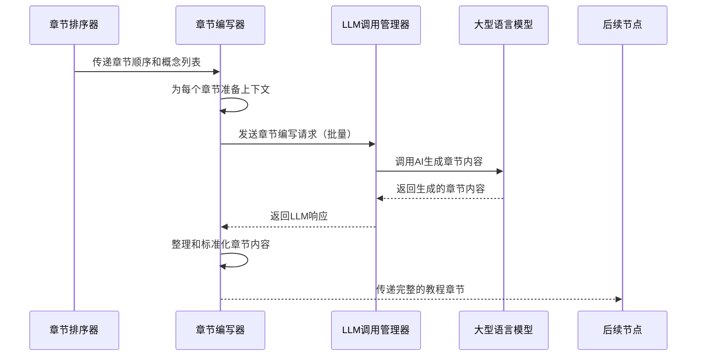
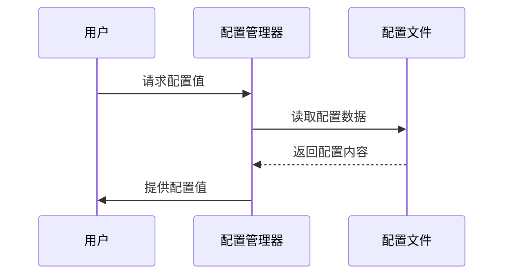

# Chapter 9: 章节编写器

欢迎来到 PocketFlow 教程代码库知识系列的第九章！在上一章中，我们学习了[章节排序器](08_章节排序器_.md)如何作为系统的"教学计划制定者"，根据概念的重要性和依赖关系确定教程章节的最佳讲解顺序。本章我们将深入了解**章节编写器**，它就像是整个系统的"专业教学作家"，负责为每个抽象概念生成详细、易懂的教程内容。

## 为什么需要章节编写器？

想象一下你是一位老师，已经确定了要讲解的知识点顺序，但还需要为每个知识点准备详细的教案。章节编写器就是这样的"教案编写专家"，它帮你：

- 📝 **内容生成**：为每个抽象概念编写完整的教学章节
- 🎯 **初学者友好**：用简单易懂的语言解释复杂技术概念
- 🔄 **连贯性保证**：确保章节之间有自然的过渡和联系
- 🌐 **多语言支持**：用中文生成高质量的教程内容

## 章节编写器的工作原理

让我们通过一个简单的例子来理解章节编写器是如何工作的。主要的代码位于 `nodes.py` 文件的 `WriteChapters` 类中：

```python
class WriteChapters(BatchNode):
    def prep(self, shared):
        chapter_order = shared["chapter_order"]  # 获取章节顺序列表
        abstractions = shared["abstractions"]    # 获取抽象概念列表
        files_data = shared["files"]             # 获取代码文件数据
        
        # 为每个章节准备处理项目
        items_to_process = []
        for i, abstraction_index in enumerate(chapter_order):
            items_to_process.append({
                "chapter_num": i + 1,
                "abstraction_index": abstraction_index,
                "abstraction_details": abstractions[abstraction_index]
            })
        
        return items_to_process  # 返回可批量处理的项目列表
```

这段代码展示了章节编写器的准备工作阶段。它是一个批量处理节点，能够同时处理多个章节的生成任务。

## 核心功能详解

### 1. 批量处理能力

章节编写器继承自 `BatchNode`，具有批量处理能力：

```python
class WriteChapters(BatchNode):
    def prep(self, shared):
        # 准备所有需要编写的章节
        items_to_process = []
        for i, abstraction_index in enumerate(chapter_order):
            items_to_process.append({
                "chapter_num": i + 1,
                "abstraction_index": abstraction_index,
                # ... 更多参数
            })
        return items_to_process  # 返回可迭代的项目列表
    
    def exec(self, item):
        # 为单个章节生成内容
        chapter_content = generate_chapter(item)
        return chapter_content
```

这种设计就像是一个高效的写作工厂，能够并行处理多个章节的生成。

### 2. 上下文感知编写

章节编写器能够感知整个教程的上下文：

```python
def prep(self, shared):
    # 创建完整的章节列表，用于上下文引用
    all_chapters = []
    for i, abstraction_index in enumerate(chapter_order):
        chapter_name = abstractions[abstraction_index]["name"]
        filename = f"{i+1:02d}_{safe_name}.md"
        all_chapters.append(f"{chapter_num}. [{chapter_name}]({filename})")
    
    full_chapter_listing = "\n".join(all_chapters)
    
    # 为每个章节添加上下文信息
    for item in items_to_process:
        item["full_chapter_listing"] = full_chapter_listing
        item["prev_chapter"] = get_previous_chapter(i, chapter_order)
        item["next_chapter"] = get_next_chapter(i, chapter_order)
```

这样确保了每个章节都能正确引用其他章节，形成连贯的学习路径。

### 3. 多语言内容生成

章节编写器完全支持中文内容生成：

```python
def exec(self, item):
    language = item.get("language", "chinese")
    
    if language.lower() != "english":
        language_instruction = "重要：用**中文**编写整个教程章节..."
    
    prompt = f"""
{language_instruction}
为项目 `{project_name}` 编写关于概念 "{abstraction_name}" 的教程章节...

用简单易懂的中文解释技术概念...
使用生动的类比帮助初学者理解...
"""
```

## 实际工作流程

让我们通过一个序列图来看看章节编写器在完整流程中的角色：



## 章节编写器的内部实现

### 智能提示词设计

章节编写器使用精心设计的提示词来引导LLM生成高质量的教程内容：

```python
prompt = f"""
用中文编写一个非常初学者友好的教程章节（Markdown格式），针对项目 `{project_name}` 的概念："{abstraction_name}"。这是第{chapter_num}章。

概念详情：
- 名称：{abstraction_name}
- 描述：{abstraction_description}

完整教程结构：
{full_chapter_listing}

相关代码片段：
{file_context_str}

编写说明：
- 以清晰的标题开始（例如：`# 第{chapter_num}章：{abstraction_name}`）
- 如果不是第一章，从上一章自然过渡，使用Markdown链接引用
- 从高层次动机开始，解释这个抽象概念解决了什么问题
- 如果概念复杂，分解成关键概念逐一解释
- 提供代码示例，每个代码块不超过10行
- 使用Mermaid图表说明内部实现
- 大量使用类比和示例帮助初学者理解
- 章节结尾总结所学内容，并过渡到下一章
"""
```

### 渐进式内容构建

章节编写器采用渐进式的内容构建策略：

```python
# 跟踪已编写的章节，为后续章节提供上下文
self.chapters_written_so_far = []

def exec(self, item):
    # 获取之前章节的摘要
    previous_chapters_summary = "\n---\n".join(self.chapters_written_so_far)
    
    # 生成当前章节内容
    chapter_content = generate_content(item, previous_chapters_summary)
    
    # 添加到已编写章节列表
    self.chapters_written_so_far.append(chapter_content)
    
    return chapter_content
```

这种方法确保了章节之间的连贯性和一致性。

### 代码示例优化

章节编写器会优化代码示例，使其适合初学者：

```python
# 原始代码可能很复杂
def complex_function(param1, param2, param3):
    # 复杂的实现逻辑...
    result = do_something_complex(param1, param2, param3)
    return result

# 优化后的示例代码
def simple_example():
    """简化版的函数示例"""
    # 只展示核心逻辑
    input_data = "示例输入"
    result = process_data(input_data)  # 核心处理
    return result
```

## 实际使用示例

假设我们要为"配置管理器"概念编写章节，章节编写器会生成类似这样的内容：

```markdown
# 第1章：配置管理器

欢迎来到 PocketFlow 教程的第一章！在这一章中，我们将学习**配置管理器**这个核心概念。

## 为什么需要配置管理器？

想象一下你要调整汽车的设置：座椅位置、空调温度、音乐音量等。如果每次开车都需要重新设置，那该多麻烦啊！配置管理器就像是汽车的"设置记忆系统"，它帮你：

- 🎛️ **统一管理**：集中管理所有配置参数
- 💾 **持久化存储**：记住你的偏好设置
- 🔧 **灵活调整**：支持运行时动态修改配置

## 如何使用配置管理器？

让我们看一个简单的使用示例：

```python
# 导入配置管理器
from config import ConfigManager

# 创建配置管理器实例
config = ConfigManager()

# 读取配置值
database_url = config.get('database.url')
api_key = config.get('api.key')

print(f"数据库连接：{database_url}")
```

**代码解释**：
- 第3行：创建配置管理器实例
- 第6-7行：读取具体的配置值
- 第9行：打印配置信息，便于调试

## 内部实现原理

配置管理器的工作原理就像是一个智能的"设置管家"：



当应用程序启动时，配置管理器会加载所有配置；当需要某个配置值时，它会快速查找并返回。

## 实际应用场景

在 Web 应用中，配置管理器常用于：

1. **数据库配置**：连接字符串、认证信息
2. **API 配置**：第三方服务的密钥和端点
3. **应用设置**：日志级别、功能开关等

## 总结

通过本章学习，我们了解了配置管理器的核心作用：它就像应用的"智能设置中心"，让配置管理变得简单而高效。

在下一章中，我们将探索[数据库连接器](02_数据库连接器.md)，学习如何管理与数据库的通信连接。让我们继续这个精彩的学习之旅！
```

## 错误处理和重试机制

章节编写器内置了完善的错误处理：

```python
def exec(self, item):
    try:
        response = call_llm(prompt, use_cache=True)
        # 验证生成的章节内容
        if not validate_chapter_content(response):
            raise ValueError("章节内容格式验证失败")
            
    except Exception as e:
        print(f"章节编写失败: {e}")
        if self.cur_retry < self.max_retries:
            print(f"第{self.cur_retry+1}次重试...")
            time.sleep(self.wait)
            self.cur_retry += 1
            return self.exec(item)  # 重试
        else:
            raise e
```

## 多语言支持的实际效果

对于中文用户，章节编写器会生成完全中文化的教程内容：

- **技术术语翻译**：将英文技术术语翻译成易懂的中文
- **文化适配**：使用中文用户熟悉的类比和示例
- **语言风格**：采用亲切、易懂的中文写作风格

## 章节间的连贯性保证

章节编写器通过以下方式确保章节间的连贯性：

1. **过渡语句**：每章开头自然引用前一章内容
2. **交叉引用**：使用Markdown链接正确引用其他章节
3. **概念衔接**：确保相关概念在不同章节中一致呈现
4. **学习路径**：遵循从简单到复杂的逻辑顺序

## 在实际项目中的应用

章节编写器在教程生成流程中扮演着内容生成的关键角色：

```python
# 在流程中连接章节编写器
order_chapters >> write_chapters
write_chapters >> combine_tutorial

# 章节编写器接收章节顺序，输出完整的教程内容
# 为最终教程组合提供材料
```

## 内容质量控制

章节编写器通过多种方式保证内容质量：

- **长度控制**：确保每章内容适中，避免过于冗长
- **代码简化**：将复杂代码分解成易于理解的小片段
- **示例丰富**：提供大量实际应用示例
- **图表辅助**：使用Mermaid图表可视化复杂概念

## 总结

通过本章的学习，我们了解了章节编写器的核心作用：

- 📝 **专业教学作家**：为每个抽象概念生成完整的教程章节
- 🎯 **初学者守护者**：用简单易懂的语言解释复杂技术
- 🔄 **连贯性大师**：确保章节间自然过渡和逻辑衔接
- 🌐 **多语言专家**：生成高质量的中文教程内容
- ⚡ **高效处理器**：批量生成多个章节，提高效率

章节编写器就像是教程生成系统的"教学内容工厂"，它将抽象的技术概念转化为生动易懂的教学材料，为学习者提供最佳的学习体验。

在下一章中，我们将探索[教程组合器](10_教程组合器_.md)，学习系统如何将各个章节组合成完整的教程文档。让我们继续这个精彩的学习之旅！

---
Generated by [AI Codebase Knowledge Builder](https://github.com/The-Pocket/Tutorial-Codebase-Knowledge)

---

Generated by [AI Codebase Knowledge Builder](https://github.com/The-Pocket/Tutorial-Codebase-Knowledge)