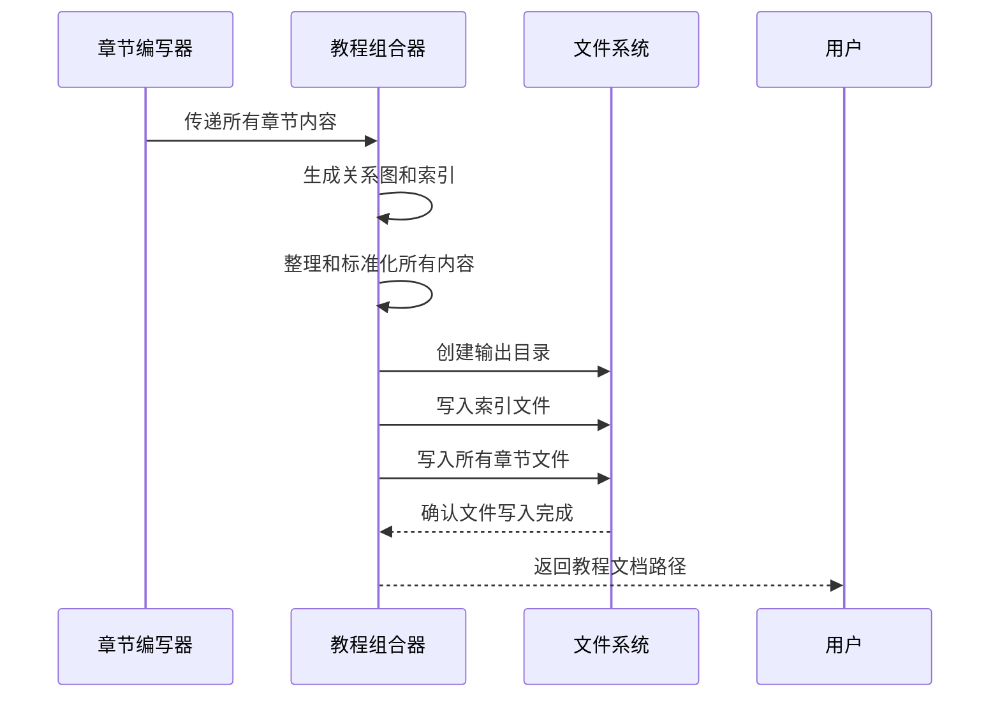
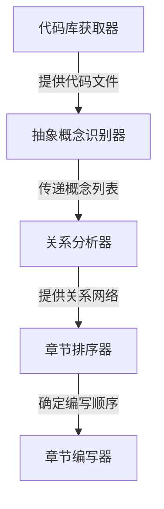

# Chapter 10: 教程组合器

欢迎来到 PocketFlow 教程代码库知识系列的第十章！在上一章中，我们学习了[章节编写器](09_章节编写器_.md)如何作为系统的"专业教学作家"，为每个抽象概念生成详细、易懂的教程内容。本章我们将深入了解**教程组合器**，它就像是整个系统的"出版编辑"，负责将各个独立的章节组合成完整的教程文档。

## 为什么需要教程组合器？

想象一下你是一位杂志编辑，收到了记者们写好的各种文章。这些文章虽然内容精彩，但如果没有统一的排版、目录结构和页面设计，读者很难获得良好的阅读体验。

教程组合器就是这样的"出版专家"，它帮你：

- 📚 **统一排版**：为所有章节提供一致的格式和样式
- 🏗️ **构建结构**：创建完整的目录体系和导航链接
- 📊 **可视化展示**：生成关系图表帮助理解系统架构
- 🔗 **建立连接**：确保章节之间有正确的交叉引用
- 📦 **打包输出**：生成最终可发布的教程文档集合

## 教程组合器的工作原理

让我们通过一个简单的例子来理解教程组合器是如何工作的。主要的代码位于 `nodes.py` 文件的 `CombineTutorial` 类中：

```python
class CombineTutorial(Node):
    def prep(self, shared):
        project_name = shared["project_name"]
        output_base_dir = shared.get("output_dir", "output")  # 默认输出目录
        output_path = os.path.join(output_base_dir, project_name)
        repo_url = shared.get("repo_url")  # 获取仓库URL
        
        # 获取可能已翻译的数据
        relationships_data = shared["relationships"]  # 关系分析结果
        chapter_order = shared["chapter_order"]  # 章节顺序索引
        abstractions = shared["abstractions"]  # 抽象概念列表
        chapters_content = shared["chapters"]  # 章节内容列表
        
        # 生成Mermaid关系图...
        # 准备索引文件内容...
        # 整理章节文件信息...
        
        return {
            "output_path": output_path,
            "index_content": index_content,
            "chapter_files": chapter_files,
        }
```

这段代码展示了教程组合器的准备工作阶段。它收集所有必要的组件，为最终的文档组合做好准备。

## 核心功能详解

### 1. 关系图生成

教程组合器能够自动生成系统架构的可视化图表：

```python
# 生成Mermaid关系图
mermaid_lines = ["flowchart TD"]
# 为每个抽象概念添加节点（使用可能已翻译的名称）
for i, abstr in enumerate(abstractions):
    node_id = f"A{i}"
    sanitized_name = abstr["name"].replace('"', "")
    mermaid_lines.append(f'    {node_id}["{sanitized_name}"]')

# 添加关系边（使用可能已翻译的标签）
for rel in relationships_data["details"]:
    from_node_id = f"A{rel['from']}"
    to_node_id = f"A{rel['to']}"
    edge_label = rel["label"].replace('"', "").replace("\n", " ")
    mermaid_lines.append(f'    {from_node_id} -- "{edge_label}" --> {to_node_id}')

mermaid_diagram = "\n".join(mermaid_lines)
```

这就像为教程添加了一张"系统地图"，帮助读者直观理解各个组件之间的关系。

### 2. 索引文件创建

教程组合器会创建主索引文件，作为教程的入口点：

```python
# 准备index.md内容
index_content = f"# Tutorial: {project_name}\n\n"
index_content += f"{relationships_data['summary']}\n\n"  # 使用可能已翻译的项目概览
index_content += f"**源代码仓库:** [{repo_url}]({repo_url})\n\n"

# 添加Mermaid关系图
index_content += "```mermaid\n"
index_content += mermaid_diagram + "\n"
index_content += "```\n\n"

index_content += f"## 章节列表\n\n"
```

索引文件就像是教程的"封面和目录"，为读者提供全局视图和导航。

### 3. 章节文件整理

教程组合器会整理所有章节文件，确保格式统一：

```python
chapter_files = []
for i, abstraction_index in enumerate(chapter_order):
    if 0 <= abstraction_index < len(abstractions) and i < len(chapters_content):
        abstraction_name = abstractions[abstraction_index]["name"]
        # 为文件名创建安全版本
        safe_name = "".join(c if c.isalnum() else "_" for c in abstraction_name).lower()
        filename = f"{i+1:02d}_{safe_name}.md"
        
        # 为章节内容添加统一的页脚
        chapter_content = chapters_content[i]
        if not chapter_content.endswith("\n\n"):
            chapter_content += "\n\n"
        chapter_content += f"---\n\nGenerated by [AI Codebase Knowledge Builder](https://github.com/The-Pocket/Tutorial-Codebase-Knowledge)"
        
        chapter_files.append({"filename": filename, "content": chapter_content})
```

这种处理确保了所有章节都有统一的格式和标识。

## 实际工作流程

让我们通过一个序列图来看看教程组合器在完整流程中的角色：



## 教程组合器的内部实现

### 输出目录管理

教程组合器负责创建和管理输出目录结构：

```python
def exec(self, prep_res):
    output_path = prep_res["output_path"]
    
    # 创建输出目录（如果不存在）
    os.makedirs(output_path, exist_ok=True)
    
    # 写入索引文件
    index_filepath = os.path.join(output_path, "index.md")
    with open(index_filepath, "w", encoding="utf-8") as f:
        f.write(prep_res["index_content"])
    
    # 写入所有章节文件
    for chapter_info in prep_res["chapter_files"]:
        chapter_filepath = os.path.join(output_path, chapter_info["filename"])
        with open(chapter_filepath, "w", encoding="utf-8") as f:
            f.write(chapter_info["content"])
    
    return output_path
```

### 文件名标准化

为了确保文件名的兼容性，教程组合器会进行标准化处理：

```python
# 创建安全的文件名（处理中文字符等）
safe_name = "".join(c if c.isalnum() else "_" for c in abstraction_name).lower()
filename = f"{i+1:02d}_{safe_name}.md"  # 例如: 01_配置管理器.md
```

这种处理确保了文件名在各种操作系统和环境中的兼容性。

### 内容完整性检查

教程组合器会验证所有内容的完整性：

```python
# 检查章节顺序、抽象概念和内容之间的匹配
for i, abstraction_index in enumerate(chapter_order):
    if 0 <= abstraction_index < len(abstractions) and i < len(chapters_content):
        # 正常处理
        pass
    else:
        print(f"警告: 在索引 {i} 处发现不匹配")
```

## 实际使用示例

假设我们有一个完整的教程生成流程，教程组合器会生成以下文件结构：

```
output/my_project/
├── index.md                 # 主索引文件
├── 01_配置管理器.md         # 第1章
├── 02_数据库连接器.md       # 第2章  
├── 03_请求路由器.md         # 第3章
├── 04_用户认证器.md         # 第4章
└── 05_日志记录器.md         # 第5章
```

### 索引文件内容示例

```markdown
# Tutorial: PocketFlow教程系统

PocketFlow教程生成系统是一个智能文档生成工具，包含**代码库获取器**、**抽象概念识别器**和**关系分析器**等核心组件。系统按照流水线方式工作，每个组件处理特定任务并将结果传递给下一个组件。

**源代码仓库:** [https://github.com/example/pocketflow](https://github.com/example/pocketflow)



## 章节列表

1. [配置管理器](01_配置管理器.md)
2. [数据库连接器](02_数据库连接器.md)
3. [请求路由器](03_请求路由器.md)
4. [用户认证器](04_用户认证器.md)
5. [日志记录器](05_日志记录器.md)

---

Generated by [AI Codebase Knowledge Builder](https://github.com/The-Pocket/Tutorial-Codebase-Knowledge)
```

### 章节文件内容示例

每个章节文件都会有统一的格式和页脚：

```markdown
# Chapter 1: 配置管理器

欢迎来到 PocketFlow 教程的第一章！在这一章中，我们将学习**配置管理器**这个核心概念。

[...章节内容...]

---

Generated by [AI Codebase Knowledge Builder](https://github.com/The-Pocket/Tutorial-Codebase-Knowledge)
```

## 错误处理和重试机制

教程组合器内置了完善的错误处理：

```python
def exec(self, prep_res):
    try:
        # 创建目录和写入文件
        os.makedirs(output_path, exist_ok=True)
        
        # 写入索引文件
        with open(index_filepath, "w", encoding="utf-8") as f:
            f.write(index_content)
        
        # 写入章节文件
        for chapter_info in chapter_files:
            with open(chapter_filepath, "w", encoding="utf-8") as f:
                f.write(chapter_info["content"])
                
    except Exception as e:
        print(f"教程组合失败: {e}")
        if self.cur_retry < self.max_retries:
            print(f"第{self.cur_retry+1}次重试...")
            time.sleep(self.wait)
            self.cur_retry += 1
            return self.exec(prep_res)  # 重试
        else:
            raise e
```

## 多语言支持

教程组合器完全支持中文输出，确保所有内容都符合中文用户的阅读习惯：

- **中文文件名**：使用中文概念名称创建文件名
- **中文目录结构**：索引文件和章节内容完全中文化
- **中文图表标签**：Mermaid图表使用中文标签
- **中文导航链接**：章节间的引用使用中文标题

## 在实际项目中的应用

教程组合器是教程生成流程的最后一个环节，起着收尾和打包的关键作用：

```python
# 在流程中连接教程组合器
write_chapters >> combine_tutorial

# 教程组合器接收所有章节内容，输出完整的教程文档
```

通过教程组合器的工作，零散的章节内容被组织成结构完整、导航清晰、格式统一的教程文档。

## 输出成果的价值

教程组合器生成的最终成果具有以下价值：

1. **完整的学习材料**：提供从入门到精通的完整学习路径
2. **可视化的系统理解**：通过关系图帮助理解系统架构
3. **便捷的导航体验**：清晰的目录结构和交叉引用
4. **统一的阅读体验**：一致的格式和排版风格
5. **可扩展的文档基础**：为后续维护和扩展提供基础

## 总结

通过本章的学习，我们了解了教程组合器的核心作用：

- 📚 **出版编辑专家**：将零散章节组合成完整的教程文档
- 🏗️ **结构构建师**：创建清晰的目录体系和导航结构
- 📊 **可视化设计师**：生成帮助理解的系统关系图表
- 🔗 **连接建立者**：确保章节间的正确引用和过渡
- 📦 **打包输出专家**：生成最终可发布的文档集合

教程组合器就像是教程生成系统的"最终装配线"，它将前面所有处理节点的成果精心组合，输出高质量、易用的教程文档，为学习者提供最佳的学习体验。

至此，我们已经完整学习了 PocketFlow 教程代码库知识系统的所有核心组件！从最初的配置参数处理，到最终的教程文档组合，每个组件都发挥着不可替代的作用，共同构成了这个强大的教程生成系统。

---

Generated by [AI Codebase Knowledge Builder](https://github.com/The-Pocket/Tutorial-Codebase-Knowledge)

---

Generated by [AI Codebase Knowledge Builder](https://github.com/The-Pocket/Tutorial-Codebase-Knowledge)