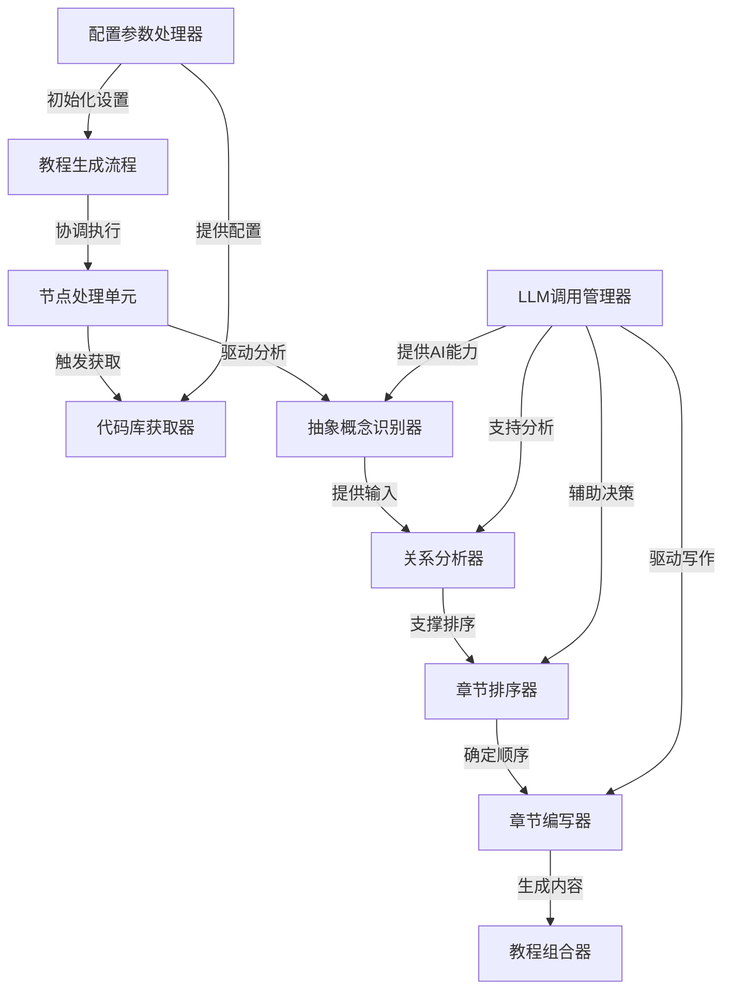

# Tutorial: PocketFlow-Tutorial-Codebase-Knowledge

**PocketFlow-Tutorial-Codebase-Knowledge** 是一个智能代码库教程生成系统，它能够*自动化分析*任何代码库并生成*初学者友好*的教程文档。

该系统通过**抽象概念识别**、**关系分析**和**章节编排**等核心功能，将复杂的代码库转化为结构化的学习材料，帮助新手快速理解项目架构和核心概念。

就像一位*经验丰富的导师*，它能够提取代码中的关键抽象，分析它们之间的交互关系，并按照*从基础到高级*的逻辑顺序组织教学内容。

**Source Repository:** [None](None)

## Chapters

1. [教程生成流程
](01_教程生成流程_.md)
2. [配置参数处理器
](02_配置参数处理器_.md)
3. [代码库获取器
](03_代码库获取器_.md)
4. [节点处理单元
](04_节点处理单元_.md)
5. [LLM调用管理器
](05_llm调用管理器_.md)
6. [抽象概念识别器
](06_抽象概念识别器_.md)
7. [关系分析器
](07_关系分析器_.md)
8. [章节排序器
](08_章节排序器_.md)
9. [章节编写器
](09_章节编写器_.md)
10. [教程组合器
](10_教程组合器_.md)

---

Generated by [AI Codebase Knowledge Builder](https://github.com/The-Pocket/Tutorial-Codebase-Knowledge)