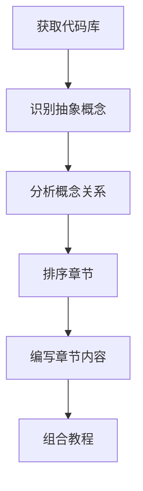
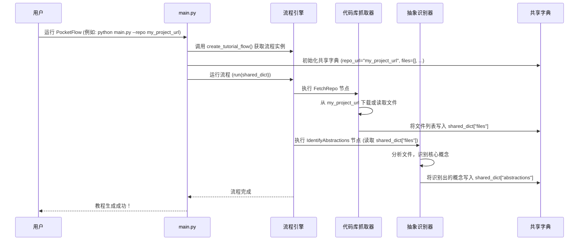

# Chapter 1: 教程生成流程


你好，新手开发者！欢迎来到PocketFlow教程系列。在本章中，我们将一起探索如何使用PocketFlow这个强大的工具，将复杂的代码库自动转化为易于理解的教程。

想象一下，你接手了一个全新的、庞大的代码项目。你是不是会感到无从下手？不知道从哪里开始阅读代码，更别说理解整个项目的结构和核心功能了。这就是PocketFlow要解决的问题！它就像一个聪明的“自动化工厂”，能够帮助你消化这些信息，并为你生成一份清晰、有条理的教程。

**我们的目标：** 在本章结束时，你将理解PocketFlow是如何一步步地将一个代码库（无论是GitHub仓库还是本地文件夹）转化成一份完整教程的。

### 核心用例：从代码库到教程

我们的核心用例非常明确：**给定一个代码库，生成一份详细的教程。**

例如，你可能有一个名为 `my_awesome_project` 的Python项目，里面包含了许多文件和复杂的逻辑。你希望PocketFlow能为你生成一份教程，解释这个项目的各个部分、它们如何协同工作，以及如何使用它。

听起来很棒，对吗？那么，这个“自动化工厂”是如何工作的呢？

### 教程生成流程概览

PocketFlow的教程生成过程可以被看作一系列相互连接的“步骤”或“节点”。每个节点都负责完成一个特定的任务，并将结果传递给下一个节点。这就像生产线上的不同工位，每个工位都有自己的职责。

让我们用一个简单的图来表示这个流程：



正如你所见，整个流程是线性的，从“获取代码库”开始，到“组合教程”结束。

### 逐步解析流程

现在，让我们深入了解每个步骤（或节点）的作用：

1.  **获取代码库**：这是“工厂”的第一步。它负责从GitHub仓库或本地文件夹中获取所有相关的代码文件。
2.  **识别抽象概念**：获取代码后，这个步骤会像一个“侦探”一样，仔细阅读代码，找出其中的核心概念或模块。例如，在一个Web项目中，它可能会识别出“用户管理”、“数据库操作”、“API接口”等概念。
3.  **分析概念关系**：识别出概念后，下一步是理解它们之间是如何相互关联的。哪个概念依赖于哪个？它们之间有什么交互？这个步骤会绘制出一张概念之间的“关系图”。
4.  **排序章节**：有了概念和它们之间的关系，我们就可以开始规划教程的结构了。这个步骤会根据概念的依赖关系和逻辑顺序，将它们组织成一个合理的章节列表。
5.  **编写章节内容**：这是教程内容生成的核心。对于每个确定的章节，这个步骤会深入分析相关的代码，并生成详细的解释、示例和用法说明。
6.  **组合教程**：最后，所有独立的章节内容会被收集起来，按照之前排序好的顺序，组合成一份完整的、连贯的教程。

### 用代码实现流程

在PocketFlow中，这个流程是通过`Flow`对象和一系列`Node`对象来构建的。我们可以在`flow.py`文件中看到这个流程的定义。

让我们看一看`flow.py`中的核心代码片段：

```python
# flow.py
from pocketflow import Flow
from nodes import (
    FetchRepo,
    IdentifyAbstractions,
    AnalyzeRelationships,
    OrderChapters,
    WriteChapters,
    CombineTutorial
)

def create_tutorial_flow():
    """创建并返回代码库教程生成流程。"""

    # 实例化节点
    fetch_repo = FetchRepo()
    identify_abstractions = IdentifyAbstractions(max_retries=5, wait=20)
    analyze_relationships = AnalyzeRelationships(max_retries=5, wait=20)
    order_chapters = OrderChapters(max_retries=5, wait=20)
    write_chapters = WriteChapters(max_retries=5, wait=20) # 这是一个批处理节点
    combine_tutorial = CombineTutorial()

    # 根据设计顺序连接节点
    fetch_repo >> identify_abstractions
    identify_abstractions >> analyze_relationships
    analyze_relationships >> order_chapters
    order_chapters >> write_chapters
    write_chapters >> combine_tutorial

    # 创建从FetchRepo开始的流程
    tutorial_flow = Flow(start=fetch_repo)

    return tutorial_flow
```

**代码解释：**

1.  `from pocketflow import Flow`：我们从`pocketflow`库中导入了`Flow`类，它是构建整个流程的核心。
2.  `from nodes import (...)`：这里导入了所有之前提到的“步骤”，它们在PocketFlow中被称为“节点”。每个节点都是一个独立的任务执行者。
3.  `create_tutorial_flow()`：这个函数负责创建并配置我们的教程生成流程。
4.  `fetch_repo = FetchRepo()`：我们创建了一个`FetchRepo`节点实例。这个节点专门负责 [代码库抓取器](02_代码库抓取器_.md) 的任务。
5.  `fetch_repo >> identify_abstractions`：这行代码非常重要！它表示`fetch_repo`节点的输出将作为`identify_abstractions`节点的输入。`>>`符号形象地展示了数据流动的方向，就像管道一样。
6.  `tutorial_flow = Flow(start=fetch_repo)`：最后，我们使用`Flow`类创建了一个完整的流程，并指定了`fetch_repo`作为流程的起始节点。

这个`create_tutorial_flow`函数就像是我们“自动化工厂”的总设计师，它定义了工厂里有哪些工位（节点），以及这些工位之间是如何协作的。

### 运行教程生成流程

那么，我们如何启动这个“工厂”呢？这要通过`main.py`文件来完成。

```python
# main.py
import dotenv
import os
import argparse
from flow import create_tutorial_flow

dotenv.load_dotenv()

def main():
    parser = argparse.ArgumentParser(description="为GitHub代码库或本地目录生成教程。")
    source_group = parser.add_mutually_exclusive_group(required=True)
    source_group.add_argument("--repo", help="公共GitHub仓库的URL。")
    source_group.add_argument("--dir", help="本地目录的路径。")
    parser.add_argument("-o", "--output", default="output", help="输出的基础目录（默认：./output）。")
    # ... 其他参数 ...

    args = parser.parse_args()

    # 初始化共享字典，包含输入参数
    shared = {
        "repo_url": args.repo,
        "local_dir": args.dir,
        "output_dir": args.output,
        # ... 其他参数 ...

        # 输出将由节点填充
        "files": [],
        "abstractions": [],
        "relationships": {},
        "chapter_order": [],
        "chapters": [],
        "final_output_dir": None
    }

    print(f"正在为: {args.repo or args.dir} 启动教程生成，语言为 {args.language.capitalize()}")

    # 创建流程实例
    tutorial_flow = create_tutorial_flow()

    # 运行流程
    tutorial_flow.run(shared)

if __name__ == "__main__":
    main()
```

**代码解释：**

1.  `import argparse`：这个模块用于处理命令行参数，例如你告诉程序要处理哪个代码库。
2.  `create_tutorial_flow()`：这里调用了我们在`flow.py`中定义的函数，获取了整个教程生成流程的实例。
3.  `shared = {...}`：这是一个非常重要的字典，我们称之为“共享状态”。它包含了所有输入参数（比如仓库URL、输出目录）以及在流程运行过程中产生的中间结果（比如识别出的抽象概念、章节顺序等）。每个节点都会从`shared`字典中读取它需要的数据，并将它的处理结果写入`shared`字典。
4.  `tutorial_flow.run(shared)`：这是启动整个流程的关键行！它告诉PocketFlow开始执行我们定义的`tutorial_flow`，并传入了`shared`字典作为初始数据和存储结果的地方。

当你从命令行运行`main.py`时，例如：

```bash
python main.py --repo https://github.com/some/repo --output my_tutorial
```

`main.py`会解析这些参数，构建`shared`字典，然后将它传递给`tutorial_flow.run()`。接着，整个教程生成“工厂”就会启动，一步步地处理代码，最终在`my_tutorial`目录下生成你的教程。

### 内部实现：数据流和节点协作

让我们用一个更具体的例子来理解数据如何在节点之间流动。

假设我们正在处理一个名为`my_project`的代码库。



在这个序列图中：

*   `main.py`是程序的入口，它初始化了`shared_dict`并启动了`Flow`。
*   `FetchRepo`节点读取`shared_dict`中的`repo_url`，然后将下载的文件列表写入`shared_dict["files"]`。
*   `IdentifyAbstractions`节点接着从`shared_dict["files"]`中读取数据，处理后将结果（识别出的抽象概念）写入`shared_dict["abstractions"]`。

这个`shared_dict`就像是工厂里的一个中央信息板，每个工位都可以在上面获取所需信息，并发布自己的最新成果。

### 总结

在本章中，我们了解了PocketFlow如何通过一个定义清晰的“教程生成流程”来工作。这个流程由一系列相互连接的“节点”组成，每个节点负责一个特定的任务，从获取代码到最终生成教程。

我们还看到了`flow.py`如何定义这些节点的连接顺序，以及`main.py`如何启动整个流程并管理数据在节点间的传递。核心思想是，数据通过一个共享字典在不同节点之间流动，每个节点完成自己的任务后更新这个字典。

现在你已经对整个教程生成流程有了一个高层次的理解。接下来，我们将深入探讨流程中的第一个节点：[代码库抓取器](02_代码库抓取器_.md)。它负责将代码库的内容带入我们的“自动化工厂”。

[下一章: 代码库抓取器](02_代码库抓取器_.md)

---

Generated by [AI Codebase Knowledge Builder](https://github.com/The-Pocket/Tutorial-Codebase-Knowledge)