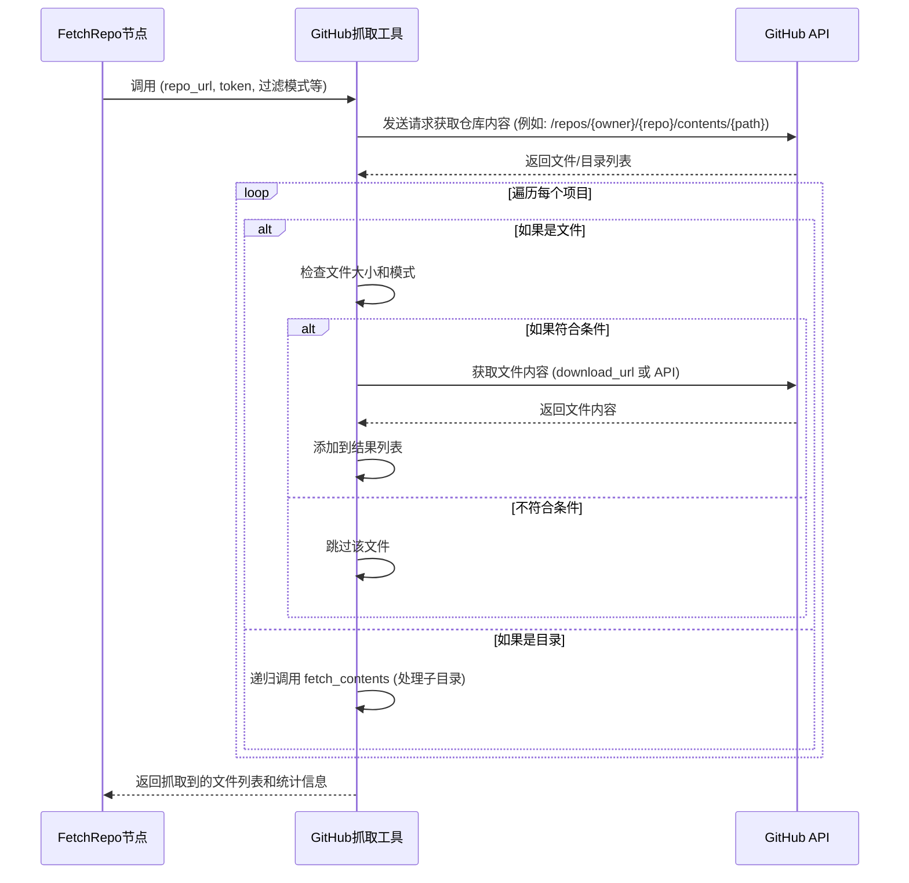
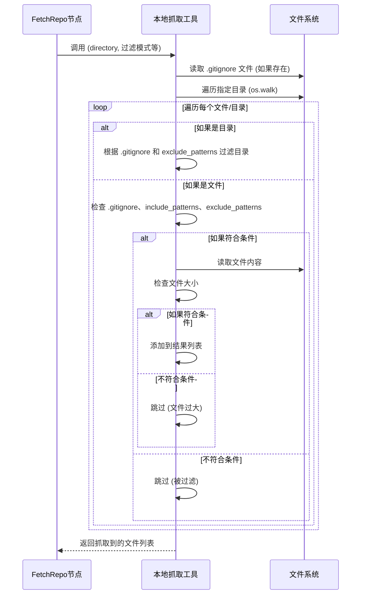

# Chapter 2: 代码库抓取器

在[教程生成流程](01_教程生成流程_.md)一章中，我们对PocketFlow的整体工作原理有了一个高层次的认识。我们知道，整个流程的第一步就是“获取代码库”，而这正是本章要介绍的“代码库抓取器”所承担的核心任务。想象一下，如果PocketFlow是一个工厂，那么代码库抓取器就是工厂的“原料采购员”，它负责从外部世界（GitHub仓库或本地文件夹）收集我们需要的“原材料”——代码文件。

## 概念详情

*   **名称**: 代码库抓取器
*   **描述**: 这就像一个智能探险家，负责深入GitHub仓库或本地目录，收集所有相关的代码文件。它会根据预设的规则（如文件大小、包含/排除模式）筛选文件，确保只获取对教程有用的内容，避免不必要的冗余。

## 为什么要“抓取”代码库？

在开始生成教程之前，我们首先需要获取源代码。无论是你自己的项目，还是GitHub上的开源项目，源码都是我们工作的“基础”。但是，我们通常不需要项目中的所有文件。例如，编译生成的文件、测试文件、大型二进制文件等，对理解核心逻辑和生成教程来说，通常是冗余甚至有害的。

代码库抓取器的作用就是：

1.  **定位**: 找到你指定的代码库（可以是GitHub上的远程仓库，也可以是本地电脑上的文件夹）。
2.  **收集**: 遍历代码库中的文件。
3.  **筛选**: 根据你设定的规则，过滤掉不需要的文件，只保留真正有用的代码文件。

这就像你在图书馆里找一本特定的书，你不会把整个图书馆都搬回家，而是根据书名、作者、类型等信息，找到并带走你真正需要的那一本。

## 它是如何工作的？（核心用例）

假设你有一个GitHub仓库或本地目录，里面包含了很多代码文件。你希望PocketFlow能自动从中提取出所有 `.py` 和 `.js` 文件，但要忽略 `node_modules` 文件夹和所有 `test_*.py` 文件，并且任何超过 1MB 的大文件也要跳过。

代码库抓取器就能完美地处理这个任务。它会像一个勤奋的机器人，自动访问这些路径，检查每个文件，然后返回一个干净的文件列表，每个文件都包含其路径和内容。

## 逐步解析：代码库抓取器内部

在PocketFlow中，`FetchRepo` 节点就是我们的“代码库抓取器”。它位于 `nodes.py` 文件中。

我们来看看它的核心代码片段：

```python
# nodes.py
class FetchRepo(Node):
    def prep(self, shared):
        # 从共享字典获取输入参数
        repo_url = shared.get("repo_url")
        local_dir = shared.get("local_dir")
        project_name = shared.get("project_name")

        # ... (省略了项目名称派生逻辑) ...

        # 获取文件筛选模式和大小限制
        include_patterns = shared["include_patterns"]
        exclude_patterns = shared["exclude_patterns"]
        max_file_size = shared["max_file_size"]

        return {
            "repo_url": repo_url,
            "local_dir": local_dir,
            "token": shared.get("github_token"),
            "include_patterns": include_patterns,
            "exclude_patterns": exclude_patterns,
            "max_file_size": max_file_size,
            "use_relative_paths": True,
        }

    def exec(self, prep_res):
        if prep_res["repo_url"]:
            print(f"正在抓取仓库: {prep_res['repo_url']}...")
            # 调用 GitHub 文件抓取工具
            result = crawl_github_files(
                repo_url=prep_res["repo_url"],
                token=prep_res["token"],
                include_patterns=prep_res["include_patterns"],
                exclude_patterns=prep_res["exclude_patterns"],
                max_file_size=prep_res["max_file_size"],
                use_relative_paths=prep_res["use_relative_paths"],
            )
        else:
            print(f"正在抓取目录: {prep_res['local_dir']}...")
            # 调用本地文件抓取工具
            result = crawl_local_files(
                directory=prep_res["local_dir"],
                include_patterns=prep_res["include_patterns"],
                exclude_patterns=prep_res["exclude_patterns"],
                max_file_size=prep_res["max_file_size"],
                use_relative_paths=prep_res["use_relative_paths"]
            )

        # 将抓取结果从字典转换为列表
        files_list = list(result.get("files", {}).items())
        if len(files_list) == 0:
            raise (ValueError("未能抓取到文件"))
        print(f"抓取到 {len(files_list)} 个文件。")
        return files_list

    def post(self, shared, prep_res, exec_res):
        shared["files"] = exec_res  # 将文件列表存储到共享字典中
```

### `prep` 方法：准备工作

`prep` 方法是 `FetchRepo` 节点在执行实际抓取操作之前做的准备工作。它主要负责从 `shared` 字典（还记得吗？它是我们所有节点共享的信息板）中获取必要的配置参数，例如：

*   `repo_url`：GitHub 仓库的 URL。
*   `local_dir`：本地目录的路径。
*   `github_token`：用于访问私有 GitHub 仓库的令牌，或者提高公共仓库的 API 限制。
*   `include_patterns`：要包含的文件模式（例如 `*.py`）。
*   `exclude_patterns`：要排除的文件模式（例如 `test_*.py`）。
*   `max_file_size`：文件的最大大小限制。

这些参数被收集起来，准备好传递给实际执行抓取操作的函数。

### `exec` 方法：执行抓取

`exec` 方法是 `FetchRepo` 节点的核心，它根据 `prep` 阶段准备好的参数来执行文件抓取。

1.  **判断来源**: 它首先检查 `repo_url` 是否存在。如果存在，说明我们要从 GitHub 抓取；否则，就从本地目录抓取。
2.  **调用工具函数**:
    *   如果目标是 GitHub 仓库，它会调用 `utils/crawl_github_files.py` 中的 `crawl_github_files` 函数。
    *   如果目标是本地目录，它会调用 `utils/crawl_local_files.py` 中的 `crawl_local_files` 函数。

这两个工具函数是真正的“探险家”，它们包含了访问和过滤文件的具体逻辑。

3.  **结果处理**: 抓取完成后，这两个函数会返回一个字典，其中包含所有符合条件的文件（路径和内容）。`exec` 方法将这个字典转换为一个 `(文件路径, 文件内容)` 元组的列表，并打印出抓取到的文件数量，如果没有任何文件，则抛出错误。

### `post` 方法：保存结果

`post` 方法负责将 `exec` 方法的执行结果（即抓取到的文件列表）保存到 `shared` 字典中。这样，后续的节点（例如 [抽象识别器](03_抽象识别器_.md)）就可以直接从 `shared["files"]` 中获取这些文件，而无需关心它们是如何被抓取到的。

## 幕后英雄：`crawl_github_files` 和 `crawl_local_files`

`FetchRepo` 节点本身并不直接进行文件 I/O 操作，它依赖于位于 `utils` 目录下的两个辅助函数：`crawl_github_files` 和 `crawl_local_files`。

### `crawl_github_files` (GitHub 仓库抓取)

这个函数负责与 GitHub API 交互，以下是其简化流程：



它会处理：

*   **API 请求**: 使用 `requests` 库向 GitHub API 发送请求。
*   **认证**: 支持使用 GitHub Token 来访问私有仓库或避免公共 API 的速率限制。
*   **路径解析**: 从 GitHub URL 中解析出仓库所有者、名称、分支/提交以及子目录路径。
*   **递归遍历**: 递归地遍历仓库中的目录，直到找到所有文件。
*   **文件过滤**: `should_include_file` 函数根据 `include_patterns` 和 `exclude_patterns` 来判断是否应该包含某个文件。
*   **大小限制**: 检查文件大小是否超过 `max_file_size`。
*   **内容获取**: 获取文件的原始内容（通过 `download_url` 或 Base64 解码）。

### `crawl_local_files` (本地目录抓取)

这个函数主要负责遍历本地文件系统，其简化流程如下：



它会处理：

*   **目录遍历**: 使用 `os.walk` 高效地遍历目录及其子目录。
*   **`.gitignore` 支持**: 自动读取项目根目录下的 `.gitignore` 文件，并根据其中的规则排除文件和目录，这大大提高了抓取的准确性。
*   **文件过滤**: 同样支持 `include_patterns` 和 `exclude_patterns` 进行更细粒度的控制。
*   **大小限制**: 检查文件大小。
*   **内容读取**: 使用 `open()` 函数读取文件的内容。

## 总结

在本章中，我们深入了解了PocketFlow的第一个重要组件：[代码库抓取器](02_代码库抓取器_.md)。我们学习了它如何像一个智能探险家一样，从GitHub仓库或本地目录中收集和筛选代码文件，为后续的教程生成流程提供“原材料”。`FetchRepo` 节点通过 `prep` 准备参数，`exec` 执行抓取，`post` 存储结果，并依赖 `crawl_github_files` 和 `crawl_local_files` 这两个强大的工具来完成实际的文件操作。

通过这些机制，PocketFlow确保我们只处理对生成高质量教程有价值的代码，避免了不必要的开销和干扰。现在，我们已经成功地将代码库的内容加载到了我们的“工厂”中。

接下来，我们将进入流程的下一个阶段，由 [抽象识别器](03_抽象识别器_.md) 登场，它将开始从这些原始代码中识别出核心概念。

[下一章: 抽象识别器](03_抽象识别器_.md)

---

Generated by [AI Codebase Knowledge Builder](https://github.com/The-Pocket/Tutorial-Codebase-Knowledge)