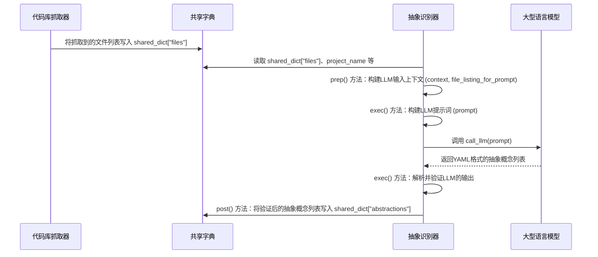

# Chapter 3: 抽象识别器

在[代码库抓取器](02_代码库抓取器_.md)一章中，我们学习了PocketFlow如何像一位勤劳的采购员，从GitHub仓库或本地目录中收集到所有我们需要的“原材料”——代码文件。现在，我们已经有了一堆原始的代码文本，但这些代码对于一个初学者来说，可能还是一堆难以理解的字符。

接下来登场的，就是我们“自动化工厂”中的一位“智慧分析师”——**抽象识别器**。它的任务是深入分析这些代码，找出其中最核心、最重要的概念，并为它们贴上清晰的“标签”和“说明”。

## 概念详情

*   **名称**: 抽象识别器
*   **描述**: 这个组件负责从大量的代码文件中识别出核心概念或“抽象”。它会分析代码，总结出最重要的部分，并为每个抽象提供一个名称、描述以及相关的代码文件。这就像一个图书馆管理员，整理书籍并为每本书贴上标签和简介。

## 为什么要识别“抽象”？

想象一下，你第一次走进一个巨大的图书馆，里面有成千上万本书。如果你没有目录，也没有标签，你该如何找到你想要的书，或者理解这个图书馆是如何组织的呢？这几乎是不可能的！

代码库也一样。一个大型项目可能包含数百、数千个文件。如果直接从头开始阅读每一行代码，你会很快迷失方向。我们需要一个高层次的视角，来理解这个项目是由哪些主要“部分”组成的，每个“部分”负责什么，以及它们存在于哪些文件中。

**抽象识别器**的作用就是：

1.  **提炼核心**: 从海量代码中找出最重要的功能模块、设计模式或业务逻辑。
2.  **命名与描述**: 为这些核心概念（抽象）赋予一个清晰、易懂的名称和描述，方便初学者理解。
3.  **关联代码**: 指明每个抽象概念与代码库中哪些文件紧密相关，为后续深入学习提供线索。

这就像是为图书馆编写一份结构清晰的“主题目录”，每个主题都有一个简介，并列出了相关的所有书籍。

## 它是如何工作的？（核心用例）

假设我们抓取了一个简单的博客系统代码库。它可能包含处理用户注册、文章发布、评论管理、数据库交互等功能。

**抽象识别器**的目标就是：

*   识别出像“用户管理”这样的抽象，并描述它如何处理用户注册、登录等。
*   识别出“文章发布”这样的抽象，并说明它负责创建、编辑和显示博客文章。
*   识别出“数据库操作”这样的抽象，并解释它是如何与数据库进行数据存取的。

最终，它会输出一个列表，每个列表项都是一个抽象，包含其名称、描述以及涉及到的文件索引。

听起来很智能，对吗？它能帮助我们把一个陌生的代码库，迅速转化为一组可理解的核心概念。

## 逐步解析：抽象识别器内部

在PocketFlow中，`IdentifyAbstractions` 节点就是我们的“抽象识别器”。它位于 `nodes.py` 文件中。

我们来看看它的核心代码片段：

```python
# nodes.py
class IdentifyAbstractions(Node):
    def prep(self, shared):
        files_data = shared["files"]
        project_name = shared["project_name"]
        language = shared.get("language", "english")
        use_cache = shared.get("use_cache", True)
        max_abstraction_num = shared.get("max_abstraction_num", 10)

        # 辅助函数：从文件数据创建LLM上下文
        def create_llm_context(files_data):
            context = ""
            file_info = []
            for i, (path, content) in enumerate(files_data):
                entry = f"--- File Index {i}: {path} ---\n{content}\n\n"
                context += entry
                file_info.append((i, path))
            return context, file_info

        context, file_info = create_llm_context(files_data)
        file_listing_for_prompt = "\n".join(
            [f"- {idx} # {path}" for idx, path in file_info]
        )
        return (
            context,
            file_listing_for_prompt,
            len(files_data),
            project_name,
            language,
            use_cache,
            max_abstraction_num,
        )

    def exec(self, prep_res):
        (
            context,
            file_listing_for_prompt,
            file_count,
            project_name,
            language,
            use_cache,
            max_abstraction_num,
        ) = prep_res
        print(f"正在使用LLM识别抽象概念...")

        language_instruction = ""
        name_lang_hint = ""
        desc_lang_hint = ""
        if language.lower() != "english":
            language_instruction = f"IMPORTANT: Generate the `name` and `description` for each abstraction in **{language.capitalize()}** language. Do NOT use English for these fields.\n\n"
            name_lang_hint = f" (value in {language.capitalize()})"
            desc_lang_hint = f" (value in {language.capitalize()})"

        prompt = f"""
        对于项目 `{project_name}`:

        代码库上下文:
        {context}

        {language_instruction}分析代码库上下文。
        识别出对代码库新手最有帮助的5-{max_abstraction_num}个核心最重要的抽象概念。

        对于每个抽象概念，提供:
        1. 简洁的 `name`{name_lang_hint}。
        2. 对初学者友好的 `description`，用简单的类比解释它是什么，大约100字{desc_lang_hint}。
        3. 相关 `file_indices`（整数）列表，格式为 `idx # path/comment`。

        上下文中存在的文件索引和路径列表:
        {file_listing_for_prompt}

        将输出格式化为字典的YAML列表:

        ```yaml
        - name: |
            查询处理{name_lang_hint}
          description: |
            解释抽象概念的作用。
            它就像一个中央调度器，负责路由请求。{desc_lang_hint}
          file_indices:
            - 0 # path/to/file1.py
            - 3 # path/to/related.py
        # ... 最多 {max_abstraction_num} 个抽象概念
        ```"""
        response = call_llm(prompt, use_cache=(use_cache and self.cur_retry == 0))

        # --- 验证 ---
        yaml_str = response.strip().split("```yaml")[1].split("```")[0].strip()
        abstractions = yaml.safe_load(yaml_str)

        # ... (省略了详细的验证逻辑，代码中会检查输出格式和索引有效性) ...

        validated_abstractions = []
        for item in abstractions:
            # ... 验证逻辑 ...
            item["files"] = sorted(list(set(validated_indices)))
            validated_abstractions.append(
                {
                    "name": item["name"],
                    "description": item["description"],
                    "files": item["files"],
                }
            )

        print(f"识别出 {len(validated_abstractions)} 个抽象概念。")
        return validated_abstractions

    def post(self, shared, prep_res, exec_res):
        shared["abstractions"] = exec_res
```

### `prep` 方法：准备工作

`prep` 方法是 `IdentifyAbstractions` 节点开始识别抽象概念前的准备阶段。它主要做以下几件事：

1.  **获取输入**: 从 `shared` 字典中获取由 [代码库抓取器](02_代码库抓取器_.md) 提供的 `files_data`（文件路径和内容列表）、`project_name`（项目名称）、`language`（目标语言）和 `max_abstraction_num`（最大抽象数量）。
2.  **构建LLM上下文**: 这是一个关键步骤。它会遍历所有抓取到的文件，将每个文件的内容及其索引和路径格式化成一个大的字符串 `context`。这个 `context` 就是我们要喂给大型语言模型（LLM）进行分析的原材料。同时，它还会生成一个 `file_listing_for_prompt` 字符串，用于在提示词中告诉LLM每个文件对应的索引和路径。
3.  **返回参数**: 将这些准备好的数据作为元组返回，供 `exec` 方法使用。

### `exec` 方法：执行识别

`exec` 方法是 `IdentifyAbstractions` 节点的核心逻辑所在，它负责调用LLM来完成抽象概念的识别。

1.  **构建提示词（Prompt）**: 这是整个过程的“魔法”所在。它会根据 `prep` 阶段准备好的 `context`、`file_listing_for_prompt`、`project_name` 以及 `language`，构建一个详细的提示词。这个提示词会明确指示LLM：
    *   分析提供的代码库上下文。
    *   识别出5到`max_abstraction_num`个最重要的核心抽象概念。
    *   为每个抽象概念提供一个简洁的**名称**和一个对初学者友好的**描述**（包含类比）。
    *   列出与该抽象概念相关的**文件索引**。
    *   指定输出格式必须是YAML列表。
    *   **重要提示**：如果目标语言不是英语，提示词会明确要求LLM以指定语言（如中文）生成名称和描述。

2.  **调用LLM**: 使用 `call_llm(prompt, ...)` 函数向大型语言模型发送这个构建好的提示词。LLM会根据提示词的要求，分析代码并生成一份YAML格式的响应，其中包含识别出的抽象概念。

3.  **解析和验证**: 接收到LLM的响应后，`exec` 方法会：
    *   从LLM的响应中提取出YAML字符串。
    *   使用 `yaml.safe_load()` 解析YAML字符串，将其转换为Python的数据结构（一个字典列表）。
    *   对解析出的数据进行严格的**验证**。这包括检查输出是否是列表、每个项是否包含 `name`、`description` 和 `file_indices` 字段，以及这些字段的类型是否正确。它还会验证 `file_indices` 中的索引是否在有效范围内，确保它们指向实际存在的文件。
    *   最终，它会整理验证后的抽象概念列表，每个抽象概念包含 `name`、`description` 和一个 `files` 列表（只包含文件索引）。

4.  **返回结果**: 返回一个包含所有验证通过的抽象概念的列表。

### `post` 方法：保存结果

`post` 方法非常简单，它将 `exec` 方法返回的抽象概念列表存储到 `shared["abstractions"]` 中。这样，后续的节点（例如 [关系分析器](04_关系分析器_.md)）就可以轻松地访问这些识别出的核心概念了。

## 幕后英雄：大型语言模型（LLM）

`IdentifyAbstractions` 节点本身并不直接“理解”代码。它依赖于一个强大的“幕后英雄”——**大型语言模型（LLM）**。LLM经过海量代码和文本的训练，拥有惊人的代码理解、总结和生成能力。

当我们将代码上下文和详细的指示（提示词）提供给LLM时，它能够：

*   **识别模式和功能**: 从代码结构、变量命名、函数调用中推断出代码的功能和意图。
*   **提取核心概念**: 识别出那些在代码库中反复出现、具有重要意义的模块或逻辑。
*   **生成自然语言描述**: 将复杂的代码逻辑用人类可读的、对初学者友好的语言进行解释和类比。
*   **遵循指令**: 严格按照提示词中指定的格式（如YAML）和语言要求（如中文）生成输出。

这就像你给一位非常聪明的、懂编程的图书馆管理员一堆手稿，并告诉他：“请帮我找出这些手稿中的主要思想，用简单的语言描述它们，并告诉我哪些手稿片段与这些思想相关，最后把结果整理成一份带有标签的目录。” LLM就是扮演了这位“超级图书馆管理员”的角色。

### 序列图：LLM如何识别抽象概念

让我们通过一个序列图来理解 `IdentifyAbstractions` 节点与LLM的交互过程：



## 总结

在本章中，我们深入探讨了PocketFlow的第二个核心组件：**抽象识别器**。我们了解到它如何像一位智慧分析师，利用大型语言模型的力量，从原始的代码文件中提炼出核心的概念，并为它们提供清晰的名称、描述和相关代码文件索引。

`IdentifyAbstractions` 节点通过 `prep` 准备LLM所需的上下文，`exec` 构建精细的提示词并调用LLM进行识别，然后对LLM的输出进行严格的解析和验证，最后通过 `post` 将识别出的抽象概念存储到 `shared` 字典中。这为后续的教程生成步骤奠定了坚实的基础。

现在，我们不仅有了代码文件，还有了这些文件的“主题目录”——一组结构化的抽象概念。接下来，我们将进入流程的下一个阶段，由 [关系分析器](04_关系分析器_.md) 登场，它将开始理解这些抽象概念之间是如何相互协作和关联的。

[下一章: 关系分析器](04_关系分析器_.md)

---

Generated by [AI Codebase Knowledge Builder](https://github.com/The-Pocket/Tutorial-Codebase-Knowledge)