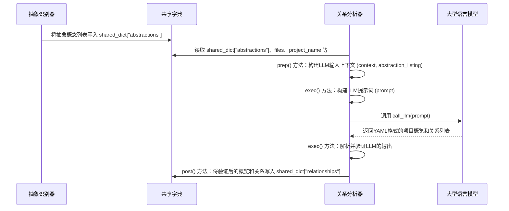

# Chapter 4: 关系分析器

在上一章[抽象识别器](03_抽象识别器_.md)中，我们学会了如何从庞大的代码库中识别出核心概念或“抽象”，并为它们贴上清晰的标签和描述。这就像我们参观了一个大型图书馆，不仅有了所有书籍的列表，还为每本书归类并写了简介。

现在，我们面临一个新的挑战：这些抽象概念之间是如何相互作用的？它们是独立的个体，还是一个紧密联系的大家庭？要真正理解一个项目，我们不仅要知道它有哪些核心部分，更要知道这些部分是如何协同工作的。

这就是本章的主角——**关系分析器**登场的时候了。它就像一位经验丰富的社交网络分析师，负责找出不同个体（抽象概念）之间的连接方式，理解它们的相互依赖和协作关系。

## 概念详情

*   **名称**: 关系分析器
*   **描述**: 一旦识别出抽象，这个组件就会分析它们之间的相互作用和依赖关系。它会创建一个项目概览，并用简洁的标签描述抽象之间的联系。这就像一个社交网络分析师，找出不同个体之间的连接方式。

## 为什么要分析“关系”？

继续我们图书馆的例子。你已经有了每本书的简介，但如果你想写一篇关于“文学史”的论文，仅仅知道每本书的内容是不够的。你需要知道：
*   哪些书是某个流派的开山之作？
*   哪些书是受到其他书的影响而创作的？
*   哪些书在内容上相互引用或补充？

理解这些“关系”能帮助你构建一个完整的知识网络。

在代码项目中，理解抽象之间的关系至关重要：

1.  **全局视图**: 帮助我们从宏观上理解整个项目的架构和数据流向。
2.  **依赖性**: 揭示哪些模块依赖于其他模块，这对于修改、扩展或调试代码都非常重要。
3.  **协作方式**: 阐明不同功能模块是如何共同完成一个复杂任务的。

没有关系分析，抽象概念就像是一个个孤立的岛屿，我们无法看到它们之间连接的桥梁。

## 它是如何工作的？（核心用例）

假设我们识别出了一个电商平台的几个抽象概念：
*   用户管理
*   商品目录
*   订单处理
*   支付网关

**关系分析器**的目标就是找出它们之间的联系：
*   “订单处理”会“使用”或“依赖”于“用户管理”来获取用户信息。
*   “订单处理”会“引用”或“查询”于“商品目录”来获取商品详情。
*   “订单处理”会“调用”或“接口”于“支付网关”来完成交易。

最终，它会提供一个简洁的项目总结，以及一个描述这些抽象之间关系的列表，每个关系都带有清晰的标签。这帮助我们快速构建起项目的整体认知。

## 逐步解析：关系分析器内部

在PocketFlow中，`AnalyzeRelationships` 节点就是我们的“关系分析器”。它位于 `nodes.py` 文件中。

我们来看看它的核心代码片段：

```python
# nodes.py
class AnalyzeRelationships(Node):
    def prep(self, shared):
        abstractions = shared["abstractions"]
        files_data = shared["files"]
        project_name = shared["project_name"]
        language = shared.get("language", "english")
        use_cache = shared.get("use_cache", True)

        num_abstractions = len(abstractions)

        # 创建包含抽象概念名称、索引、描述和相关文件代码片段的上下文
        context = "Identified Abstractions:\n"
        all_relevant_indices = set()
        abstraction_info_for_prompt = []
        for i, abstr in enumerate(abstractions):
            # 使用 'files' 字段，其中直接包含文件索引
            file_indices_str = ", ".join(map(str, abstr["files"]))
            # 抽象概念的名称和描述可能已被翻译
            info_line = f"- Index {i}: {abstr['name']} (Relevant file indices: [{file_indices_str}])\n  Description: {abstr['description']}"
            context += info_line + "\n"
            abstraction_info_for_prompt.append(
                f"{i} # {abstr['name']}"
            )  # 在提示词中也使用可能已翻译的名称
            all_relevant_indices.update(abstr["files"])

        context += "\nRelevant File Snippets (Referenced by Index and Path):\n"
        # 使用辅助函数获取相关文件的内容
        relevant_files_content_map = get_content_for_indices(
            files_data, sorted(list(all_relevant_indices))
        )
        # 格式化文件内容以构建上下文
        file_context_str = "\n\n".join(
            f"--- File: {idx_path} ---\n{content}"
            for idx_path, content in relevant_files_content_map.items()
        )
        context += file_context_str

        return (
            context,
            "\n".join(abstraction_info_for_prompt),
            num_abstractions,
            project_name,
            language,
            use_cache,
        )

    def exec(self, prep_res):
        (
            context,
            abstraction_listing,
            num_abstractions,
            project_name,
            language,
            use_cache,
         ) = prep_res
        print(f"正在使用LLM分析关系...")

        language_instruction = ""
        lang_hint = ""
        list_lang_note = ""
        if language.lower() != "english":
            lang_cap = language.capitalize()
            language_instruction = f"IMPORTANT: Generate the `summary` and relationship `label` fields in **{lang_cap}** language. Do NOT use English for these fields.\n\n"
            lang_hint = f" (in {lang_cap})"
            list_lang_note = f" (Names might be in {lang_cap})"

        prompt = f"""
基于项目 `{project_name}` 的以下抽象概念和相关代码片段：

抽象概念索引和名称列表{list_lang_note}：
{abstraction_listing}

上下文（抽象概念、描述、代码）：
{context}

{language_instruction}请提供：
1. 项目主要目的和功能的 `summary`（概览），用几句对初学者友好的句子描述{lang_hint}。使用 Markdown 格式，通过 **粗体** 和 *斜体* 文本突出重要概念。
2. 一个 `relationships` 列表，描述这些抽象概念之间的关键交互。对于每个关系，请指定：
    - `from_abstraction`: 源抽象概念的索引（例如，`0 # 抽象概念名称1`）
    - `to_abstraction`: 目标抽象概念的索引（例如，`1 # 抽象概念名称2`）
    - `label`: 对交互的简短标签，**仅用几个词表示**{lang_hint}（例如，“管理”、“继承”、“使用”）。
    理想情况下，关系应该以一个抽象概念调用或向另一个抽象概念传递参数为依据。
    简化关系，并排除不重要的关系。

重要提示：确保每个抽象概念都至少参与一个关系（作为源或目标）。每个抽象概念索引必须在所有关系中至少出现一次。

将输出格式化为 YAML：

```yaml
summary: |
  项目的简短、易懂的解释{lang_hint}。
  可以使用多行，并用**粗体**和*斜体*强调。
relationships:
  - from_abstraction: 0 # 抽象概念名称1
    to_abstraction: 1 # 抽象概念名称2
    label: "管理"{lang_hint}
  - from_abstraction: 2 # 抽象概念名称3
    to_abstraction: 0 # 抽象概念名称1
    label: "提供配置"{lang_hint}
  # ... 其他关系
```

现在，请提供 YAML 输出：
"""
        response = call_llm(prompt, use_cache=(use_cache and self.cur_retry == 0))

        # --- 验证 ---
        yaml_str = response.strip().split("```yaml")[1].split("```")[0].strip()
        relationships_data = yaml.safe_load(yaml_str)

        # ... (省略了详细的验证逻辑，代码中会检查输出格式和索引有效性) ...

        validated_relationships = []
        for rel in relationships_data["relationships"]:
            # ... 验证逻辑 ...
            validated_relationships.append(
                    {
                        "from": from_idx,
                        "to": to_idx,
                        "label": rel["label"],
                    }
                )

        print("生成了项目概览和关系详情。")
        return {
            "summary": relationships_data["summary"],
            "details": validated_relationships,
        }

    def post(self, shared, prep_res, exec_res):
        shared["relationships"] = exec_res
```

### `prep` 方法：准备工作

`prep` 方法是 `AnalyzeRelationships` 节点进行关系分析前的准备阶段。它的主要任务是为大型语言模型（LLM）准备一个包含足够信息的上下文：

1.  **获取输入**: 从 `shared` 字典中获取由 [抽象识别器](03_抽象识别器_.md) 提供的 `abstractions` 列表（每个抽象概念包含名称、描述和相关文件索引）、原始的 `files_data`（所有文件内容），以及 `project_name`、`language` 和 `use_cache` 标志。
2.  **构建LLM上下文**:
    *   首先，它会列出所有已识别的抽象概念，包括它们的索引、名称和描述。
    *   然后，它会收集所有与这些抽象概念相关的代码文件片段。为了避免重复和过长，它会找到所有抽象概念关联到的文件索引的并集，然后使用 `get_content_for_indices` 辅助函数获取这些文件的内容。
    *   将这些信息（抽象概念列表、描述、相关代码片段）组合成一个详细的 `context` 字符串。这个 `context` 将作为LLM理解项目结构和行为的基础。
3.  **返回参数**: 将这些准备好的数据作为元组返回，供 `exec` 方法使用。

### `exec` 方法：执行分析

`exec` 方法是 `AnalyzeRelationships` 节点的核心，它负责调用LLM来完成抽象概念之间关系的分析。

1.  **构建提示词（Prompt）**: 这是一个精心设计的提示词，旨在引导LLM：
    *   分析提供的抽象概念列表和代码上下文。
    *   生成一个对初学者友好的项目**概览**（`summary`），要求使用 Markdown 粗体和斜体进行强调。
    *   生成一个**关系**列表（`relationships`），描述抽象概念之间的关键交互。
    *   对于每个关系，明确要求提供 `from_abstraction`（源抽象）、`to_abstraction`（目标抽象）的索引和名称，以及一个简洁的 `label`（标签），例如“管理”、“使用”等。
    *   **重要提示**: 明确要求LLM确保每个抽象概念都至少参与一个关系，以避免遗漏。
    *   **语言指示**: 如果目标语言不是英语，提示词会明确要求LLM以指定语言（如中文）生成概览和关系标签。
    *   指定输出格式必须是YAML。

2.  **调用LLM**: 使用 `call_llm(prompt, ...)` 函数向大型语言模型发送这个构建好的提示词。LLM会根据提示词的要求，分析抽象概念和代码，并生成一份YAML格式的响应，其中包含项目概览和关系列表。

3.  **解析和验证**: 接收到LLM的响应后，`exec` 方法会：
    *   从LLM的响应中提取出YAML字符串。
    *   使用 `yaml.safe_load()` 解析YAML字符串，将其转换为Python的数据结构。
    *   对解析出的数据进行严格的**验证**。这包括检查输出是否包含 `summary` 和 `relationships` 字段，并验证 `relationships` 列表中的每个关系项是否包含 `from_abstraction`、`to_abstraction` 和 `label` 字段。它还会验证抽象概念的索引是否在有效范围内。
    *   最终，它会整理验证后的结果，将关系中的索引转换为纯整数形式，并保留可能已被翻译的概览和标签。

4.  **返回结果**: 返回一个字典，包含项目概览（`summary`）和关系详情列表（`details`）。

### `post` 方法：保存结果

`post` 方法非常简单，它将 `exec` 方法返回的项目概览和关系详情存储到 `shared["relationships"]` 中。这样，后续的节点（例如 [章节排序器](#章节排序器)）就可以轻松地访问这些已分析出的关系了。

## 幕后英雄：大型语言模型（LLM）

与[抽象识别器](03_抽象识别器_.md)一样，`AnalyzeRelationships` 节点同样依赖于**大型语言模型（LLM）**的强大能力。LLM在此处扮演的角色更加复杂：

*   **语义理解**: 它不仅要识别代码中的概念，还要理解这些概念之间的语义联系。例如，一个函数调用另一个函数，一个类继承另一个类，或者一个模块读取另一个模块的数据，这些都是LLM需要识别的关系。
*   **模式识别**: LLM能够从代码结构、函数签名、变量传递等模式中推断出依赖和交互。
*   **总结与提炼**: LLM需要将复杂的代码交互总结成简洁明了的概览和关系标签，这些标签对初学者来说是易于理解的。
*   **遵循复杂指令**: 提示词中包含多项严格要求，例如输出格式、语言、以及确保所有抽象概念都参与关系等，LLM需要准确地遵循这些指令。

LLM在这里就像一位“架构师”，它能够审视项目的各个部分，并描绘出一幅清晰的“蓝图”，展示这些部分是如何相互连接和协作的。

### 序列图：LLM如何分析关系

让我们通过一个序列图来理解 `AnalyzeRelationships` 节点与LLM的交互过程：



## 总结

在本章中，我们深入探讨了PocketFlow的第三个核心组件：**关系分析器**。我们了解到它如何像一位社交网络分析师，利用大型语言模型的力量，分析已识别的抽象概念之间的相互作用和依赖关系。

`AnalyzeRelationships` 节点通过 `prep` 准备了包含抽象概念、描述和相关代码片段的详细上下文，`exec` 构建了精细的提示词并调用LLM进行关系识别，然后对LLM的输出进行了严格的解析和验证，最后通过 `post` 将项目概览和关系存储到 `shared` 字典中。

有了这些关系信息，我们不仅知道项目有哪些核心部分，还理解了它们是如何协同工作的。这对于构建一份结构清晰、逻辑连贯的教程至关重要。

接下来，我们将进入流程的下一个阶段，由 [章节排序器](05_章节排序器_.md) 登场，它将根据这些抽象概念及其关系，智能地安排教程章节的顺序。

[下一章: 章节排序器](05_章节排序器_.md)

---

Generated by [AI Codebase Knowledge Builder](https://github.com/The-Pocket/Tutorial-Codebase-Knowledge)