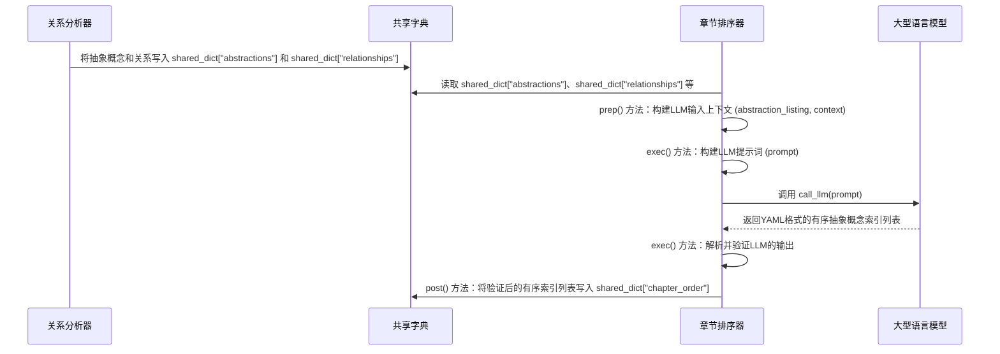

# Chapter 5: 章节排序器

在上一章[关系分析器](04_关系分析器_.md)中，我们学会了如何分析项目中的核心概念（抽象）之间的相互作用和依赖关系，并得到了一个清晰的项目概览和关系列表。这就像我们不仅知道了图书馆里有哪些书以及每本书讲了什么，还弄清楚了这些书之间是如何相互引用的。

现在，我们面临一个关键问题：既然我们已经有了这些核心概念和它们之间的关系，那么在编写教程时，应该以怎样的顺序来呈现它们呢？是先讲最基础的，还是先讲最常用的？如果一个概念依赖于另一个概念，我们是不是应该先讲解被依赖的那个？

这就是本章的主角——**章节排序器**登场的时候了。它就像一位经验丰富的课程设计师，根据已识别的抽象概念和它们之间的关系，智能地规划教程的章节顺序，确保读者能够循序渐进、逻辑清晰地学习。

## 概念详情

*   **名称**: 章节排序器
*   **描述**: 这个组件的任务是根据抽象和它们之间的关系，决定教程章节的最佳呈现顺序。它会确保先介绍基础概念，然后逐步深入到更复杂的细节，从而为读者提供一个逻辑清晰、易于理解的学习路径。

## 为什么要“排序章节”？

想象一下，你正在学习一门新的编程语言。如果教程一开始就教你如何构建一个复杂的网络服务器，而没有先讲解变量、函数、类等基本概念，你肯定会感到非常困惑和挫败。一个好的教程，其章节顺序至关重要。

**章节排序器**的作用就是：

1.  **构建逻辑流**: 确保教程的知识点是逐步展开的，从基础到进阶，从通用到具体。
2.  **避免依赖倒置**: 如果概念A是概念B的基础，那么教程中必须先讲解概念A，再讲解概念B，避免读者在理解B时，发现自己还没学A。
3.  **提升学习体验**: 一个精心设计的章节顺序，能让读者更容易吸收新知识，减少学习障碍，提高学习效率。

它就像为你量身定制的学习路线图，每一步都为你指明了方向，让你不会在复杂的知识森林中迷失。

## 它是如何工作的？（核心用例）

假设我们有以下几个抽象概念及其关系：
*   **抽象 0: 数据模型** (被 **抽象 1: 用户管理** 和 **抽象 2: 订单处理** 依赖)
*   **抽象 1: 用户管理** (被 **抽象 2: 订单处理** 使用)
*   **抽象 2: 订单处理** (使用 **抽象 1: 用户管理** 和 **抽象 3: 支付网关**)
*   **抽象 3: 支付网关** (被 **抽象 2: 订单处理** 调用)

**章节排序器**的目标就是根据这些信息，给出一个最佳的章节顺序。一个合理的顺序可能是：

1.  **数据模型** (最基础，是其他概念的基础)
2.  **用户管理** (依赖于数据模型，且被订单处理使用)
3.  **支付网关** (虽然被订单处理调用，但可以独立讲解其原理)
4.  **订单处理** (依赖于用户管理和支付网关，最后讲解)

最终，它会输出一个抽象概念的索引列表，这个列表就是教程章节的顺序。

## 逐步解析：章节排序器内部

在PocketFlow中，`OrderChapters` 节点就是我们的“章节排序器”。它位于 `nodes.py` 文件中。

我们来看看它的核心代码片段：

```python
# nodes.py
class OrderChapters(Node):
    def prep(self, shared):
        abstractions = shared["abstractions"]  # 名称/描述可能已被翻译
        relationships = shared["relationships"]  # 摘要/标签可能已被翻译
        project_name = shared["project_name"]  # 获取项目名称
        language = shared.get("language", "english")  # 获取语言
        use_cache = shared.get("use_cache", True)  # 获取 use_cache 标志，默认为 True

        # 为LLM准备上下文
        abstraction_info_for_prompt = []
        for i, a in enumerate(abstractions):
            abstraction_info_for_prompt.append(
                f"- {i} # {a['name']}"
            )  # 使用可能已被翻译的名称
        abstraction_listing = "\n".join(abstraction_info_for_prompt)

        # 使用可能已被翻译的摘要和标签
        summary_note = ""
        if language.lower() != "english":
            summary_note = (
                f" (注意: 项目摘要可能已用 {language.capitalize()} 语言编写)"
            )

        context = f"项目摘要{summary_note}:\n{relationships['summary']}\n\n"
        context += "关系 (索引指向上述抽象概念):\n"
        for rel in relationships["details"]:
            from_name = abstractions[rel["from"]]["name"]
            to_name = abstractions[rel["to"]]["name"]
            # 使用可能已被翻译的“标签”
            context += f"- 从 {rel['from']} ({from_name}) 到 {rel['to']} ({to_name}): {rel['label']}\n"  # 标签可能已被翻译

        list_lang_note = ""
        if language.lower() != "english":
            list_lang_note = f" (名称可能已用 {language.capitalize()} 语言编写)"

        return (
            abstraction_listing,
            context,
            len(abstractions),
            project_name,
            list_lang_note,
            use_cache,
        )  # 返回 use_cache

    def exec(self, prep_res):
        (
            abstraction_listing,
            context,
            num_abstractions,
            project_name,
            list_lang_note,
            use_cache,
        ) = prep_res  # 解包 use_cache
        print("正在使用LLM确定章节顺序...")
        # 提示词指令中不需要语言变体，只需根据结构排序
        # 输入名称可能已被翻译，因此有此注释。
        prompt = f"""
根据项目 ```` {project_name} ```` 的以下抽象概念及其关系：

抽象概念 (索引 # 名称){list_lang_note}:
{abstraction_listing}

关于关系和项目摘要的上下文:
{context}

如果你要为 ```` {project_name} ```` 制作一个教程，解释这些抽象概念的最佳顺序是什么，从第一个到最后一个？
理想情况下，首先解释那些最重要或最基础的，也许是面向用户的概念或入口点。然后转向更详细的、低级别的实现细节或支持概念。

输出抽象概念索引的有序列表，为了清晰起见，在注释中包含名称。使用格式 `idx # AbstractionName`。

```yaml
- 2 # 基础概念
- 0 # 核心类A
- 1 # 核心类B (使用核心类A)
- ...
```

现在，请提供 YAML 输出：
"""
        response = call_llm(prompt, use_cache=(use_cache and self.cur_retry == 0)) # 仅当启用缓存且未重试时才使用缓存

        # --- 验证 ---
        yaml_str = response.strip().split("```yaml")[1].split("```")[0].strip()
        ordered_indices_raw = yaml.safe_load(yaml_str)

        if not isinstance(ordered_indices_raw, list):
            raise ValueError("LLM输出不是列表")

        ordered_indices = []
        seen_indices = set()
        for entry in ordered_indices_raw:
            try:
                if isinstance(entry, int):
                    idx = entry
                elif isinstance(entry, str) and "#" in entry:
                    idx = int(entry.split("#")[0].strip())
                else:
                    idx = int(str(entry).strip())

                if not (0 <= idx < num_abstractions):
                    raise ValueError(
                        f"有序列表中存在无效索引 {idx}。最大索引为 {num_abstractions-1}。"
                    )
                if idx in seen_indices:
                    raise ValueError(f"有序列表中存在重复索引 {idx}。")
                ordered_indices.append(idx)
                seen_indices.add(idx)

            except (ValueError, TypeError):
                raise ValueError(
                    f"无法从有序列表条目中解析索引: {entry}"
                )

        # 检查是否包含所有抽象概念
        if len(ordered_indices) != num_abstractions:
            raise ValueError(
                f"有序列表长度 ({len(ordered_indices)}) 与抽象概念数量 ({num_abstractions}) 不匹配。缺失索引: {set(range(num_abstractions)) - seen_indices}"
            )

        print(f"确定的章节顺序 (索引): {ordered_indices}")
        return ordered_indices  # 返回索引列表

    def post(self, shared, prep_res, exec_res):
        # exec_res 已经是排序后的索引列表
        shared["chapter_order"] = exec_res  # 索引列表
```

### `prep` 方法：准备工作

`prep` 方法是 `OrderChapters` 节点在确定章节顺序之前做的准备工作。它主要负责从 `shared` 字典中获取以下关键信息，并将其格式化为LLM容易理解的上下文：

1.  **获取抽象概念**: 从 `shared["abstractions"]` 中获取所有已识别的抽象概念列表。这些概念的名称和描述可能已经过翻译。
2.  **获取关系**: 从 `shared["relationships"]` 中获取项目概览和抽象概念之间的关系。概览和关系标签也可能已经过翻译。
3.  **构建LLM上下文**:
    *   它会创建一个包含所有抽象概念索引和名称的列表 (`abstraction_listing`)。
    *   然后，它会结合项目摘要和所有关系，构建一个详细的 `context` 字符串。这个 `context` 会清晰地展示每个抽象概念的名称、描述以及它们之间是如何相互连接的。
    *   为了支持多语言，它还会根据 `language` 参数添加一些提示信息，说明某些字段可能已经过翻译。
4.  **返回参数**: 将这些准备好的数据作为元组返回，供 `exec` 方法使用。

### `exec` 方法：执行排序

`exec` 方法是 `OrderChapters` 节点的核心，它负责调用大型语言模型（LLM）来确定章节的最佳顺序。

1.  **构建提示词（Prompt）**: 这是一个精心设计的提示词，旨在引导LLM：
    *   分析提供的抽象概念列表和它们之间的关系上下文。
    *   假设要为项目生成教程，确定解释这些抽象概念的最佳顺序。
    *   强调排序原则：先介绍最重要或最基础的，然后逐步深入到更详细的实现细节。
    *   要求输出一个YAML格式的有序索引列表，并在注释中包含抽象概念的名称，以提高可读性。
    *   尽管抽象概念名称和关系标签可能已翻译，但排序本身的指令是通用的。

2.  **调用LLM**: 使用 `call_llm(prompt, ...)` 函数向LLM发送这个构建好的提示词。LLM会根据其对代码结构、概念依赖和教程逻辑的理解，生成一个YAML格式的响应，其中包含建议的章节顺序。

3.  **解析和验证**: 接收到LLM的响应后，`exec` 方法会：
    *   从LLM的响应中提取出YAML字符串。
    *   使用 `yaml.safe_load()` 解析YAML字符串，将其转换为Python的列表结构。
    *   对解析出的数据进行严格的**验证**。这包括检查输出是否是列表、每个条目是否能解析为有效的抽象概念索引。它还会检查是否有重复的索引，并确保所有抽象概念都包含在排序列表中，不多也不少。
    *   确保所有抽象概念都被包含在排序列表中，且每个概念只出现一次。

4.  **返回结果**: 返回一个包含所有抽象概念索引的有序列表。

### `post` 方法：保存结果

`post` 方法非常简单，它将 `exec` 方法返回的有序抽象概念索引列表存储到 `shared["chapter_order"]` 中。这样，后续的节点（例如 [章节编写器](06_章节编写器_.md)）就可以根据这个列表来逐一编写教程章节了。

## 幕后英雄：大型语言模型（LLM）

`OrderChapters` 节点再次依赖于**大型语言模型（LLM）**的强大能力。在这里，LLM扮演的角色是“教程规划师”：

*   **理解逻辑依赖**: LLM能够从抽象概念的描述和它们之间的关系中，推断出哪些概念是基础，哪些是上层应用，从而建立一个逻辑上的依赖图。
*   **教学法原则**: LLM通过其训练数据，学习了人类如何组织教学内容的模式，例如从简单到复杂、从宏观到微观的教学顺序。
*   **综合考量**: 它需要综合考虑所有抽象概念的重要性、相互依赖性以及对初学者的友好程度，给出一个最佳的排序方案。
*   **遵循指令**: LLM需要严格按照提示词的要求，以YAML格式输出一个完整且不重复的抽象概念索引列表。

LLM在这里就像一位非常聪明的导师，它能够审视你所有的学习材料，并为你规划出一条最有效的学习路径。

### 序列图：LLM如何排序章节

让我们通过一个序列图来理解 `OrderChapters` 节点与LLM的交互过程：



## 总结

在本章中，我们深入探讨了PocketFlow的第四个核心组件：**章节排序器**。我们了解到它如何像一位课程设计师，利用大型语言模型的力量，根据已识别的抽象概念和它们之间的关系，智能地规划教程章节的呈现顺序。

`OrderChapters` 节点通过 `prep` 准备了包含抽象概念和关系的详细上下文，`exec` 构建了精细的提示词并调用LLM进行排序，然后对LLM的输出进行了严格的解析和验证，最后通过 `post` 将有序的抽象概念索引列表存储到 `shared` 字典中。

这个有序列表是教程生成流程中非常关键的一步，它确保了最终生成的教程将具有清晰的逻辑结构和良好的学习体验。

接下来，我们将进入流程的下一个阶段，由 [章节编写器](06_章节编写器_.md) 登场，它将根据这个排序，逐一为每个抽象概念编写详细的教程内容。

[下一章: 章节编写器](06_章节编写器_.md)

---

Generated by [AI Codebase Knowledge Builder](https://github.com/The-Pocket/Tutorial-Codebase-Knowledge)