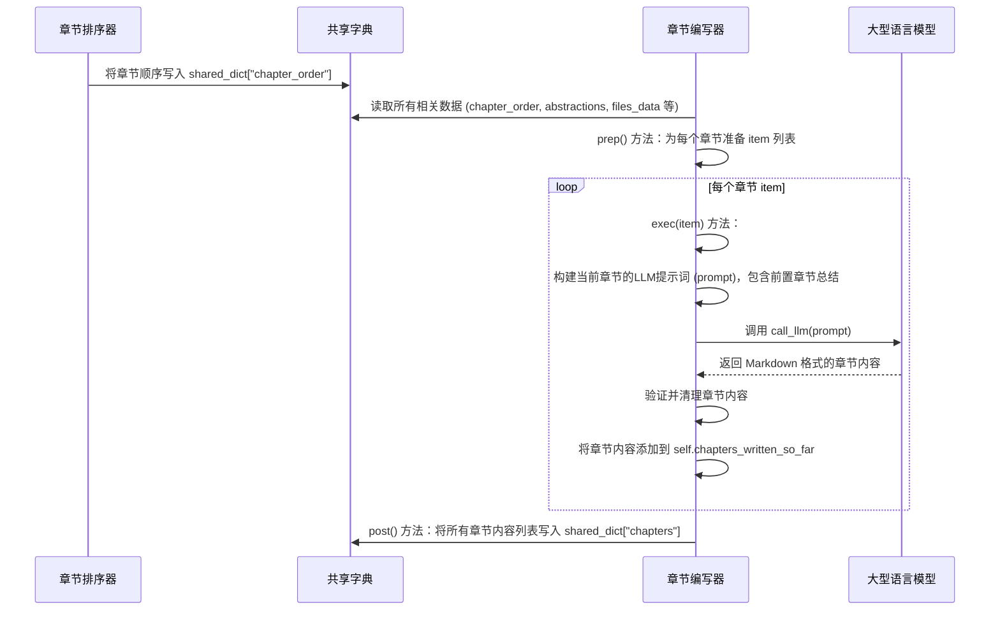

# Chapter 6: 章节编写器

在上一章[章节排序器](05_章节排序器_.md)中，我们学会了如何像一位经验丰富的课程设计师，根据项目中的核心概念（抽象）及其相互关系，智能地规划出教程章节的最佳呈现顺序。现在，我们有了一张清晰的“学习路线图”，知道应该先讲什么，后讲什么。

有了这张路线图，接下来最激动人心的任务就是：**真正开始创作教程内容！** 这就像你已经设计好了图书馆的目录，现在要开始为每一本书撰写详细的摘要和导读了。

这就是本章的主角——**章节编写器**登场的时候了。它是PocketFlow“自动化工厂”中的“金牌内容创作者”，负责为每个抽象概念生成详细、引人入胜且易于理解的Markdown格式教程章节。

## 概念详情

*   **名称**: 章节编写器
*   **描述**: 这是教程生成的核心环节，负责为每个抽象生成详细的教程章节。它会利用LLM的力量，结合抽象的描述、相关代码片段和已完成的章节内容，撰写出引人入胜、易于理解的Markdown格式章节。

## 为什么要“编写章节”？

我们已经有了：
*   所有原始代码文件。
*   核心抽象概念的名称、描述和它们对应的文件索引。
*   抽象概念之间的关系和项目概览。
*   以及最重要的，一个逻辑清晰的章节顺序。

但是，这些都还不是给人类阅读的教程。我们需要将这些零散的信息，通过流畅的语言、恰当的例子和清晰的结构，组织成一份真正有价值的学习材料。

**章节编写器**的作用就是：

1.  **内容创作**: 将抽象概念的描述、相关代码和上下文转化为易于理解的教程文本。
2.  **代码解读**: 深入分析与抽象概念相关的代码片段，并提供详细的解释和示例。
3.  **结构化呈现**: 按照教程的惯例，使用标题、列表、代码块、图表等Markdown元素，使章节内容清晰、有条理。
4.  **上下文衔接**: 确保每个章节都能与之前的章节自然衔接，并为后续章节做好铺垫，形成一个连贯的整体。

它就像一位才华横溢的老师，不仅精通知识，还擅长将知识点拆解、简化，用最容易理解的方式传授给学生，并能引导学生一步步深入学习。

## 它是如何工作的？（核心用例）

假设“章节排序器”告诉我们，下一个要编写的章节是关于“用户管理”这个抽象概念。

**章节编写器**会接收到：
*   “用户管理”的名称和描述。
*   所有与“用户管理”相关的代码文件片段。
*   之前已经编写好的所有章节的摘要，以便进行上下文衔接。
*   以及完整的教程结构（包括所有章节标题和文件名），以便正确创建章节间的链接。

然后，它会利用大型语言模型（LLM）的强大能力，生成一个 Markdown 格式的章节：
*   章节标题：`# Chapter X: 用户管理`
*   引言：简要介绍用户管理是什么，它解决了什么问题，并与前一章节进行过渡。
*   核心用例：举例说明用户管理在项目中的具体应用。
*   概念拆解：如果复杂，会分解讲解用户注册、登录、权限等子概念。
*   代码示例：提供清晰、简短的代码片段，解释如何实现用户管理功能。
*   内部实现：可能会用序列图或流程图来解释用户管理模块的内部工作原理。
*   章节链接：正确链接到其他相关章节，并为下一章节做铺垫。

最终，它会输出一个完整的 Markdown 字符串，这就是我们教程中的一个章节。

## 逐步解析：章节编写器内部

在PocketFlow中，`WriteChapters` 节点就是我们的“章节编写器”。它是一个 `BatchNode`，这意味着它会为每个需要编写的章节并行或顺序地执行相同的逻辑。它位于 `nodes.py` 文件中。

我们来看看它的核心代码片段：

```python
# nodes.py
class WriteChapters(BatchNode):
    def prep(self, shared):
        chapter_order = shared["chapter_order"]  # 抽象概念的索引列表
        abstractions = shared[
            "abstractions"
        ]  # 抽象概念的详细信息列表（名称、描述、相关文件索引）
        files_data = shared["files"]  # 所有文件内容
        project_name = shared["project_name"] # 项目名称
        language = shared.get("language", "english") # 目标语言
        use_cache = shared.get("use_cache", True) # 是否使用缓存

        # 存储已编写章节的摘要，用于后续章节的上下文
        self.chapters_written_so_far = []

        # 创建完整的章节列表和文件名映射，用于生成链接
        all_chapters = []
        chapter_filenames = {}
        for i, abstraction_index in enumerate(chapter_order):
            if 0 <= abstraction_index < len(abstractions):
                chapter_num = i + 1
                chapter_name = abstractions[abstraction_index]["name"] # 可能已翻译的名称
                # 生成安全的文件名
                safe_name = "".join(
                    c if c.isalnum() else "_" for c in chapter_name
                ).lower()
                filename = f"{i+1:02d}_{safe_name}.md"
                all_chapters.append(f"{chapter_num}. [{chapter_name}]({filename})")
                chapter_filenames[abstraction_index] = {
                    "num": chapter_num,
                    "name": chapter_name,
                    "filename": filename,
                }

        # 完整的章节列表字符串
        full_chapter_listing = "\n".join(all_chapters)

        items_to_process = []
        for i, abstraction_index in enumerate(chapter_order):
            if 0 <= abstraction_index < len(abstractions):
                abstraction_details = abstractions[abstraction_index] # 抽象概念的详细信息
                related_file_indices = abstraction_details.get("files", []) # 相关文件索引
                # 获取相关文件的内容
                related_files_content_map = get_content_for_indices(
                    files_data, related_file_indices
                )

                # 获取前后章节的信息，用于过渡和链接
                prev_chapter = None
                if i > 0:
                    prev_idx = chapter_order[i - 1]
                    prev_chapter = chapter_filenames[prev_idx]

                next_chapter = None
                if i < len(chapter_order) - 1:
                    next_idx = chapter_order[i + 1]
                    next_chapter = chapter_filenames[next_idx]

                items_to_process.append(
                    {
                        "chapter_num": i + 1,
                        "abstraction_index": abstraction_index,
                        "abstraction_details": abstraction_details,
                        "related_files_content_map": related_files_content_map,
                        "project_name": project_name,
                        "full_chapter_listing": full_chapter_listing,
                        "chapter_filenames": chapter_filenames,
                        "prev_chapter": prev_chapter,
                        "next_chapter": next_chapter,
                        "language": language,
                        "use_cache": use_cache,
                    }
                )
            else:
                print(
                    f"警告: chapter_order 中存在无效的抽象概念索引 {abstraction_index}。已跳过。"
                )

        print(f"正在准备编写 {len(items_to_process)} 个章节...")
        return items_to_process

    def exec(self, item):
        # 为每个章节执行此函数
        abstraction_name = item["abstraction_details"]["name"] # 抽象概念名称
        abstraction_description = item["abstraction_details"]["description"] # 抽象概念描述
        chapter_num = item["chapter_num"] # 章节编号
        project_name = item.get("project_name") # 项目名称
        language = item.get("language", "english") # 目标语言
        use_cache = item.get("use_cache", True) # 是否使用缓存
        print(f"正在使用LLM为 {abstraction_name} 编写第 {chapter_num} 章...")

        # 准备相关代码片段的上下文
        file_context_str = "\n\n".join(
            f"--- 文件: {idx_path.split('# ')[1] if '# ' in idx_path else idx_path} ---\n{content}"
            for idx_path, content in item["related_files_content_map"].items()
        )

        # 获取之前已编写章节的摘要，用于上下文
        previous_chapters_summary = "\n---\n".join(self.chapters_written_so_far)

        # 根据目标语言设置指令和提示
        language_instruction = ""
        concept_details_note = ""
        structure_note = ""
        prev_summary_note = ""
        instruction_lang_note = ""
        mermaid_lang_note = ""
        code_comment_note = ""
        link_lang_note = ""
        tone_note = ""
        if language.lower() != "english":
            lang_cap = language.capitalize()
            language_instruction = f"重要提示: 请将本教程章节的**所有内容**用**{lang_cap}**语言编写。虽然一些输入上下文（如概念名称、描述、章节列表、前一章节总结）可能已经是{lang_cap}，但您必须将所有其他生成的内容，包括解释、示例、技术术语和潜在的代码注释，都翻译成{lang_cap}。除了代码语法、必要的专有名词或另有说明外，请勿使用任何英语。整个输出必须是{lang_cap}。\n\n"
            concept_details_note = f" (注意: 已提供{lang_cap}版本)"
            structure_note = f" (注意: 章节名称可能已是{lang_cap}版本)"
            prev_summary_note = f" (注意: 此总结可能已是{lang_cap}版本)"
            instruction_lang_note = f" (用{lang_cap}编写)"
            mermaid_lang_note = f" (如果合适，Mermaid图表的标签/文本请用{lang_cap}编写)"
            code_comment_note = f" (如果可能，请翻译成{lang_cap}；否则，为清晰起见，尽量减少英语)"
            link_lang_note = (
                f" (使用上方结构中{lang_cap}的章节标题)"
            )
            tone_note = f" (适合{lang_cap}读者)"

        prompt = f"""
{language_instruction}请为项目 `{project_name}` 中关于概念“{abstraction_name}”的教程编写一个非常适合初学者的章节（Markdown 格式）。这是第 {chapter_num} 章。

概念详情{concept_details_note}:
- 名称: {abstraction_name}
- 描述:
{abstraction_description}

完整的教程结构{structure_note}:
{item["full_chapter_listing"]}

前几章的上下文{prev_summary_note}:
{previous_chapters_summary if previous_chapters_summary else "这是第一章。"}

相关代码片段 (代码本身保持不变):
{file_context_str if file_context_str else "此抽象概念未提供特定的代码片段。"}

章节编写说明 (除非另有说明，否则请用 {language.capitalize()} 语言生成内容):
- 以清晰的标题开头 (例如, `# 第 {chapter_num} 章: {abstraction_name}`)。使用提供的概念名称。

- 如果这不是第一章，请从上一章进行简短的过渡{instruction_lang_note}，并使用适当的 Markdown 链接引用它，链接文本使用其名称{link_lang_note}。

- 从高层次的动机开始，解释这个抽象概念解决了什么问题{instruction_lang_note}。以一个核心用例作为具体示例。整个章节应引导读者理解如何解决这个用例。内容要非常精简，对初学者友好。

- 如果抽象概念复杂，请将其分解为关键概念。逐一用非常适合初学者的方式解释每个概念{instruction_lang_note}。

- 解释如何使用这个抽象概念来解决用例{instruction_lang_note}。为代码片段提供示例输入和输出（如果输出不是具体值，请高层次地描述会发生什么{instruction_lang_note}）。

- 每个代码块应少于10行！如果需要更长的代码块，请将其分解为更小的部分，并逐一讲解。积极简化代码使其最小化。使用注释{code_comment_note}跳过不重要的实现细节。每个代码块之后都应有对初学者友好的解释{instruction_lang_note}。

- 描述内部实现以帮助理解其幕后原理{instruction_lang_note}。首先提供一个非代码或代码轻量级的逐步讲解，说明调用抽象概念时会发生什么{instruction_lang_note}。建议使用一个简单的序列图（sequenceDiagram）配合一个虚拟示例——保持简洁，最多5个参与者，以确保清晰度。如果参与者名称有空格，请使用：`participant QP as 查询处理`。{mermaid_lang_note}。

- 然后深入代码，讲解内部实现，并引用文件。提供示例代码块，但同样要保持其简单和对初学者友好。进行解释{instruction_lang_note}。

- 重要提示: 当你需要引用其他章节中涵盖的核心抽象概念时，请始终使用这样的标准 Markdown 链接: [章节标题](文件名.md)。使用上方“完整的教程结构”来查找正确的 文件名 和 章节标题{link_lang_note}。请翻译周围的文本。

- 使用 mermaid 图表来阐释复杂概念 (```mermaid``` 格式)。{mermaid_lang_note}。

- 在整个章节中大量使用类比和示例{instruction_lang_note}，以帮助初学者理解。

- 在章节末尾，用一个简短的总结{instruction_lang_note}回顾所学内容，并为下一章提供过渡{instruction_lang_note}。如果存在下一章，请使用适当的 Markdown 链接: [下一章标题](下一章文件名){link_lang_note}。

- 确保语气热情友好，易于新手理解{tone_note}。

- 请**只输出**本章节的 Markdown 内容。

现在，请直接提供一个超级对初学者友好的 Markdown 输出 (不需要 ```markdown``` 标签):
"""
        chapter_content = call_llm(prompt, use_cache=(use_cache and self.cur_retry == 0)) # 仅当启用缓存且未重试时才使用缓存
        # 基础验证/清理：确保章节以正确的标题开头
        actual_heading = f"# 第 {chapter_num} 章: {abstraction_name}" # 使用可能已翻译的名称
        if not chapter_content.strip().startswith(f"# 第 {chapter_num}"):
            # 如果标题缺失或不正确，则添加或替换，并尽量保留内容
            lines = chapter_content.strip().split("\n")
            if lines and lines[0].strip().startswith(
                "#"
            ): # 如果有标题，则替换它
                lines[0] = actual_heading
                chapter_content = "\n".join(lines)
            else: # 否则，在前面加上标题
                chapter_content = f"{actual_heading}\n\n{chapter_content}"

        # 将生成的内容添加到临时列表中，供下一次迭代的上下文使用
        self.chapters_written_so_far.append(chapter_content)

        return chapter_content # 返回 Markdown 字符串（可能已翻译）

    def post(self, shared, prep_res, exec_res_list):
        # exec_res_list 包含按顺序生成的每个章节的 Markdown 内容
        shared["chapters"] = exec_res_list
        # 清理临时实例变量
        del self.chapters_written_so_far
        print(f"完成编写 {len(exec_res_list)} 个章节。")
```

### `prep` 方法：准备工作

`prep` 方法是 `WriteChapters` 节点在开始编写章节之前做的准备工作。它主要负责收集所有必要的信息，并将其组织成 `items_to_process` 列表，为每个章节的 `exec` 调用提供独立的上下文。

1.  **获取所有必需数据**: 从 `shared` 字典中获取 `chapter_order`（排序后的抽象概念索引列表）、`abstractions`（抽象概念的详细信息）、`files_data`（所有代码文件内容）、`project_name`、`language` 和 `use_cache`。
2.  **构建完整的章节列表**: 遍历 `chapter_order`，为每个抽象概念生成一个章节标题和文件名。这个列表 (`full_chapter_listing`) 会被用来在章节中创建正确的内部链接。同时，`chapter_filenames` 字典会存储章节索引到其文件名、标题和编号的映射。
3.  **为每个章节准备输入**: 再次遍历 `chapter_order`，为每个即将编写的章节构建一个独立的 `item` 字典。每个 `item` 包含：
    *   章节编号 (`chapter_num`) 和对应的抽象概念索引 (`abstraction_index`)。
    *   抽象概念的详细信息 (`abstraction_details`)，包括名称、描述。
    *   与该抽象概念相关的代码文件内容 (`related_files_content_map`)。
    *   项目名称、完整的章节列表、文件名映射、前后章节信息（用于过渡和链接）、目标语言和缓存标志。
    *   **重要**: `previous_chapters_summary` 不在此处准备，而是在 `exec` 方法中动态构建，因为它是顺序累积的。
4.  **返回`items_to_process`**: 这个列表将被 `BatchNode` 机制逐个处理。

### `exec` 方法：执行编写

`exec` 方法是 `WriteChapters` 节点的核心，它会为 `prep` 阶段准备的每个 `item`（即每个章节）执行一次。它负责调用大型语言模型（LLM）来生成单个章节的Markdown内容。

1.  **解包章节信息**: 从传入的 `item` 字典中解包出当前章节所需的各种信息，例如抽象概念名称、描述、章节编号、相关代码片段、项目名称和目标语言等。
2.  **构建代码上下文**: 将 `related_files_content_map` 格式化为LLM可以理解的代码上下文字符串 `file_context_str`。
3.  **动态获取前置章节总结**: 这是一个关键点。由于 `WriteChapters` 是一个 `BatchNode`，它可能顺序处理章节。`self.chapters_written_so_far` 是一个实例变量，它会在每次 `exec` 调用成功后被更新，从而保证当前章节的编写可以引用之前已完成章节的总结。
4.  **构建提示词（Prompt）**: 这是一个非常详细和精细的提示词，它向LLM提供了：
    *   **强制语言指令**: 明确要求LLM将**所有生成内容**都用目标语言（例如中文）编写，并给出了翻译的例外情况（如代码语法）。
    *   **章节基本信息**: 项目名称、概念名称、描述和章节编号。
    *   **完整教程结构**: 整个教程的所有章节列表，用于帮助LLM创建正确的内部链接。
    *   **前置章节上下文**: `previous_chapters_summary`，让LLM了解之前章节的内容，以便进行自然过渡。
    *   **相关代码片段**: `file_context_str`，供LLM分析和解释。
    *   **详细的编写要求**:
        *   **结构化**: 明确标题格式、过渡、总结和链接要求。
        *   **初学者友好**: 强调高层次动机、核心用例、类比和示例。
        *   **代码处理**: 要求代码块简短、精简，提供解释，使用注释跳过不重要细节。
        *   **内部实现**: 建议使用 `mermaid` 序列图来可视化内部流程。
        *   **链接**: 强调正确使用Markdown链接到其他章节。
        *   **口吻**: 要求语气热情友好。
    *   **输出格式**: 明确要求只输出Markdown内容。
5.  **调用LLM**: 使用 `call_llm(prompt, ...)` 函数向LLM发送这个构建好的提示词。LLM会根据其强大的内容生成能力和对指令的理解，生成一个Markdown格式的章节内容。
6.  **基础验证/清理**: 对LLM生成的章节内容进行初步检查，例如确保它以正确的章节标题开头。如果标题缺失或不正确，会进行修正。
7.  **更新前置章节总结**: 将当前章节的Markdown内容添加到 `self.chapters_written_so_far` 列表中，以便下一个章节可以使用它作为上下文。
8.  **返回章节内容**: 返回生成的Markdown字符串。

### `post` 方法：保存结果

`post` 方法在所有章节都编写完成后执行。

1.  **收集所有章节**: `exec_res_list` 是一个列表，包含了所有章节的Markdown内容（由所有 `exec` 调用返回）。
2.  **存储到共享字典**: 将这个章节内容列表存储到 `shared["chapters"]` 中。
3.  **清理**: 删除临时实例变量 `self.chapters_written_so_far`。

## 幕后英雄：大型语言模型（LLM）

`WriteChapters` 节点是PocketFlow中对**大型语言模型（LLM）**依赖最深、也是最能体现其强大能力的地方。LLM在这里扮演的角色是“全能内容创作者”和“教学专家”：

*   **自然语言生成**: 将结构化的数据（抽象概念、代码）转化为流畅、连贯的自然语言教程。
*   **代码理解与解释**: 能够阅读和理解代码，并用通俗易懂的语言解释其功能、工作原理和用法。
*   **教学策略应用**: 根据提示词中的指导，应用从其训练数据中学到的教学法原则，如从高层次动机开始、分解复杂概念、使用类比和示例、提供代码解释等。
*   **上下文感知**: 能够利用前置章节总结来确保章节之间的平滑过渡和逻辑连贯性。
*   **多格式生成**: 灵活生成Markdown格式的内容，包括标题、列表、代码块、`mermaid`图表、内部链接等。
*   **遵循复杂约束**: 严格遵循提示词中关于语言、代码块长度、链接格式、语气等大量具体且复杂的指令。

LLM在这里就像一个拥有丰富编程知识、出色写作能力和教学经验的老师，能够独立完成一份高质量的教程创作。

### 序列图：LLM如何编写章节

让我们通过一个序列图来理解 `WriteChapters` 节点与LLM的交互过程：



## 总结

在本章中，我们深入探讨了PocketFlow最核心的组件之一：**章节编写器**。我们了解到它如何像一位全能的内容创作者，利用大型语言模型（LLM）的强大能力，结合抽象概念、相关代码、教程结构和前置章节上下文，生成详细、易懂且结构化的Markdown教程章节。

`WriteChapters` 节点通过 `prep` 精心准备每个章节的输入上下文，`exec` 构建极其详细的提示词并调用LLM进行内容创作，然后对LLM的输出进行验证和调整，并动态维护已编写章节的总结，最后通过 `post` 将所有生成的章节内容存储到 `shared` 字典中。

至此，我们已经拥有了教程的所有独立章节内容。接下来，我们将进入流程的最后一个阶段，由 [教程组合器](07_教程组合器_.md) 登场，它将把这些独立的章节组织成一份完整的教程，并生成最终输出。

[下一章: 教程组合器](07_教程组合器_.md)

---

Generated by [AI Codebase Knowledge Builder](https://github.com/The-Pocket/Tutorial-Codebase-Knowledge)