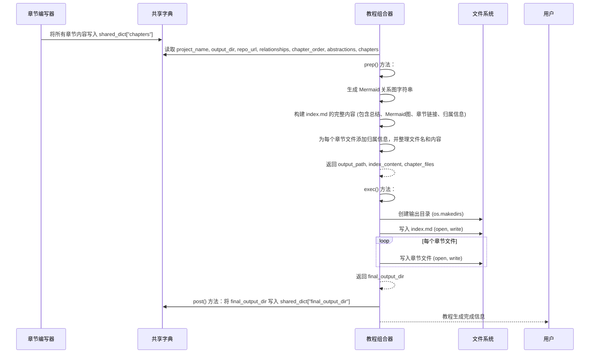

# Chapter 7: 教程组合器


在上一章[章节编写器](06_章节编写器_.md)中，我们见证了PocketFlow如何像一位勤奋的作家，为我们教程中的每一个核心概念，逐一精心创作出详细且易于理解的Markdown章节。现在，我们手头拥有了一堆独立的、高质量的教程章节文件。

然而，这些单独的章节还不能算作一份完整的教程。它们需要被汇集起来，按照正确的顺序组织好，并且需要一个总览性的主页来引导读者。这就像你准备了一桌丰盛的菜肴，现在需要一个优雅的餐盘来盛放它们，并配上菜单，让食客一目了然。

这就是本章的主角——**教程组合器**登场的时候了。它是PocketFlow“自动化工厂”中的“最终包装员”，负责将所有独立的章节整合，生成一个主索引文件，并最终将所有教程文件保存到指定的输出目录。

## 概念详情

*   **名称**: 教程组合器
*   **描述**: 这个组件是整个流程的最后一步，它将所有单独生成的章节合并成一个完整的教程。它还会生成一个主索引文件，包含项目总结和抽象关系图（使用Mermaid），并负责将所有文件保存到指定的输出目录。

## 为什么要“组合教程”？

我们已经拥有了所有单独的章节，它们内容丰富，语言友好。但是，一份好的教程不仅仅是内容的堆砌，它还需要：

1.  **统一的结构**: 一个清晰的主索引页面，能够总览整个项目，并提供所有章节的导航链接。
2.  **全局的理解**: 主索引页面通常包含项目总结和关键概念的关系图，帮助读者在深入细节之前建立宏观认知。
3.  **便捷的访问**: 所有章节文件需要被妥善地组织在一个目录下，方便读者下载、浏览和分享。
4.  **专业的外观**: 统一的输出格式和文件组织，使得生成的教程看起来更专业、更易用。

**教程组合器**的作用就是完成这份“包装”工作，将零散的组件组装成一个有凝聚力、用户友好的最终产品。

## 它是如何工作的？（核心用例）

假设我们已经生成了关于项目 `MyAwesomeProject` 的所有章节。

**教程组合器**会接收到：
*   项目名称 `MyAwesomeProject`。
*   由 [关系分析器](04_关系分析器_.md) 生成的项目总结和抽象概念之间的关系。
*   由 [章节排序器](05_章节排序器_.md) 确定的章节顺序。
*   由 [章节编写器](06_章节编写器_.md) 生成的所有章节的Markdown内容。
*   以及一个指定的输出目录，例如 `./output/MyAwesomeProject`。

然后，它会执行以下操作：
1.  **生成抽象关系图**: 根据项目总结和抽象关系数据，使用Mermaid语法生成一个可视化关系图。
2.  **创建主索引文件 (index.md)**:
    *   包含项目名称作为主标题。
    *   插入项目总结。
    *   嵌入生成的Mermaid关系图。
    *   列出所有章节，并以Markdown链接的形式指向各自的章节文件。
    *   添加教程的生成来源归属信息。
3.  **保存所有文件**: 将 `index.md` 和所有独立的章节Markdown文件（例如 `01_introduction.md`, `02_user_management.md` 等）保存到指定的输出目录中。

最终，在输出目录下，你会看到一个结构清晰的教程文件夹，里面包含 `index.md` 和所有章节文件，可以直接用Markdown阅读器打开，或者部署为在线文档。

## 逐步解析：教程组合器内部

在PocketFlow中，`CombineTutorial` 节点就是我们的“教程组合器”。它位于 `nodes.py` 文件中。

我们来看看它的核心代码片段：

```python
# nodes.py
class CombineTutorial(Node):
    def prep(self, shared):
        project_name = shared["project_name"]
        output_base_dir = shared.get("output_dir", "output")  # 默认输出目录
        output_path = os.path.join(output_base_dir, project_name)
        repo_url = shared.get("repo_url")  # 获取仓库URL

        # 获取可能已翻译的数据
        relationships_data = shared[
            "relationships"
        ]  # {"summary": str, "details": [{"from": int, "to": int, "label": str}]} -> 摘要/标签可能已翻译
        chapter_order = shared["chapter_order"]  # 索引列表
        abstractions = shared[
            "abstractions"
        ]  # 字典列表 -> 名称/描述可能已翻译
        chapters_content = shared[
            "chapters"
        ]  # 字符串列表 -> 内容可能已翻译

        # --- 生成 Mermaid 图 ---
        mermaid_lines = ["flowchart TD"]
        # 为每个抽象概念添加节点，使用可能已翻译的名称
        for i, abstr in enumerate(abstractions):
            node_id = f"A{i}"
            # 使用可能已翻译的名称，并进行 Meramid ID 和标签的清理
            sanitized_name = abstr["name"].replace('"', "")
            node_label = sanitized_name  # 只使用清理后的名称
            mermaid_lines.append(
                f'    {node_id}["{node_label}"]'
            )  # 节点标签使用可能已翻译的名称
        # 为关系添加边，使用可能已翻译的标签
        for rel in relationships_data["details"]:
            from_node_id = f"A{rel['from']}"
            to_node_id = f"A{rel['to']}"
            # 使用可能已翻译的标签，并进行清理
            edge_label = (
                rel["label"].replace('"', "").replace("\n", " ")
            )  # 基本清理
            max_label_len = 30
            if len(edge_label) > max_label_len:
                edge_label = edge_label[: max_label_len - 3] + "..."
            mermaid_lines.append(
                f'    {from_node_id} -- "{edge_label}" --> {to_node_id}'
            )  # 边标签使用可能已翻译的标签

        mermaid_diagram = "\n".join(mermaid_lines)
        # --- Mermaid 生成结束 ---

        # --- 准备 index.md 内容 ---
        index_content = f"# 教程: {project_name}\n\n"
        index_content += f"{relationships_data['summary']}\n\n"  # 直接使用可能已翻译的摘要
        # 保持固定字符串为英文
        index_content += f"**Source Repository:** [{repo_url}]({repo_url})\n\n"

        # 添加 Mermaid 关系图 (图表本身使用可能已翻译的名称/标签)
        index_content += "```mermaid\n"
        index_content += mermaid_diagram + "\n"
        index_content += "```\n\n"

        # 保持固定字符串为英文
        index_content += f"## Chapters\n\n"

        chapter_files = []
        # 根据确定的顺序生成章节链接，使用可能已翻译的名称
        for i, abstraction_index in enumerate(chapter_order):
            # 确保索引有效且有对应内容
            if 0 <= abstraction_index < len(abstractions) and i < len(chapters_content):
                abstraction_name = abstractions[abstraction_index][
                    "name"
                ]  # 可能已翻译的名称
                # 清理可能已翻译的名称以用于文件名
                safe_name = "".join(
                    c if c.isalnum() else "_" for c in abstraction_name
                ).lower()
                filename = f"{i+1:02d}_{safe_name}.md"
                index_content += f"{i+1}. [{abstraction_name}]({filename})\n"  # 链接文本使用可能已翻译的名称

                # 为章节内容添加归属信息 (使用英文固定字符串)
                chapter_content = chapters_content[i]  # 可能已翻译的内容
                if not chapter_content.endswith("\n\n"):
                    chapter_content += "\n\n"
                # 保持固定字符串为英文
                chapter_content += f"---\n\nGenerated by [AI Codebase Knowledge Builder](https://github.com/The-Pocket/Tutorial-Codebase-Knowledge)"

                # 存储文件名和相应内容
                chapter_files.append({"filename": filename, "content": chapter_content})
            else:
                print(
                    f"警告: 章节顺序、抽象概念或内容在索引 {i} (抽象概念索引 {abstraction_index}) 处不匹配。已跳过此条目的文件生成。"
                )

        # 为索引内容添加归属信息 (使用英文固定字符串)
        index_content += f"\n\n---\n\nGenerated by [AI Codebase Knowledge Builder](https://github.com/The-Pocket/Tutorial-Codebase-Knowledge)"

        return {
            "output_path": output_path,
            "index_content": index_content,
            "chapter_files": chapter_files,  # 字典列表: {"filename": str, "content": str}
        }

    def exec(self, prep_res):
        output_path = prep_res["output_path"]
        index_content = prep_res["index_content"]
        chapter_files = prep_res["chapter_files"]

        print(f"正在将教程组合到目录: {output_path}")
        # 依赖 Node 内置的重试/回退机制
        os.makedirs(output_path, exist_ok=True)

        # 写入 index.md
        index_filepath = os.path.join(output_path, "index.md")
        with open(index_filepath, "w", encoding="utf-8") as f:
            f.write(index_content)
        print(f"  - 已写入 {index_filepath}")

        # 写入章节文件
        for chapter_info in chapter_files:
            chapter_filepath = os.path.join(output_path, chapter_info["filename"])
            with open(chapter_filepath, "w", encoding="utf-8") as f:
                f.write(chapter_info["content"])
            print(f"  - 已写入 {chapter_filepath}")

        return output_path  # 返回最终路径

    def post(self, shared, prep_res, exec_res):
        shared["final_output_dir"] = exec_res  # 存储输出路径
        print(f"\n教程生成完成！文件位于: {exec_res}")
```

### `prep` 方法：准备工作

`prep` 方法是 `CombineTutorial` 节点在执行文件写入操作之前做的所有准备工作。它主要负责从 `shared` 字典中收集所有必要的数据，并组装成最终 `index.md` 的内容以及每个章节的文件信息。

1.  **获取所有必需数据**: 从 `shared` 字典中获取 `project_name`、`output_dir`（输出目录）、`repo_url`（仓库URL）、`relationships`（项目总结和关系）、`chapter_order`（章节顺序）、`abstractions`（抽象概念详情）和 `chapters`（所有章节的Markdown内容）。需要注意的是，这些数据中的文本信息（如名称、描述、总结、标签、章节内容）可能已经根据目标语言进行了翻译。
2.  **生成 Mermaid 关系图**:
    *   遍历 `abstractions` 列表，为每个抽象概念创建一个Mermaid图节点。节点ID使用 `A{索引}` 格式，节点标签使用抽象概念的**可能已翻译**的名称，并进行必要的清理以符合Mermaid语法。
    *   遍历 `relationships_data["details"]` 列表，为每个关系创建一条Mermaid图的边。边标签使用关系的**可能已翻译**的标签，并进行清理和截断以保持简洁。
    *   将所有节点和边组合成完整的 `mermaid_diagram` 字符串。
3.  **准备主索引文件 (index.md) 内容**:
    *   以项目名称作为主标题。
    *   插入项目总结 (`relationships_data['summary']`)，这部分内容可能已经过翻译。
    *   嵌入生成的 `mermaid_diagram`。
    *   添加“## Chapters”副标题。
    *   遍历 `chapter_order` 和 `abstractions`，为每个章节生成一个Markdown链接。链接文本使用抽象概念的**可能已翻译**的名称，链接目标是该章节对应的文件名 (`{i+1:02d}_{safe_name}.md`)。文件名的 `safe_name` 是从抽象概念的**可能已翻译**的名称清理而来的。
    *   **为每个章节内容添加归属信息**: 在每个章节Markdown内容的末尾，添加一行固定的英文归属信息 (`Generated by [AI Codebase Knowledge Builder](...)`)。
    *   **为 `index.md` 添加归属信息**: 在 `index.md` 内容的末尾也添加同样的归属信息。
4.  **组织章节文件信息**: 创建一个 `chapter_files` 列表，其中每个元素是一个字典，包含章节的最终文件名 (`filename`) 和其完整的Markdown内容 (`content`)。
5.  **返回所有准备好的数据**: 包括 `output_path`、`index_content` 和 `chapter_files`。

### `exec` 方法：执行文件写入

`exec` 方法是 `CombineTutorial` 节点的核心，它负责将 `prep` 阶段准备好的所有内容实际写入文件系统。

1.  **获取准备好的数据**: 从 `prep_res` 中解包 `output_path`、`index_content` 和 `chapter_files`。
2.  **创建输出目录**: 使用 `os.makedirs(output_path, exist_ok=True)` 确保目标输出目录存在。`exist_ok=True` 意味着如果目录已存在，则不会引发错误。
3.  **写入 `index.md`**: 将 `index_content` 写入 `output_path` 下的 `index.md` 文件。
4.  **写入章节文件**: 遍历 `chapter_files` 列表，将每个章节的 `content` 写入其对应的 `filename`。
5.  **返回输出路径**: 返回最终的 `output_path`。

### `post` 方法：保存结果并完成

`post` 方法在所有文件写入完成后执行。

1.  **存储最终输出路径**: 将 `exec` 方法返回的 `output_path` 存储到 `shared["final_output_dir"]` 中。
2.  **打印完成消息**: 向用户输出一条友好的消息，告知教程已成功生成，并指明输出目录。

## 幕后英雄：文件系统操作和 Mermaid 语法

`CombineTutorial` 节点虽然不直接依赖LLM进行内容创作，但它依赖于以下关键技术：

*   **文件系统操作 (os 模块)**: `os.makedirs` 用于创建目录，`os.path.join` 用于构建跨平台兼容的文件路径，`open()` 函数用于文件的读写。这些是任何文件操作的核心。
*   **Mermaid 语法**: 这是一个基于文本的图表和流程图工具。`CombineTutorial` 通过生成符合Mermaid语法的字符串，使得 `index.md` 能够动态渲染出漂亮的抽象概念关系图。这意味着它需要理解Mermaid的节点和边定义规则，以及如何处理标签中的特殊字符。

这个节点就像一个高效的出版发行部门，它不负责内容创作，但确保所有内容被正确地排版、装订，并最终送达读者手中。

### 序列图：教程组合器如何工作



## 总结

在本章中，我们深入探讨了PocketFlow教程生成流程的最后一个组件：**教程组合器**。我们了解到它如何像一个高效的出版发行部门，将所有独立的教程章节汇集起来，生成一个总览性的主索引文件（`index.md`），其中包含项目总结和抽象关系图，并最终将所有文件保存到指定的输出目录。

`CombineTutorial` 节点通过 `prep` 阶段精心准备了所有输出文件的内容和结构，包括生成Mermaid图和构建Markdown文件内容。然后，`exec` 阶段负责实际的文件系统操作，创建目录并写入所有Markdown文件。最后，`post` 阶段记录最终输出路径并向用户发出完成通知。

至此，PocketFlow的整个教程生成流程宣告完成！从原始的代码库到一份结构清晰、内容丰富的教程，每一步都由不同的组件协同完成，最终为用户提供了一份易于理解的学习材料。

希望这个系列的教程能帮助你理解PocketFlow的强大功能和内部工作原理。现在，去探索你自己的代码库，并用PocketFlow生成属于你自己的教程吧！

[下一章: LLM 调用工具](08_llm_调用工具_.md)

---

Generated by [AI Codebase Knowledge Builder](https://github.com/The-Pocket/Tutorial-Codebase-Knowledge)