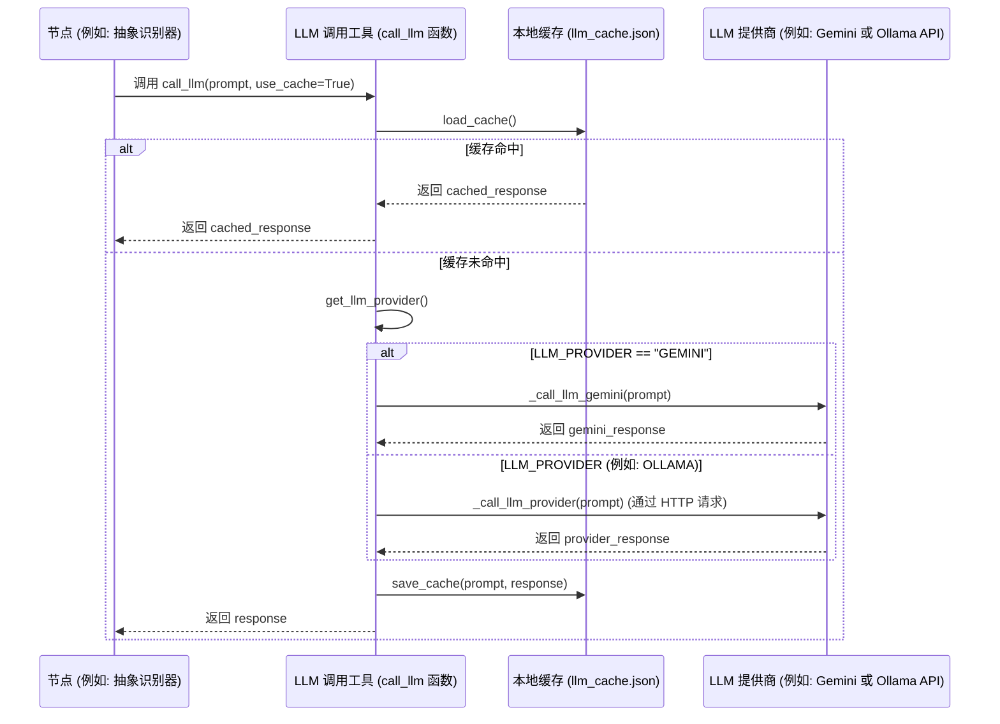

# Chapter 8: LLM 调用工具


在上一章[教程组合器](07_教程组合器_.md)中，我们完成了PocketFlow教程生成流程的最后一步：将所有独立的章节整合，生成了一个总览性的主索引文件，并最终将所有教程文件保存到了指定的输出目录。至此，一份完整的教程已经呈现在我们眼前。

现在，是时候揭示我们“自动化工厂”中那些“幕后英雄”之一了——**LLM 调用工具**。在前面的章节中，你可能已经多次看到 `call_llm()` 这个函数的身影，它在[抽象识别器](03_抽象识别器_.md)、[关系分析器](04_关系分析器_.md)、[章节排序器](05_章节排序器_.md)和[章节编写器](06_章节编写器_.md)中都扮演了核心角色。但它究竟是什么？它是如何工作的？

本章将深入探讨这个连接我们程序与强大大型语言模型（LLM）的桥梁。它就像一个高效的翻译官，负责将我们程序的问题（提示词）传递给LLM，并接收LLM的回答，确保整个信息传递过程的顺畅和高效。

## 概念详情

*   **名称**: LLM 调用工具
*   **描述**: 这个工具是与大型语言模型（LLM）沟通的桥梁，负责发送请求（提示）并接收回复。它就像一个翻译器，将我们的问题转换为LLM能理解的语言，并将LLM的回答翻译回来。它还包含缓存机制，以避免重复调用LLM，提高效率。

## 为什么要有一个“LLM 调用工具”？

在PocketFlow的教程生成过程中，很多智能化的任务，比如识别抽象概念、分析它们之间的关系、智能排序章节以及生成详细的章节内容，都离不开大型语言模型（LLM）的强大能力。LLM能够理解复杂的文本，进行推理，并生成高质量的自然语言和结构化数据。

但是，我们的Python程序不能直接“对话”LLM。我们需要一个专门的工具来处理以下问题：

1.  **统一接口**: 不同的LLM提供商（如Google Gemini, OpenAI, Ollama等）可能有不同的API接口和认证方式。LLM调用工具提供了一个统一的函数 `call_llm()`，无论后端使用哪种LLM，前端节点都可以用相同的方式调用。
2.  **请求管理**: 负责将我们精心构建的“提示词”（Prompt）发送给LLM服务。
3.  **响应解析**: 接收LLM返回的原始响应，并提取出我们真正需要的内容。
4.  **错误处理**: 在与LLM通信过程中，可能会遇到网络问题、API限制、模型错误等。工具需要妥善处理这些异常。
5.  **效率提升（缓存）**: LLM的调用通常需要时间和成本。如果对相同的提示词进行多次调用，每次都重新请求会造成浪费。缓存机制可以存储LLM的响应，当遇到相同的请求时，直接返回缓存结果，大大提高效率并降低成本。

它就像一个专业的“LLM经纪人”，替你打理所有与LLM相关的繁琐事务，让你专注于构建教程内容的逻辑，而无需关心底层的通信细节。

## 它是如何工作的？（核心用例）

假设[抽象识别器](03_抽象识别器_.md)需要LLM帮助识别代码中的核心概念。它会构建一个详细的提示词，然后简单地调用：

```python
response = call_llm(prompt, use_cache=True)
```

**LLM 调用工具**就会接管这个请求：
1.  **检查缓存**: 首先，它会检查本地缓存中是否有这个 `prompt` 对应的历史响应。
2.  **命中缓存**: 如果有，它会立即返回缓存中的结果，整个过程几乎是瞬时的，且不消耗LLM的API配额。
3.  **未命中缓存**: 如果缓存中没有，它会根据环境变量配置，选择一个LLM提供商（例如 Google Gemini 或 Ollama）。
4.  **发送请求**: 构建HTTP请求（包括API密钥、模型名称、提示词等），发送给LLM服务。
5.  **接收响应**: 等待LLM处理，并接收返回的响应数据。
6.  **解析响应**: 从响应中提取出LLM生成的文本内容。
7.  **更新缓存**: 将这个新的 `prompt` 和其 `response` 存储到本地缓存中，以备将来使用。
8.  **返回结果**: 将LLM的文本响应返回给 `抽象识别器`。

整个过程对 `抽象识别器` 来说是透明的，它只关心发送提示词和接收结果。

## 逐步解析：LLM 调用工具内部

LLM 调用工具的核心代码位于 `utils/call_llm.py` 文件中。

我们来看看它的核心代码片段：

```python
# utils/call_llm.py
from google import genai
import os
import logging
import json
import requests
from datetime import datetime

# ... (日志和缓存配置) ...

def get_llm_provider():
    # ... (获取LLM提供商的逻辑) ...
    return provider

def _call_llm_provider(prompt: str) -> str:
    """
    根据环境变量调用LLM提供商。
    支持通过统一的OpenAI兼容API调用Ollama、XAI等。
    """
    logger.info(f"PROMPT: {prompt}") # 记录提示词

    provider = os.environ.get("LLM_PROVIDER")
    # ... (环境变量验证和获取模型、URL、API密钥) ...

    url = f"{base_url.rstrip('/')}/v1/chat/completions" # OpenAI兼容API端点

    headers = {
        "Content-Type": "application/json",
    }
    if api_key:
        headers["Authorization"] = f"Bearer {api_key}"

    payload = {
        "model": model,
        "messages": [{"role": "user", "content": prompt}],
        "temperature": 0.7,
    }

    try:
        response = requests.post(url, headers=headers, json=payload)
        response_json = response.json()
        logger.info("RESPONSE:\n%s", json.dumps(response_json, indent=2))
        response.raise_for_status() # 检查HTTP错误
        return response.json()["choices"][0]["message"]["content"]
    except requests.exceptions.HTTPError as e:
        # ... (错误处理) ...
        raise Exception(error_message)
    # ... (其他异常处理) ...


def call_llm(prompt: str, use_cache: bool = True) -> str:
    # 记录提示词
    logger.info(f"PROMPT: {prompt}")

    # 如果启用缓存，则检查缓存
    if use_cache:
        cache = load_cache()
        if prompt in cache:
            logger.info(f"RESPONSE: {cache[prompt]}")
            return cache[prompt]

    provider = get_llm_provider()
    if provider == "GEMINI":
        response_text = _call_llm_gemini(prompt)
    else:  # 使用通用方法调用OpenAI兼容API
        response_text = _call_llm_provider(prompt)

    # 记录响应
    logger.info(f"RESPONSE: {response_text}")

    # 如果启用缓存，则更新缓存
    if use_cache:
        cache = load_cache()
        cache[prompt] = response_text
        save_cache(cache)

    return response_text


def _call_llm_gemini(prompt: str) -> str:
    """
    调用Google Gemini LLM。
    """
    # ... (Gemini API配置和调用逻辑) ...
    response = client.models.generate_content(
        model=model,
        contents=[prompt]
    )
    return response.text
```

### 核心函数：`call_llm(prompt: str, use_cache: bool = True) -> str`

这个函数是PocketFlow中所有LLM调用的入口点。

1.  **日志记录**: 每次调用都会将 `prompt` 记录到日志文件中，方便调试和跟踪。
2.  **缓存机制**:
    *   首先，它会尝试从本地文件 `llm_cache.json` 中加载缓存。
    *   如果 `use_cache` 为 `True` 且当前 `prompt` 存在于缓存中，它会立即返回缓存的结果，避免实际的LLM API调用。
    *   如果未命中缓存，它会继续执行实际的LLM调用。
    *   在成功获取LLM响应后，它会将 `prompt` 和 `response_text` 存储到缓存中，并保存到文件中，以便下次使用。
3.  **LLM提供商选择**:
    *   它通过 `get_llm_provider()` 函数确定要使用的LLM提供商。这个函数会检查环境变量 `LLM_PROVIDER`。如果未设置但检测到Gemini相关的环境变量，则默认为 "GEMINI"。
    *   如果提供商是 "GEMINI"，则调用 `_call_llm_gemini()` 函数。
    *   否则，调用 `_call_llm_provider()` 函数，这是一个通用的方法，适用于支持OpenAI兼容API的LLM（如Ollama、XAI等）。
4.  **返回响应**: 最终，它返回LLM生成的文本响应。

### 通用LLM调用函数：`_call_llm_provider(prompt: str) -> str`

这个函数负责处理除Google Gemini之外的，通过OpenAI兼容API进行调用的LLM。

1.  **环境变量配置**: 它读取 `LLM_PROVIDER`、`<PROVIDER>_MODEL`、`<PROVIDER>_BASE_URL` 和 `<PROVIDER>_API_KEY` 等环境变量来配置LLM模型、基础URL和API密钥。
2.  **构建请求**: 它构建一个HTTP `POST` 请求，目标是 `<BASE_URL>/v1/chat/completions`。这是OpenAI API的标准聊天完成端点。
    *   `headers` 包含 `Content-Type` 和 `Authorization`（如果提供了API密钥）。
    *   `payload` 包含模型名称、消息列表（`{"role": "user", "content": prompt}`）和温度参数（`temperature: 0.7` 用于控制生成文本的随机性）。
3.  **发送请求并处理响应**:
    *   使用 `requests` 库发送HTTP请求。
    *   `response.raise_for_status()` 用于检查HTTP响应状态码，如果不是2xx，则抛出异常。
    *   从JSON响应中提取LLM生成的文本内容 (`response.json()["choices"][0]["message"]["content"]`)。
4.  **错误处理**: 它包含了针对各种 `requests` 异常（如HTTP错误、连接错误、超时等）的详细错误处理，提高了鲁棒性。

### Gemini LLM调用函数：`_call_llm_gemini(prompt: str) -> str`

这个函数专门用于调用Google Gemini LLM。

1.  **API客户端配置**: 它根据环境变量 `GEMINI_PROJECT_ID` 或 `GEMINI_API_KEY` 来配置Google Gemini的API客户端。
2.  **模型调用**: 它使用 `client.models.generate_content()` 方法调用指定的Gemini模型（默认为 `gemini-2.5-pro-exp-03-25`），并传入提示词。
3.  **返回响应**: 返回Gemini模型生成的文本内容。

### 缓存机制：`load_cache()` 和 `save_cache()`

这两个辅助函数负责LLM响应的持久化缓存。

*   `load_cache()`: 尝试从 `llm_cache.json` 文件中加载JSON格式的缓存数据。如果文件不存在或无法解析，则返回一个空字典。
*   `save_cache()`: 将当前的缓存字典保存到 `llm_cache.json` 文件中。

### 日志记录

LLM 调用工具还集成了日志记录功能，将每次的提示词和LLM响应都记录到 `logs/llm_calls_YYYYMMDD.log` 文件中。这对于调试、分析LLM行为和审计API调用历史非常有帮助。

## 序列图：LLM 调用工具如何与LLM交互

让我们通过一个序列图来理解 `call_llm` 函数的内部工作流程：



## 总结

在本章中，我们深入探讨了PocketFlow教程生成流程中一个至关重要的“幕后英雄”：**LLM 调用工具**。我们了解到它如何作为一个高效的“翻译官”和“经纪人”，为我们的程序提供一个统一、健壮且高效的方式来与各种大型语言模型进行交互。

`call_llm` 函数通过其智能的缓存机制，显著提高了效率并降低了成本。它还通过 `_call_llm_provider` 和 `_call_llm_gemini` 两个内部函数，灵活地支持了不同的LLM提供商，同时提供了全面的错误处理和详细的日志记录。

理解这个工具的工作原理，有助于我们认识到LLM在PocketFlow中扮演的核心角色，以及如何通过精心设计的工具，将LLM的强大能力无缝集成到复杂的自动化流程中。

现在，你已经掌握了PocketFlow如何利用LLM来理解代码、生成内容的所有细节。接下来，我们将深入了解LLM所处理的“原材料”——**节点抽象**，这是PocketFlow中用于表示代码结构和概念的核心数据结构。

[下一章: 节点抽象](09_节点抽象_.md)

---

Generated by [AI Codebase Knowledge Builder](https://github.com/The-Pocket/Tutorial-Codebase-Knowledge)