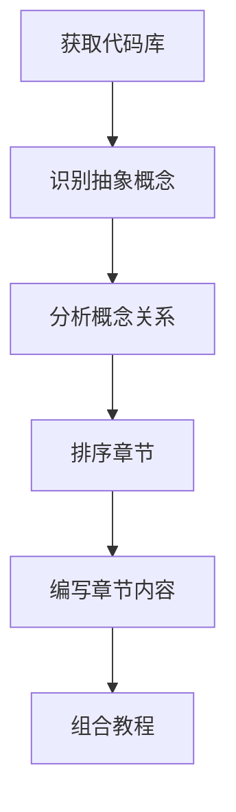
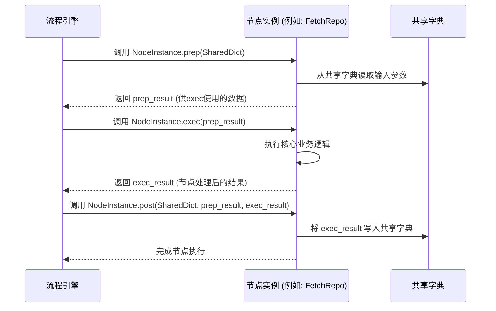

# Chapter 9: 节点抽象


在上一章[LLM 调用工具](08_llm_调用工具_.md)中，我们深入了解了PocketFlow如何通过一个高效的“翻译官”和“经纪人”——LLM 调用工具，与各种大型语言模型（LLM）进行交互。我们明白了LLM在我们的“自动化工厂”中扮演着内容创作、智能分析和决策的核心角色。

现在，是时候揭示这些LLM所处理的“原材料”——**节点抽象**了。你可能已经注意到，在[教程生成流程](01_教程生成流程_.md)的概览中，我们提到了“节点”是整个流程中的“工位”。而本章的“节点抽象”正是对这些“工位”更深层次的理解：它们是构成PocketFlow教程生成流程的基本构建块，每个节点都负责一个特定的任务。

想象一下一个乐高积木套装。每个积木都有其特定的形状、颜色和功能。你可以将这些积木组合起来，搭建出各种复杂的模型。在PocketFlow中，“节点”就如同这些乐高积木。它们是独立的、可复用的组件，通过巧妙的组合，能够创建出强大的自动化工作流。

## 概念详情

*   **名称**: 节点抽象
*   **描述**: 这些是教程生成流程中的基本构建块，每个节点都负责一个特定的任务，例如获取代码、识别抽象或编写章节。它们就像乐高积木，可以组合起来创建复杂的自动化工作流。通过将大任务分解为小任务，使整个流程更易于管理和扩展。

## 为什么要理解“节点抽象”？

在PocketFlow中，整个教程生成过程被分解成一系列离散的、可管理的小任务。每个任务都由一个“节点”来处理。理解节点抽象的重要性在于：

1.  **模块化与可维护性**: 每个节点只专注于一个任务，这使得代码结构清晰，易于理解和维护。当某个任务需要修改时，我们只需要关注对应的节点，而不会影响整个系统。
2.  **可扩展性**: 如果我们需要增加新的功能（例如，添加代码测试生成、自动部署教程等），我们只需要创建新的节点，并将其插入到现有流程中即可，而无需重写整个流程。
3.  **可复用性**: 某些节点（例如LLM调用工具）可以在不同的流程中被复用，提高了代码的利用率。
4.  **流程可视化**: 将复杂的流程分解为一个个节点，使得整个工作流可以通过图表（如Mermaid图）清晰地展示出来，便于理解和沟通。
5.  **容错性与重试**: 每个节点可以独立处理错误，甚至可以配置重试机制，提高了整个流程的鲁棒性。

它就像一个大型工厂的生产线，每个工位（节点）都有明确的分工，共同完成产品的制造（教程生成）。

## 它是如何工作的？（核心用例）

回想一下我们在[教程生成流程](01_教程生成流程_.md)中看到的流程图：



图中的每一个方框，例如“获取代码库”、“识别抽象概念”，都代表着一个**节点**。

在PocketFlow中，这些节点是通过 `pocketflow` 库中的 `Node` 类来实现的。例如，`FetchRepo` 就是一个负责“获取代码库”任务的节点。

我们来看一个具体的例子：当 `IdentifyAbstractions` 节点需要识别抽象概念时，它会接收来自 `FetchRepo` 节点的代码文件列表作为输入。`IdentifyAbstractions` 节点内部会调用LLM来完成识别任务，然后将识别出的抽象概念列表作为输出，传递给下一个节点 `AnalyzeRelationships`。

每个节点都像一个微型处理器，接收输入，执行特定逻辑，然后产生输出。

## 逐步解析：节点抽象的内部结构

在PocketFlow中，所有自定义的节点都继承自 `pocketflow` 库提供的 `Node` 或 `BatchNode` 基类。让我们以 `FetchRepo` 节点为例，看看一个典型的节点是如何抽象和工作的。

核心代码片段位于 `nodes.py` 文件中：

```python
# nodes.py
from pocketflow import Node, BatchNode
# ... 其他导入 ...

class FetchRepo(Node):
    def prep(self, shared):
        # 准备阶段：从共享字典获取输入，并返回供exec使用的数据
        repo_url = shared.get("repo_url")
        local_dir = shared.get("local_dir")
        # ... 其他参数 ...
        return {
            "repo_url": repo_url,
            "local_dir": local_dir,
            # ... 其他准备好的数据 ...
        }

    def exec(self, prep_res):
        # 执行阶段：接收prep的输出，执行核心业务逻辑
        if prep_res["repo_url"]:
            print(f"正在抓取仓库: {prep_res['repo_url']}...")
            result = crawl_github_files(...)
        else:
            print(f"正在抓取目录: {prep_res['local_dir']}...")
            result = crawl_local_files(...)
        files_list = list(result.get("files", {}).items())
        return files_list

    def post(self, shared, prep_res, exec_res):
        # 后处理阶段：将exec的输出存储到共享字典中，供后续节点使用
        shared["files"] = exec_res
```

### `Node` 基类

`pocketflow` 库提供了一个 `Node` 基类，它定义了所有节点都应该遵循的结构和生命周期。一个典型的节点通常包含以下三个核心方法：

1.  **`prep(self, shared)` 方法**:
    *   **作用**: 这是节点的“准备”阶段。它负责从全局的 `shared` 字典中获取节点所需的输入参数和数据。
    *   **输入**: `shared` 字典，这是一个贯穿整个流程的共享数据存储。
    *   **输出**: 一个字典或元组，包含 `exec` 方法执行所需的所有数据。这样做的好处是，`exec` 方法可以专注于业务逻辑，而无需直接访问 `shared` 字典，提高了内聚性。
    *   **类比**: 就像工厂工位上的工人，在开始工作前，先从仓库（`shared` 字典）领取所有需要的工具和原材料，并整理好放在自己的工作台上。

2.  **`exec(self, prep_res)` 方法**:
    *   **作用**: 这是节点的“执行”阶段，包含了节点的核心业务逻辑。它接收 `prep` 方法准备好的数据，并执行实际的任务。
    *   **输入**: `prep_res`，即 `prep` 方法的输出。
    *   **输出**: 节点处理后的结果数据。
    *   **类比**: 工人根据工作台上的材料和工具，开始进行实际的加工操作，并生产出半成品或成品。

3.  **`post(self, shared, prep_res, exec_res)` 方法**:
    *   **作用**: 这是节点的“后处理”阶段。它负责将 `exec` 方法的输出结果存储到全局的 `shared` 字典中，以便后续的节点可以访问和使用这些数据。
    *   **输入**: `shared` 字典、`prep_res`（`prep` 的输出）和 `exec_res`（`exec` 的输出）。
    *   **输出**: 无（通常）。
    *   **类比**: 工人将完成的半成品或成品，送回到仓库（`shared` 字典），以便其他工位或最终打包使用。

### `BatchNode` 基类

除了 `Node` 基类，PocketFlow 还提供了一个 `BatchNode` 基类，用于处理需要对多个项目并行或顺序执行相同逻辑的场景。例如，`WriteChapters` 节点就是 `BatchNode` 的一个实例，因为它需要为教程中的每一个章节编写内容。

`BatchNode` 的 `prep` 方法会返回一个可迭代对象（例如列表），其中每个元素代表一个要处理的“批次项”。`exec` 方法则会为每个批次项被调用一次。

```python
# nodes.py
class WriteChapters(BatchNode):
    def prep(self, shared):
        # ... 准备逻辑 ...
        items_to_process = []
        for i, abstraction_index in enumerate(shared["chapter_order"]):
            # 为每个章节准备一个item字典
            item = { /*... 章节相关数据 ...*/ }
            items_to_process.append(item)
        return items_to_process # 返回一个列表，每个元素都是一个批次项

    def exec(self, item):
        # 为每个item（即每个章节）执行此函数
        abstraction_name = item["abstraction_details"]["name"]
        # ... 编写章节内容的逻辑 ...
        return chapter_content

    def post(self, shared, prep_res, exec_res_list):
        # exec_res_list 包含了所有exec调用的结果（即所有章节的Markdown内容）
        shared["chapters"] = exec_res_list
```

### 节点之间的连接

在 `flow.py` 文件中，我们看到节点通过 `>>` 运算符连接起来：

```python
# flow.py
fetch_repo >> identify_abstractions
identify_abstractions >> analyze_relationships
# ...
```

这行代码 `fetch_repo >> identify_abstractions` 的含义是：
*   `fetch_repo` 节点的输出（通过其 `post` 方法写入 `shared` 字典）将作为 `identify_abstractions` 节点的输入（通过其 `prep` 方法从 `shared` 字典读取）。
*   这形象地展示了数据在不同节点之间是如何流动的，形成了一个有向无环图（DAG）的计算流程。

## 节点抽象的优势

通过这种“节点抽象”的设计，PocketFlow实现了以下优势：

*   **关注点分离**: 每个节点只关注其特定的任务，提高了代码的内聚性。
*   **松耦合**: 节点之间通过共享字典进行通信，减少了直接依赖，提高了灵活性。
*   **可测试性**: 每个节点都可以独立测试，确保其功能的正确性。
*   **错误处理**: PocketFlow的 `Node` 基类内置了重试机制，可以为每个节点配置失败重试策略，增强了整个流程的健壮性。

它就像一套高度模块化的机器，每个模块都可以独立工作，通过标准接口相互连接，共同完成复杂的任务。

## 序列图：一个典型的节点生命周期

让我们通过一个序列图来理解一个典型的 `Node` 在流程中是如何被执行的：



## 总结

在本章中，我们深入探讨了PocketFlow中**节点抽象**的核心概念。我们了解到，节点是构成整个教程生成流程的基本构建块，每个节点都负责一个特定的任务。通过 `prep`、`exec` 和 `post` 这三个核心方法，节点实现了职责分离，并与全局的 `shared` 字典进行数据交换。我们还了解了 `BatchNode` 如何处理批处理任务，以及节点之间如何通过 `>>` 运算符连接，形成清晰的数据流。

这种模块化的设计使得PocketFlow的教程生成流程具有高度的灵活性、可扩展性和可维护性，同时提高了整个系统的鲁棒性。理解节点抽象是理解PocketFlow内部工作原理的关键一步。

你现在已经掌握了PocketFlow从代码抓取到最终教程生成的所有关键概念和组件。希望这个系列教程能帮助你更好地利用PocketFlow的强大功能。

[返回目录](README.md)

---

Generated by [AI Codebase Knowledge Builder](https://github.com/The-Pocket/Tutorial-Codebase-Knowledge)