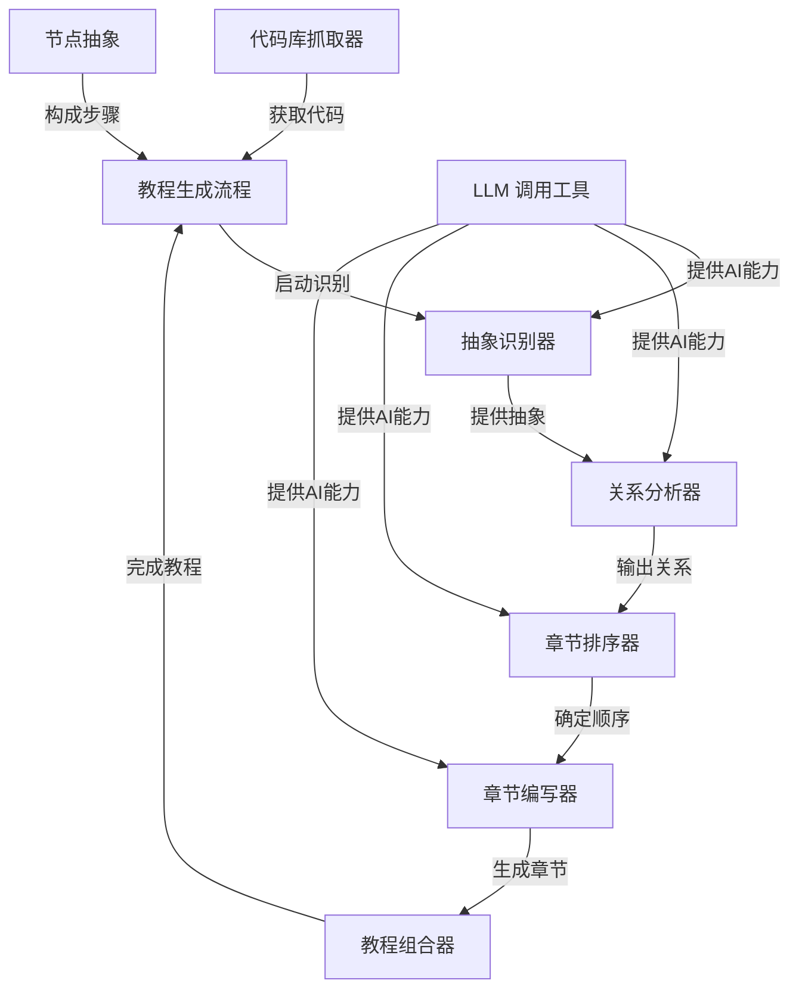

# Tutorial: PocketFlow-Tutorial-Codebase-Knowledge

`PocketFlow-Tutorial-Codebase-Knowledge`项目是一个**自动化教程生成器**，它能从GitHub仓库或本地代码库中抓取代码，**识别核心抽象概念**，分析它们之间的**关系**，然后自动**编写**和**组织**成一个清晰、易懂的Markdown格式教程。它就像一个智能作家，将复杂的代码库转化为**结构化的学习材料**，帮助新手快速理解项目。

**Source Repository:** [None](None)

## Chapters

1. [教程生成流程
](01_教程生成流程_.md)
2. [代码库抓取器
](02_代码库抓取器_.md)
3. [抽象识别器
](03_抽象识别器_.md)
4. [关系分析器
](04_关系分析器_.md)
5. [章节排序器
](05_章节排序器_.md)
6. [章节编写器
](06_章节编写器_.md)
7. [教程组合器
](07_教程组合器_.md)
8. [LLM 调用工具
](08_llm_调用工具_.md)
9. [节点抽象
](09_节点抽象_.md)

---

Generated by [AI Codebase Knowledge Builder](https://github.com/The-Pocket/Tutorial-Codebase-Knowledge)