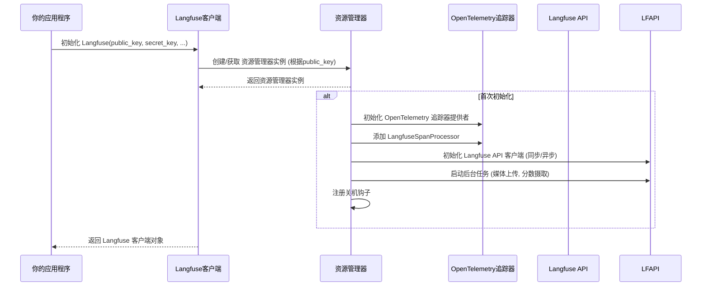

# Chapter 1: Langfuse客户端


欢迎来到Langfuse教程的第一章！在本章中，我们将深入了解Langfuse的核心组件之一：**Langfuse客户端**。

想象一下，你正在构建一个很酷的AI应用程序，它可能使用了大型语言模型（LLM）来回答问题、生成文本或执行其他智能任务。你希望知道你的AI应用程序表现如何：它给出了正确的答案吗？它运行得快吗？每次调用花了多少钱？

这就是Langfuse客户端发挥作用的地方。它就像你应用程序中的一个“记录员”。它负责收集所有与你的AI应用交互相关的信息，比如大语言模型的输入、输出、成本和延迟，并将这些数据发送到Langfuse平台进行可视化和分析。它还管理着后台任务，确保数据被高效、可靠地上传。

在本章中，我们将学习如何初始化Langfuse客户端，并了解它在幕后是如何工作的。

## 什么是Langfuse客户端？

Langfuse客户端是`langfuse-python`库的核心入口点。它是你与Langfuse平台进行交互的主要工具。当你初始化一个Langfuse客户端实例时，你实际上是在告诉Langfuse：“嘿，我准备好开始记录我的AI应用程序的活动了！”

它为你提供了一种简单的方式来：
1.  **记录**你的AI应用程序的每一步，从用户输入到LLM的响应。
2.  **发送**这些记录的数据到Langfuse云平台，以便进行分析和可视化。
3.  **管理**数据上传的幕后工作，确保数据可靠地到达平台。

## 为什么我们需要Langfuse客户端？

假设你正在开发一个智能聊天机器人。当用户提问时，你的机器人会调用一个LLM来生成答案。你不仅想知道最终的答案是什么，还想知道：
*   用户问了什么？
*   LLM收到了什么指令？
*   LLM生成了什么答案？
*   这次交互花了多长时间？
*   消耗了多少token，从而计算出成本？

如果没有Langfuse客户端，你需要手动编写代码来收集所有这些信息，然后自己存储和分析它们。这会非常繁琐且容易出错。Langfuse客户端将所有这些复杂性封装起来，让你只需几行代码就能轻松实现数据追踪。

## 如何初始化Langfuse客户端？

初始化Langfuse客户端非常简单。你只需要提供你的公共密钥（`public_key`）和秘密密钥（`secret_key`），以及Langfuse服务器的地址（`base_url`）。

```python
from langfuse import Langfuse

# 假设你已经从Langfuse平台获取了这些密钥和URL
# 请在实际应用中替换为你的真实密钥和URL
public_key = "pk-lf-..."
secret_key = "sk-lf-..."
base_url = "https://cloud.langfuse.com" # 或者你的自托管实例地址

# 初始化Langfuse客户端
langfuse = Langfuse(
    public_key=public_key,
    secret_key=secret_key,
    base_url=base_url,
)

print("Langfuse客户端已成功初始化！")
```

**代码解释：**
*   我们从`langfuse`库中导入了`Langfuse`类。
*   我们设置了`public_key`、`secret_key`和`base_url`。这些是连接到Langfuse平台所必需的凭据。
*   通过创建`Langfuse`类的一个实例，我们就初始化了客户端。这个`langfuse`对象现在就可以用来追踪你的AI应用程序的行为了。

初始化客户端后，它就会在后台准备好开始记录数据。

## Langfuse客户端的幕后工作

你可能好奇，当我们初始化`Langfuse()`时，幕后发生了什么？让我们通过一个简单的流程图来理解。



**流程解释：**
1.  **你的应用程序**调用`Langfuse()`来初始化客户端。
2.  **Langfuse客户端**不会直接做所有的事情。它会请求一个名为`LangfuseResourceManager`的组件来管理底层的资源。这个`ResourceManager`是一个单例模式，这意味着对于同一个`public_key`，只会有一个`ResourceManager`实例存在，这样可以节省资源。
3.  如果这是第一次使用这个`public_key`初始化，`ResourceManager`会进行一系列设置：
    *   它会配置一个**OpenTelemetry追踪器**。OpenTelemetry是一个开放标准，用于收集应用程序的遥测数据（追踪、指标和日志）。Langfuse利用它来标准化地收集追踪数据。
    *   它会添加一个**`LangfuseSpanProcessor`**。这是一个OpenTelemetry的组件，专门负责处理Langfuse的追踪数据，将其格式化并发送到Langfuse API。
    *   它会初始化与**Langfuse API**通信的客户端，用于发送数据。
    *   **后台任务**，如媒体上传和分数摄取，也会在这个阶段启动。这些任务在后台异步运行，确保你的应用程序性能不会因为数据上传而受影响。
    *   最后，它会注册一个**关机钩子**，确保当你的应用程序结束时，所有未发送的数据都能被正确地发送出去。
4.  一旦`ResourceManager`准备就绪，**Langfuse客户端**对象就会返回给你的应用程序，你就可以开始使用它了。

## 深入了解内部实现

让我们看一些`langfuse-python`库中的代码片段，来理解上述流程是如何实现的。

### `LangfuseResourceManager` - 核心资源管理器

`LangfuseResourceManager`是负责管理所有底层资源的类。它是一个线程安全的单例，确保每个`public_key`只有一个实例。

```python
# langfuse/_client/resource_manager.py
class LangfuseResourceManager:
    _instances: Dict[str, "LangfuseResourceManager"] = {}
    _lock = threading.RLock()

    def __new__(
        cls,
        *,
        public_key: str,
        secret_key: str,
        base_url: str,
        # ... 其他配置参数
    ) -> "LangfuseResourceManager":
        if public_key in cls._instances:
            return cls._instances[public_key] # 如果已存在，则返回现有实例

        with cls._lock:
            # 确保在多线程环境下只有一个实例被创建
            if public_key not in cls._instances:
                instance = super(LangfuseResourceManager, cls).__new__(cls)
                instance._initialize_instance(...) # 首次初始化
                cls._instances[public_key] = instance
            return cls._instances[public_key]
```

**代码解释：**
*   `_instances`字典存储了不同`public_key`对应的`LangfuseResourceManager`实例。
*   `_lock`用于在多线程环境中保护`_instances`字典，确保线程安全。
*   `__new__`方法是Python中创建对象的第一步。在这里，它检查是否已经存在对应`public_key`的实例。如果存在，就直接返回现有实例，避免重复创建。如果不存在，它会在一个锁的保护下创建并初始化一个新实例。
*   `_initialize_instance`方法包含了所有设置OpenTelemetry追踪器、API客户端和后台任务的逻辑。

### OpenTelemetry追踪器初始化

`_initialize_instance`方法中一个关键的部分是初始化OpenTelemetry追踪器，并设置`LangfuseSpanProcessor`。

```python
# langfuse/_client/resource_manager.py (在 _initialize_instance 方法内部)
        # OTEL Tracer
        if tracing_enabled:
            tracer_provider = tracer_provider or _init_tracer_provider(
                environment=environment, release=release, sample_rate=sample_rate
            )
            self.tracer_provider = tracer_provider

            langfuse_processor = LangfuseSpanProcessor(
                public_key=self.public_key,
                secret_key=secret_key,
                base_url=base_url,
                # ... 其他参数
            )
            tracer_provider.add_span_processor(langfuse_processor)

            self._otel_tracer = tracer_provider.get_tracer(
                LANGFUSE_TRACER_NAME,
                langfuse_version,
                attributes={"public_key": self.public_key},
            )
```

**代码解释：**
*   `_init_tracer_provider`函数负责创建或获取一个OpenTelemetry的`TracerProvider`。它还会设置资源属性，如环境（`environment`）和发布版本（`release`），以及采样率（`sample_rate`）。采样率决定了有多少比例的追踪数据会被发送。
*   `LangfuseSpanProcessor`是Langfuse自定义的OpenTelemetry `SpanProcessor`。它的主要工作是将OpenTelemetry的Span（追踪数据）转换成Langfuse平台能够理解的格式，并将其发送到Langfuse API。
*   最后，`tracer_provider.get_tracer`会获取一个OpenTelemetry `Tracer`实例，这个实例就是实际用来创建和管理Span的工具。

### 获取客户端的辅助函数

你可能还注意到`langfuse`库提供了一个`get_client()`函数。这个函数在某些情况下非常有用，特别是当你不想每次都手动传递`public_key`和`secret_key`时。

```python
# langfuse/_client/get_client.py
from langfuse._client.client import Langfuse
from langfuse._client.resource_manager import LangfuseResourceManager

def get_client(*, public_key: Optional[str] = None) -> Langfuse:
    with LangfuseResourceManager._lock:
        active_instances = LangfuseResourceManager._instances

        if not public_key:
            # 如果没有指定public_key，并且只有一个客户端实例，则返回该实例
            if len(active_instances) == 1:
                instance = list(active_instances.values())[0]
                return _create_client_from_instance(instance)
            # 如果有多个实例但未指定public_key，为防止数据泄露，返回一个禁用追踪的客户端
            elif len(active_instances) > 1:
                langfuse_logger.warning(...)
                return Langfuse(tracing_enabled=False, public_key="fake", secret_key="fake")
            # 如果还没有任何实例，则创建一个默认客户端
            else:
                return Langfuse()
        else:
            # 如果指定了public_key，则查找对应的实例并创建客户端
            target_instance = active_instances.get(public_key, None)
            if target_instance is None:
                langfuse_logger.warning(...)
                return Langfuse(tracing_enabled=False, public_key="fake", secret_key="fake")
            return _create_client_from_instance(target_instance, public_key)
```

**代码解释：**
*   `get_client()`函数会检查当前进程中已经初始化的`LangfuseResourceManager`实例。
*   如果你的应用程序只有一个Langfuse客户端实例（即只用一个`public_key`初始化过一次），那么即使你不传递`public_key`给`get_client()`，它也能智能地返回这个唯一的客户端。
*   如果你的应用程序初始化了多个Langfuse客户端实例（使用了不同的`public_key`），那么你必须明确指定`public_key`，`get_client()`才能返回正确的客户端。这样做是为了防止数据意外地发送到错误的Langfuse项目，从而避免数据泄露。
*   如果出现模棱两可的情况（有多个实例但未指定`public_key`），`get_client()`会返回一个`tracing_enabled=False`的客户端，这意味着它不会记录任何数据，以确保安全。

## 总结

在本章中，我们学习了Langfuse客户端是`langfuse-python`库的核心。它充当了你的AI应用程序和Langfuse平台之间的桥梁，负责收集、处理和上传追踪数据。我们了解了如何简单地初始化客户端，以及它在幕后如何利用`LangfuseResourceManager`和OpenTelemetry来管理资源、处理数据并确保高效可靠的上传。

理解Langfuse客户端的工作原理是使用Langfuse进行AI可观测性的第一步。在接下来的章节中，我们将学习如何使用客户端来追踪你的AI应用程序的各种组件。

接下来，我们将学习如何使用 [Langfuse观察封装器](02_langfuse观察封装器_.md) 来实际记录你的AI应用程序的活动。

---

Generated by [AI Codebase Knowledge Builder](https://github.com/The-Pocket/Tutorial-Codebase-Knowledge)