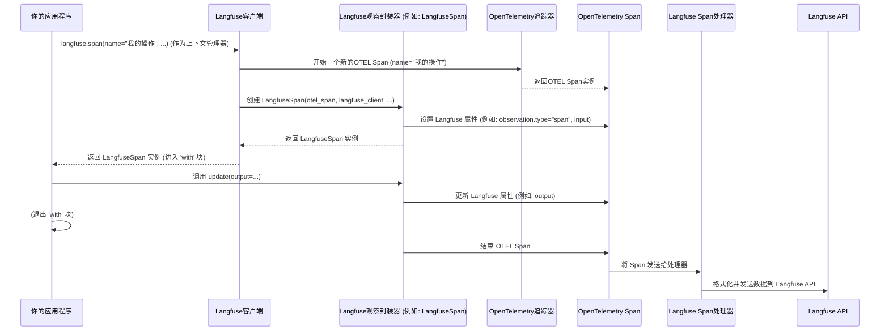

# Chapter 2: Langfuse观察封装器


欢迎回到Langfuse教程！在上一章 [Langfuse客户端](01_langfuse客户端_.md) 中，我们学习了如何初始化Langfuse客户端，以及它如何作为你的AI应用与Langfuse平台之间的桥梁。客户端就像一个“记录员”，准备好收集你应用程序的各种活动数据。

现在，我们有了这个准备好记录的“记录员”，下一步就是告诉它要记录什么。这就是**Langfuse观察封装器**发挥作用的地方。你可以把它想象成一个“操作记录本”，它记录了你AI应用中每个独立操作（比如一次大语言模型调用、一个工具使用或一个函数执行）的所有细节。它不仅记录了操作的输入、输出、元数据，还能让你对这些操作进行评分，并将它们组织成一个结构化的追踪。

## 什么是Langfuse观察封装器？

Langfuse观察封装器是Langfuse追踪系统的核心。它是一系列包装器类（例如`LangfuseSpan`、`LangfuseGeneration`等），旨在让你轻松地追踪AI应用程序中的各种操作。

想象一下你正在开发一个复杂的AI应用，比如一个RAG（检索增强生成）系统。这个系统可能会经历以下几个步骤：
1.  用户提出一个问题。
2.  你的应用使用一个检索器（Retriever）从数据库中查找相关文档。
3.  找到的文档被传递给一个大型语言模型（LLM）。
4.  LLM根据文档生成答案。

每个步骤都是一个独立的操作，你可能想知道：
*   检索器收到了什么查询？返回了什么文档？
*   LLM收到了什么指令和文档？生成了什么答案？
*   每个步骤耗时多久？消耗了多少资源？
*   用户对最终答案满意吗？

Langfuse观察封装器就是用来记录这些“操作”的。它将这些操作封装成“观察”（Observations），每个观察都是一个带有输入、输出、元数据和时间的独立记录。这些观察会被组织成一个有层次的“追踪”（Trace），反映了你的应用程序的执行流程。

## 使用Langfuse观察封装器追踪你的应用

Langfuse客户端提供了几种方法来创建和管理观察：
1.  `langfuse.span()`: 用于追踪通用操作。
2.  `langfuse.generation()`: 用于追踪LLM调用。
3.  `langfuse.event()`: 用于记录瞬时事件。

这些方法通常作为**上下文管理器**使用，这样可以确保操作的开始和结束时间被正确记录，即使发生错误也能正确处理。

### 示例用例：追踪一个简单的LLM调用

让我们从一个简单的用例开始：追踪你的应用程序中一次LLM调用。

首先，确保你已经初始化了Langfuse客户端（如果你忘记了，可以回顾 [Langfuse客户端](01_langfuse客户端_.md) 章节）。

```python
from langfuse import Langfuse
import os

# 假设你已经设置了环境变量或直接提供了密钥
# 在实际应用中，请使用安全的方式管理你的API密钥
langfuse = Langfuse(
    public_key=os.environ.get("LANGFUSE_PUBLIC_KEY"),
    secret_key=os.environ.get("LANGFUSE_SECRET_KEY"),
    base_url=os.environ.get("LANGFUSE_BASE_URL", "https://cloud.langfuse.com"),
)

print("Langfuse客户端已成功初始化！")
```
**代码解释：**
*   我们从环境变量中获取Langfuse的密钥和URL，这是推荐的实践方式。
*   初始化`Langfuse`客户端实例，以便后续使用。

现在，让我们模拟一个LLM调用，并使用`langfuse.generation()`来追踪它。

```python
# 模拟一个LLM调用函数
def call_llm(prompt_text: str):
    # 实际的LLM调用会在这里发生
    # 假设LLM返回一个简单的响应
    print(f"LLM正在处理提示: '{prompt_text}'")
    response_text = f"LLM的响应：关于'{prompt_text}'，这是一个生成的结果。"
    return response_text

# 使用Langfuse追踪一个LLM调用
with langfuse.generation(name="我的第一个LLM生成", input="介绍一下Langfuse"):
    llm_output = call_llm("介绍一下Langfuse")
    print(f"LLM输出: {llm_output}")

print("LLM调用已追踪。")
```
**代码解释：**
*   `with langfuse.generation(...)`创建了一个类型为“generation”的观察。它是一个上下文管理器，当进入`with`块时，观察开始；当退出`with`块时，观察结束。
*   `name="我的第一个LLM生成"`给这个观察起了一个有意义的名字。
*   `input="介绍一下Langfuse"`记录了LLM的输入。
*   `call_llm("介绍一下Langfuse")`是模拟的LLM调用。
*   Langfuse会自动捕获这个`generation`的开始和结束时间。

运行这段代码后，你可以在Langfuse UI中看到一个名为“我的第一个LLM生成”的追踪，其中包含了这个LLM调用的详细信息。

### 记录更丰富的细节

仅仅记录输入和名称是不够的。Langfuse观察封装器允许你记录大量有用的信息，例如：
*   `output`: LLM的输出。
*   `metadata`: 任何你希望关联的自定义数据（例如用户ID、请求ID）。
*   `model`: 使用的LLM模型名称。
*   `usage_details`: token使用量、成本等。
*   `level`: 观察的级别（例如“INFO”、“WARNING”、“ERROR”）。

让我们扩展上面的例子：

```python
import time

# 模拟一个更真实的LLM调用函数
def call_llm_with_details(prompt_text: str, model_name: str):
    print(f"调用模型 '{model_name}' 处理提示: '{prompt_text}'")
    time.sleep(0.1) # 模拟LLM响应时间
    response_text = f"LLM ({model_name}) 的响应：关于'{prompt_text}'，这是一个更详细的生成结果。"
    
    # 模拟token使用量
    prompt_tokens = len(prompt_text) // 2 # 假设每个token 2个字符
    completion_tokens = len(response_text) // 2
    total_tokens = prompt_tokens + completion_tokens
    
    return {
        "text": response_text,
        "usage": {"prompt_tokens": prompt_tokens, "completion_tokens": completion_tokens, "total_tokens": total_tokens},
        "cost": total_tokens * 0.000002 # 模拟成本
    }

# 使用Langfuse追踪一个LLM调用，并记录更多细节
with langfuse.generation(
    name="详细LLM生成",
    input="Langfuse如何帮助我分析LLM应用？",
    model="gpt-4",
    metadata={"user_id": "user-123", "request_id": "req-abc"},
    level="INFO"
) as gen: # 'gen' 是 LangfuseGeneration 实例
    llm_result = call_llm_with_details("Langfuse如何帮助我分析LLM应用？", "gpt-4")
    
    # 使用 gen.update() 来更新观察的输出、使用细节和成本
    gen.update(
        output=llm_result["text"],
        usage_details=llm_result["usage"],
        cost_details={"total_cost": llm_result["cost"]}
    )
    print(f"LLM详细输出: {llm_result['text']}")

print("详细LLM调用已追踪。")
```
**代码解释：**
*   我们现在在`langfuse.generation`中直接提供了`model`、`metadata`和`level`。
*   `as gen`将上下文管理器返回的`LangfuseGeneration`实例赋值给变量`gen`。
*   在LLM调用完成后，我们使用`gen.update()`方法来更新这个观察的`output`、`usage_details`和`cost_details`。这是因为LLM的输出和使用信息通常在调用结束后才能获取。

### 创建嵌套的观察（追踪）

一个真实的AI应用通常包含多个步骤，这些步骤是相互关联的。Langfuse允许你创建嵌套的观察，形成一个有层次的追踪结构。这对于理解复杂系统的执行流程至关重要。

让我们模拟一个“问答”流程，其中包含一个“搜索”步骤（一个通用`span`）和一个“生成答案”步骤（一个`generation`）。

```python
# 模拟一个搜索函数
def search_documents(query: str):
    print(f"正在搜索文档: '{query}'")
    time.sleep(0.05)
    return ["文档A: Langfuse是一个LLM可观测性平台。", "文档B: 它可以追踪和评估LLM应用。"]

# 模拟一个LLM生成答案的函数
def generate_answer_from_docs(query: str, documents: list):
    print(f"LLM正在根据文档生成答案...")
    time.sleep(0.1)
    combined_input = f"用户问题: {query}\n相关文档: {' '.join(documents)}"
    response = f"根据文档，Langfuse是一个用于追踪和评估LLM应用的可观测性平台，它可以帮助你分析LLM性能。"
    return {
        "text": response,
        "usage": {"prompt_tokens": len(combined_input)//2, "completion_tokens": len(response)//2},
        "model": "gpt-4"
    }

# 使用Langfuse追踪一个问答流程
with langfuse.span(name="问答流程", input="Langfuse是什么？") as qa_span:
    # 在问答流程中创建一个子span用于搜索
    with qa_span.start_as_current_observation(name="搜索文档", as_type="span", input={"query": "Langfuse"}) as search_span:
        documents = search_documents("Langfuse")
        search_span.update(output={"documents": documents})
    
    # 在问答流程中创建一个子generation用于生成答案
    with qa_span.start_as_current_observation(
        name="生成最终答案", 
        as_type="generation",
        input={"query": "Langfuse是什么？", "documents": documents}
    ) as gen_span:
        llm_answer = generate_answer_from_docs("Langfuse是什么？", documents)
        gen_span.update(
            output=llm_answer["text"],
            model=llm_answer["model"],
            usage_details=llm_answer["usage"]
        )
    
    qa_span.update(output={"final_answer": llm_answer["text"]})

print("问答流程已完成并追踪。")
```
**代码解释：**
*   我们首先使用`langfuse.span(name="问答流程", ...)`创建了一个顶级的通用观察`qa_span`。
*   在`qa_span`的上下文中，我们使用`qa_span.start_as_current_observation(name="搜索文档", as_type="span", ...)`创建了一个子观察`search_span`。`as_type="span"`表示这是一个通用操作。
*   接着，又创建了一个子观察`gen_span`，类型为`as_type="generation"`，用于模拟LLM调用。
*   `start_as_current_observation`方法非常重要，它不仅创建了子观察，还将其设置为当前的OpenTelemetry上下文中的活动观察。这意味着当你在`gen_span`内部创建任何更深层次的观察时，它们会自动成为`gen_span`的子观察，从而构建出正确的追踪层次结构。

通过这种方式，Langfuse UI会显示一个清晰的树状结构，展示“问答流程”包含“搜索文档”和“生成最终答案”两个子步骤，帮助你直观地理解应用的执行路径和性能瓶颈。

## 观察封装器的内部工作原理

现在，让我们稍微深入一点，了解Langfuse观察封装器是如何在幕后工作的。

还记得上一章提到的OpenTelemetry吗？Langfuse观察封装器就是基于OpenTelemetry的**Span**（追踪段）构建的。当你创建一个`LangfuseSpan`或`LangfuseGeneration`时，实际上是创建了一个OpenTelemetry Span，并为其添加了Langfuse特有的属性。

### 流程图：创建观察


**流程解释：**
1.  **你的应用程序**通过`langfuse.span()`或`langfuse.generation()`等方法请求创建一个新的观察。
2.  **Langfuse客户端**接收到请求后，会利用其内部的**OpenTelemetry追踪器**来**开始一个新的OpenTelemetry Span**。这个Span是所有追踪数据的载体。
3.  **Langfuse客户端**将这个底层的OpenTelemetry Span封装在一个**Langfuse观察封装器**实例（例如`LangfuseSpan`或`LangfuseGeneration`）中。
4.  在封装器的`__init__`方法中，会根据传入的参数（如`input`、`metadata`、`as_type`等）将这些数据作为**OpenTelemetry Span的属性**设置进去。
5.  当你的代码退出`with`块时，封装器的`__exit__`方法（或者手动调用的`end()`方法）会被触发，它会告诉底层的**OpenTelemetry Span**操作已**结束**。
6.  OpenTelemetry Span结束时，它会将自身的数据传递给配置好的**Langfuse Span处理器**。
7.  **Langfuse Span处理器**负责将OpenTelemetry Span的数据转换为Langfuse平台能够理解的格式，并通过网络发送到**Langfuse API**。

### 代码片段：`LangfuseObservationWrapper` 的核心

在`langfuse/_client/span.py`文件中，`LangfuseObservationWrapper`是所有具体观察封装器（如`LangfuseSpan`、`LangfuseGeneration`）的基类。

```python
# langfuse/_client/span.py
class LangfuseObservationWrapper:
    def __init__(
        self,
        *,
        otel_span: otel_trace_api.Span, # 包装的OpenTelemetry Span
        langfuse_client: "Langfuse",
        as_type: ObservationTypeLiteral, # 观察类型（"span", "generation"等）
        input: Optional[Any] = None,
        output: Optional[Any] = None,
        metadata: Optional[Any] = None,
        # ... 其他参数
    ):
        self._otel_span = otel_span # 保存对底层OTEL Span的引用
        self._langfuse_client = langfuse_client
        self._observation_type = as_type

        # 设置观察类型属性
        self._otel_span.set_attribute(
            LangfuseOtelSpanAttributes.OBSERVATION_TYPE, as_type
        )

        # 处理输入、输出、元数据中的媒体内容并应用掩码
        # (这部分逻辑在 _process_media_and_apply_mask 和 _mask_attribute 方法中)
        media_processed_input = self._process_media_and_apply_mask(
            data=input, field="input", span=self._otel_span
        )
        # ... 类似地处理 output 和 metadata

        attributes = {}
        if as_type in get_observation_types_list(ObservationTypeGenerationLike):
            # 如果是generation类型，创建generation特有的属性
            attributes = create_generation_attributes(
                input=media_processed_input,
                output=media_processed_output,
                metadata=media_processed_metadata,
                # ... 其他generation参数
            )
        else:
            # 否则，创建span特有的属性
            attributes = create_span_attributes(
                input=media_processed_input,
                output=media_processed_output,
                metadata=media_processed_metadata,
                # ... 其他span参数
            )
        
        # 将所有属性设置到底层OTEL Span上
        self._otel_span.set_attributes(
            {k: v for k, v in attributes.items() if v is not None}
        )
        # ... 省略其他初始化逻辑
```
**代码解释：**
*   `LangfuseObservationWrapper`的`__init__`方法接收一个`otel_span`（OpenTelemetry Span实例）和`langfuse_client`作为核心参数。
*   `as_type`参数决定了这个观察的类型（例如“span”或“generation”），并作为OpenTelemetry Span的一个属性被设置。
*   它调用内部方法来处理输入、输出和元数据，可能包括上传媒体文件（如果启用）和应用数据掩码（如果配置）。
*   根据`as_type`，它会调用`create_generation_attributes`或`create_span_attributes`函数（定义在`langfuse/_client/attributes.py`中）来构造一个字典，其中包含所有Langfuse特有的属性。
*   最后，这些Langfuse属性被批量设置到底层的`_otel_span`上。

### `start_as_current_observation` 方法

当你使用像`with qa_span.start_as_current_observation(...)`这样的嵌套调用时，`LangfuseObservationWrapper`中的`start_as_current_observation`方法是关键。

```python
# langfuse/_client/span.py (在 LangfuseObservationWrapper 类中)
    def start_as_current_observation(  # type: ignore[misc]
        self,
        *,
        name: str,
        as_type: ObservationTypeLiteralNoEvent,
        # ... 其他参数
    ) -> _AgnosticContextManager[Any]: # 返回一个上下文管理器
        """创建新的子观察并将其设置为当前观察上下文。"""
        # 内部调用 Langfuse 客户端的 _create_span_with_parent_context 方法
        return self._langfuse_client._create_span_with_parent_context(
            name=name,
            as_type=as_type,
            remote_parent_span=None,
            parent=self._otel_span, # 这里的关键是传递当前的 otel_span 作为父级
            # ... 其他参数
        )
```
**代码解释：**
*   这个方法实际上是委托给`Langfuse`客户端的私有方法`_create_span_with_parent_context`。
*   最关键的一点是，它将**当前封装器所包装的`_otel_span`作为`parent`参数传递给子观察的创建函数**。
*   OpenTelemetry会自动识别这个父子关系，从而构建出正确的追踪层次结构。

## 总结

在本章中，我们深入学习了Langfuse观察封装器，它是Langfuse追踪系统的核心。我们了解了如何使用`langfuse.span()`、`langfuse.generation()`和`langfuse.event()`等方法来记录AI应用中的各种操作。通过上下文管理器和`update()`方法，我们可以灵活地捕获操作的输入、输出、元数据，并创建嵌套的追踪结构。

理解这些观察封装器的工作原理，以及它们如何利用OpenTelemetry在幕后构建追踪，是充分利用Langfuse进行AI可观测性的关键。

接下来，我们将学习如何使用 [Langchain回调处理器](03_langchain回调处理器_.md) 来更方便地集成Langfuse到你的Langchain应用中。

---

Generated by [AI Codebase Knowledge Builder](https://github.com/The-Pocket/Tutorial-Codebase-Knowledge)