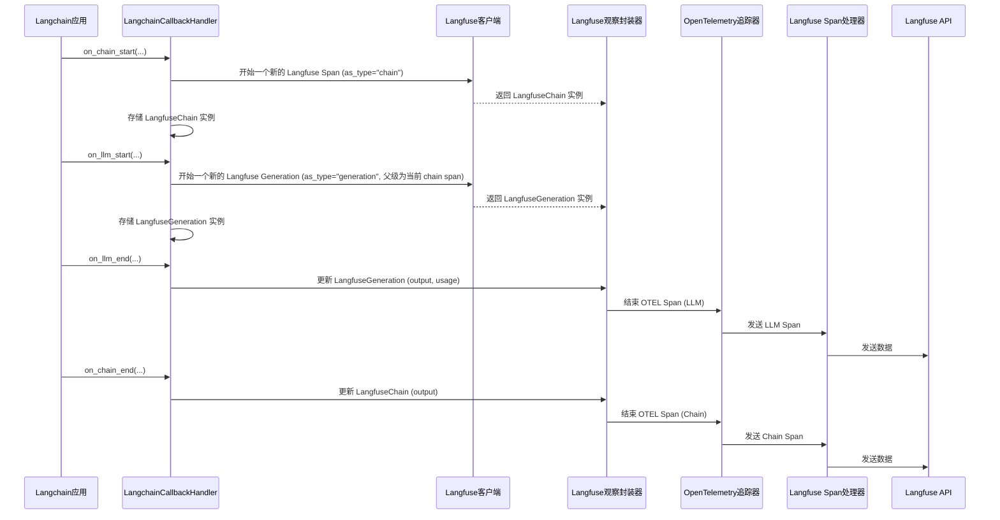

# Chapter 3: Langchain回调处理器


欢迎回到Langfuse教程！在上一章 [Langfuse观察封装器](02_langfuse观察封装器_.md) 中，我们学习了如何使用Langfuse的观察封装器来手动追踪AI应用中的各种操作，例如LLM调用和通用操作。这让你对追踪的细节有了很好的控制。

然而，如果你正在使用像Langchain这样流行的框架来构建你的AI应用，你可能会发现手动在每个LLM调用、链执行或工具使用周围添加`with langfuse.generation()`或`with langfuse.span()`会非常繁琐。Langchain本身就提供了丰富的回调（Callbacks）机制，用于在内部事件发生时执行自定义逻辑。

这就是**Langchain回调处理器**发挥作用的地方。它就像Langfuse与Langchain框架之间的“翻译官”。当你使用Langchain构建AI应用时，它能自动捕获Langchain内部的各种事件（如LLM调用、链执行、工具使用），并将这些事件转换成Langfuse可理解的追踪数据。这让你无需手动修改代码，就能在Langfuse中看到Langchain应用的详细运行情况。

## 什么是Langchain回调处理器？

想象一下，你正在用Langchain搭建一个复杂的AI代理（Agent），它可能会：
1.  接收用户输入。
2.  决定使用哪个工具（Tool）。
3.  执行工具。
4.  根据工具结果调用LLM生成响应。

这些步骤在Langchain内部都会触发一系列事件（例如`on_llm_start`、`on_tool_start`、`on_chain_end`等）。Langchain回调处理器（`LangchainCallbackHandler`）是一个特殊的类，它“监听”这些事件。每当Langchain内部发生一个相关事件时，回调处理器就会被调用，然后它负责将这些事件数据“翻译”成Langfuse的观察（Observations），并发送给Langfuse平台。

这样，你就不需要手动编写代码来追踪每个LLM调用或工具使用，Langfuse回调处理器会自动为你完成。

## 如何使用Langchain回调处理器？

使用Langchain回调处理器非常简单。你只需要创建它的一个实例，然后将其传递给你的Langchain组件。

首先，确保你已经初始化了Langfuse客户端（如果你忘记了，可以回顾 [Langfuse客户端](01_langfuse客户端_.md) 章节）。

```python
import os
from langfuse import Langfuse

# 假设你已经设置了环境变量或直接提供了密钥
# 在实际应用中，请使用安全的方式管理你的API密钥
langfuse = Langfuse(
    public_key=os.environ.get("LANGFUSE_PUBLIC_KEY"),
    secret_key=os.environ.get("LANGFUSE_SECRET_KEY"),
    base_url=os.environ.get("LANGFUSE_BASE_URL", "https://cloud.langfuse.com"),
)

print("Langfuse客户端已成功初始化！")
```

现在，让我们创建一个Langchain LLM，并使用`LangchainCallbackHandler`来追踪它的调用。

```python
from langchain_openai import ChatOpenAI
from langfuse.langchain import CallbackHandler

# 1. 初始化Langfuse回调处理器
langfuse_handler = CallbackHandler()

# 2. 初始化一个Langchain LLM
# 确保你设置了OPENAI_API_KEY环境变量
llm = ChatOpenAI(
    model="gpt-3.5-turbo",
    temperature=0,
    callbacks=[langfuse_handler] # 将回调处理器传递给LLM
)

# 3. 调用LLM
response = llm.invoke("Langfuse是一个什么平台？")

print(f"LLM的响应: {response.content}")
print("Langchain LLM调用已通过Langfuse追踪。")

# 为了确保所有追踪数据都已发送，通常在应用结束时调用flush
langfuse.flush()
```

**代码解释：**
*   我们从`langfuse.langchain`导入了`CallbackHandler`。
*   `langfuse_handler = CallbackHandler()` 创建了一个回调处理器实例。这个处理器会自动连接到前面初始化过的Langfuse客户端。
*   在初始化`ChatOpenAI`时，我们将`callbacks=[langfuse_handler]`传递给它。这意味着每当这个LLM被调用时，`langfuse_handler`就会收到通知。
*   当你运行这段代码时，Langfuse回调处理器会自动捕获`llm.invoke()`的开始和结束，以及LLM的输入和输出，并将其作为一次`generation`追踪发送到Langfuse平台。你可以在Langfuse UI中看到这个LLM调用的详细追踪。

### 追踪更复杂的Langchain链

`LangchainCallbackHandler`的真正威力在于它能够自动追踪复杂的Langchain链（Chains）和代理（Agents）。你只需将回调处理器传递给顶层组件，它就会自动追踪所有子组件的事件。

让我们看一个简单的Langchain链的例子：

```python
from langchain_core.prompts import ChatPromptTemplate
from langchain_core.output_parsers import StrOutputParser
from langchain_openai import ChatOpenAI
from langfuse.langchain import CallbackHandler
import os

# 1. 初始化Langfuse回调处理器
langfuse_handler = CallbackHandler()

# 2. 定义Prompt模板
prompt = ChatPromptTemplate.from_messages([
    ("system", "你是一个乐于助人的AI助手。"),
    ("user", "{question}")
])

# 3. 初始化LLM (同样将回调处理器传递给LLM)
llm = ChatOpenAI(model="gpt-3.5-turbo", temperature=0, callbacks=[langfuse_handler])

# 4. 初始化输出解析器
output_parser = StrOutputParser()

# 5. 构建链
chain = prompt | llm | output_parser

# 6. 调用链
question = "用一句话解释Langfuse。"
response = chain.invoke({"question": question})

print(f"链的响应: {response}")
print("Langchain链调用已通过Langfuse追踪。")

langfuse.flush()
```

**代码解释：**
*   即使我们只是将`langfuse_handler`传递给了LLM，由于链的执行会通过LLM，Langfuse回调处理器依然能够捕获到LLM的调用。
*   如果你将回调处理器直接传递给`chain.invoke()`方法（例如`chain.invoke({"question": question}, config={"callbacks": [langfuse_handler]})`），那么整个链的开始和结束也会被追踪为一个`chain`观察，而内部的LLM调用则会作为其子`generation`。这种方式更推荐，因为它能提供更完整的追踪视图。

```python
# 重新运行链，但这次将回调处理器传递给链的invoke方法
from langchain_core.runnables import RunnableConfig

# 创建一个配置对象，包含回调处理器
config: RunnableConfig = {"callbacks": [langfuse_handler]}

response_with_chain_trace = chain.invoke({"question": question}, config=config)

print(f"链的响应 (带链追踪): {response_with_chain_trace}")
print("Langchain链调用已通过Langfuse追踪 (包括链本身的观察)。")

langfuse.flush()
```

现在，你将在Langfuse UI中看到一个顶级的`chain`观察，其内部包含一个`generation`观察。这完美地反映了Langchain链的执行结构。

## Langchain回调处理器的内部工作原理

`LangchainCallbackHandler`继承自Langchain的`BaseCallbackHandler`。这意味着它实现了Langchain定义的一系列回调方法，例如`on_llm_start`、`on_chain_start`、`on_tool_end`等等。

### 流程图：Langchain事件如何转化为Langfuse追踪



**流程解释：**
1.  **Langchain应用**中的组件（如链、LLM、工具）在开始执行时，会调用`LangchainCallbackHandler`中相应的`on_start`方法（例如`on_chain_start`、`on_llm_start`）。
2.  `LangchainCallbackHandler`接收到这些事件后，会根据事件类型（链、LLM、工具、检索器等）调用**Langfuse客户端**的`start_observation()`方法来创建一个相应的**Langfuse观察封装器**（`LangfuseChain`、`LangfuseGeneration`等）。
3.  这些观察封装器内部包装着一个**OpenTelemetry Span**，并将其设置为当前上下文的活动Span。这样就建立了追踪的父子关系。
4.  `LangchainCallbackHandler`会存储这些创建的观察实例，以便在后续的`on_end`或`on_error`事件中更新它们。
5.  当Langchain组件执行结束时，会调用`LangchainCallbackHandler`中相应的`on_end`方法（例如`on_llm_end`、`on_chain_end`）。
6.  `LangchainCallbackHandler`会从存储中取出对应的观察实例，并使用事件中的输出、使用情况等信息来**更新**观察。
7.  然后，它会调用观察实例的`end()`方法，这会触发底层**OpenTelemetry Span**的结束。
8.  结束的OpenTelemetry Span会被发送给**Langfuse Span处理器**，最终由它格式化并发送到**Langfuse API**。

### 代码片段：`LangchainCallbackHandler` 的核心逻辑

让我们看一些`langfuse-python`库中的代码片段，来理解上述流程是如何实现的。

在`langfuse/langchain/CallbackHandler.py`文件中，`LangchainCallbackHandler`类是核心。

```python
# langfuse/langchain/CallbackHandler.py
# ... 导入语句 ...

class LangchainCallbackHandler(LangchainBaseCallbackHandler):
    def __init__(
        self,
        *,
        public_key: Optional[str] = None,
        update_trace: bool = False,
        trace_context: Optional[TraceContext] = None,
    ) -> None:
        self.client = get_client(public_key=public_key) # 获取Langfuse客户端
        self.run_inline = True

        # 存储当前正在进行的Langchain run ID 和对应的 Langfuse 观察实例
        self.runs: Dict[
            UUID,
            Union[
                LangfuseSpan,
                LangfuseGeneration,
                LangfuseAgent,
                LangfuseChain,
                LangfuseTool,
                LangfuseRetriever,
            ],
        ] = {}
        # 存储 OpenTelemetry 上下文令牌，用于在 Span 结束时恢复上下文
        self.context_tokens: Dict[UUID, Token] = {}
        # ... 其他初始化 ...

    def on_llm_start(
        self,
        serialized: Optional[Dict[str, Any]],
        prompts: List[str],
        *,
        run_id: UUID, # Langchain为每个run生成的唯一ID
        parent_run_id: Optional[UUID] = None, # 父级run的ID
        tags: Optional[List[str]] = None,
        metadata: Optional[Dict[str, Any]] = None,
        **kwargs: Any,
    ) -> Any:
        try:
            # 内部调用 __on_llm_action 来处理LLM开始事件
            self.__on_llm_action(
                serialized,
                run_id,
                # 处理 prompts 列表，如果是单个prompt则直接传递，否则传递整个列表
                cast(List, prompts[0] if len(prompts) == 1 else prompts),
                parent_run_id,
                tags=tags,
                metadata=metadata,
                **kwargs,
            )
        except Exception as e:
            langfuse_logger.exception(e)

    def __on_llm_action( # 这是一个内部辅助方法
        self,
        serialized: Optional[Dict[str, Any]],
        run_id: UUID,
        prompts: List[Any],
        parent_run_id: Optional[UUID] = None,
        tags: Optional[List[str]] = None,
        metadata: Optional[Dict[str, Any]] = None,
        **kwargs: Any,
    ) -> None:
        try:
            # 从 serialized 和 kwargs 中提取模型名称
            model_name = self._parse_model_and_log_errors(
                serialized=serialized, metadata=metadata, kwargs=kwargs
            )
            
            # 准备传递给 Langfuse generation 的内容
            content = {
                "name": self.get_langchain_run_name(serialized, **kwargs),
                "input": prompts,
                "metadata": self.__join_tags_and_metadata(tags, metadata),
                "model": model_name,
                "model_parameters": self._parse_model_parameters(kwargs),
            }

            # 获取父级观察（如果是顶层LLM调用，则为 Langfuse 客户端本身）
            parent_observation = self._get_parent_observation(parent_run_id)
            
            # 使用父级观察来开始一个新的 Langfuse generation
            generation = parent_observation.start_observation(
                as_type="generation", **content
            )  # type: ignore

            # 将新创建的 generation 附加到当前 OpenTelemetry 上下文
            self._attach_observation(run_id, generation)

        except Exception as e:
            langfuse_logger.exception(e)

    def _attach_observation( # 这是一个内部辅助方法
        self,
        run_id: UUID,
        observation: Union[
            LangfuseAgent, # LangfuseAgent, LangfuseChain, LangfuseGeneration, ...
        ],
    ) -> None:
        # 获取 Langfuse 观察实例内部的 OpenTelemetry Span
        ctx = trace.set_span_in_context(observation._otel_span)
        # 将这个 Span 设置为当前的 OpenTelemetry 上下文，并获取一个令牌
        token = context.attach(ctx)

        # 存储 run_id 和对应的 Langfuse 观察实例及上下文令牌
        self.runs[run_id] = observation
        self.context_tokens[run_id] = token

    def _get_parent_observation( # 这是一个内部辅助方法
        self, parent_run_id: Optional[UUID]
    ) -> Union[
        Langfuse, # Langfuse 客户端
        LangfuseAgent, # LangfuseAgent, LangfuseChain, LangfuseGeneration, ...
    ]:
        # 如果存在父级 run ID，并且在 self.runs 中找到了对应的观察，则返回该观察
        if parent_run_id and parent_run_id in self.runs:
            return self.runs[parent_run_id]
        # 否则，表示这是顶层追踪，返回 Langfuse 客户端
        return self.client
```

**代码解释：**
*   `__init__` 方法初始化时，会获取一个 [Langfuse客户端](01_langfuse客户端_.md) 实例，并创建两个字典`self.runs`和`self.context_tokens`，用于存储Langchain的`run_id`和对应的Langfuse观察实例及OpenTelemetry上下文令牌。
*   `on_llm_start` 是Langchain回调处理器的一个标准方法，当任何LLM开始执行时，Langchain都会调用它。它会进一步调用`__on_llm_action`方法。
*   `__on_llm_action` 方法负责：
    *   从Langchain事件数据中解析出模型名称、输入、元数据和模型参数。
    *   通过`_get_parent_observation`获取父级观察。如果`parent_run_id`存在，就使用对应的Langfuse观察实例作为父级；否则，就使用Langfuse客户端本身（表示这是一个新的追踪的根）。
    *   调用父级观察的`start_observation(as_type="generation", ...)`来创建一个新的Langfuse `generation`观察。
    *   调用`_attach_observation`将新创建的观察与其Langchain `run_id`关联起来，并将其底层OpenTelemetry Span设置为当前活动Span。
*   `_attach_observation` 方法是关键，它使用OpenTelemetry的`trace.set_span_in_context`和`context.attach`来将Langfuse观察的底层OpenTelemetry Span绑定到当前的执行上下文。这确保了后续的子操作会自动成为这个Span的子Span。
*   `_get_parent_observation` 方法负责确定当前操作的父级观察。这是构建追踪层次结构的关键。

当Langchain LLM执行完毕调用`on_llm_end`时，`LangchainCallbackHandler`会执行类似以下逻辑：

```python
# langfuse/langchain/CallbackHandler.py (简化)
    def on_llm_end(
        self,
        response: LLMResult,
        *,
        run_id: UUID,
        parent_run_id: Optional[UUID] = None,
        **kwargs: Any,
    ) -> Any:
        try:
            # 从LLM响应中解析出输出和使用情况
            extracted_response = self._extract_raw_response(response.generations[-1][-1])
            llm_usage = self._parse_usage(response)
            
            # 通过 run_id 获取并从内部字典中移除对应的 Langfuse generation 观察实例
            generation = self._detach_observation(run_id)

            if generation is not None:
                # 更新 generation 的输出和使用情况
                generation.update(
                    output=extracted_response,
                    usage=llm_usage,
                ).end() # 调用 end() 方法结束观察
        except Exception as e:
            langfuse_logger.exception(e)

    def _detach_observation( # 这是一个内部辅助方法
        self, run_id: UUID
    ) -> Optional[
        Union[
            LangfuseAgent, # LangfuseAgent, LangfuseChain, LangfuseGeneration, ...
        ]
    ]:
        # 从 self.context_tokens 中弹出上下文令牌
        token = self.context_tokens.pop(run_id, None)

        if token:
            # 从 OpenTelemetry 运行时上下文中分离令牌，恢复之前的上下文
            _RUNTIME_CONTEXT.detach(token)

        # 从 self.runs 中弹出对应的 Langfuse 观察实例
        return self.runs.pop(run_id, None)
```

**代码解释：**
*   `on_llm_end` 方法接收LLM的最终响应。
*   它会调用`_detach_observation`来获取之前存储的Langfuse `generation`实例，并将其从`self.runs`和`self.context_tokens`中移除。
*   `_detach_observation` 还会通过`_RUNTIME_CONTEXT.detach(token)`将之前绑定的OpenTelemetry Span从当前上下文中分离，恢复到父级Span的上下文。
*   最后，获取到的`generation`实例会用LLM的输出和使用情况进行更新，并调用`end()`方法。`end()`方法会触发底层OpenTelemetry Span的结束，并将数据发送到Langfuse。

通过这种巧妙的设计，`LangchainCallbackHandler`能够无缝地将Langchain的事件流转换为结构化的Langfuse追踪，大大简化了Langchain应用的观测性集成。

## 总结

在本章中，我们学习了Langfuse的Langchain回调处理器。它是一个强大的工具，能够自动捕获Langchain应用中的各种事件（如LLM调用、链执行、工具使用），并将其无缝地转化为Langfuse追踪。这使得在Langfuse中观察和分析复杂的Langchain应用变得异常简单，无需手动修改大量代码。我们还深入了解了其内部工作原理，包括如何利用Langchain的回调机制和OpenTelemetry来构建分层的追踪结构。

现在你已经掌握了如何使用Langchain回调处理器来追踪你的Langchain应用，接下来我们将探讨Langfuse与OpenAI的深度集成，看看它如何提供更细致的OpenAI模型追踪和成本分析：[OpenAI集成](04_openai集成_.md)。

---

Generated by [AI Codebase Knowledge Builder](https://github.com/The-Pocket/Tutorial-Codebase-Knowledge)