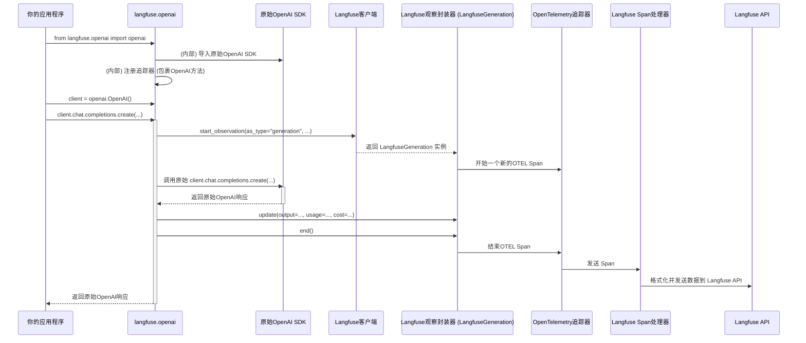

# Chapter 4: OpenAI集成


欢迎回到Langfuse教程！在上一章 [Langchain回调处理器](03_langchain回调处理器_.md) 中，我们学习了如何利用Langchain的回调处理器，无需手动修改代码就能自动追踪Langchain应用程序的内部事件。这大大简化了Langchain应用的观测性集成。

现在，如果你的应用程序直接使用OpenAI SDK进行LLM调用，而不是通过Langchain这样的框架，你又该如何轻松地追踪这些调用呢？手动为每个`openai.ChatCompletion.create()`调用添加 `with langfuse.generation()` 显然会很麻烦。

这就是**OpenAI集成**发挥作用的地方。它就像Langfuse与OpenAI SDK之间的“透明代理”。它能自动拦截所有通过OpenAI SDK发起的LLM调用（包括同步、异步和流式调用），并自动记录这些调用的详细信息，如输入、输出、模型参数、使用量和成本。这意味着你只需要简单地修改导入语句，就能获得完整的OpenAI使用监控，而无需改动任何OpenAI调用逻辑。

## 什么是OpenAI集成？

想象一下你有一个使用OpenAI模型生成文本或嵌入的Python脚本。通常你会这样导入OpenAI库：

```python
import openai
```

OpenAI集成提供了一个特殊的导入方式：

```python
from langfuse.openai import openai
```

当你使用`from langfuse.openai import openai`来导入OpenAI库时，Langfuse会悄悄地“包裹”（wrap）OpenAI SDK中的关键方法（例如`openai.chat.completions.create`、`openai.embeddings.create`）。这种包裹是透明的，对你的代码来说，你仍然在使用标准的OpenAI方法，但Langfuse已经在幕后为你完成了所有追踪工作。

它会自动捕捉：
*   **输入和输出**：LLM接收到的提示（prompt）和生成的响应。
*   **模型信息**：使用的模型名称（例如`gpt-3.5-turbo`）。
*   **模型参数**：如`temperature`、`max_tokens`等。
*   **使用量和成本**：消耗的token数量和估算的成本。
*   **延迟**：每一次LLM调用的耗时。
*   **错误**：如果LLM调用失败，也会被记录。

## 如何使用OpenAI集成？

使用OpenAI集成非常简单，只需要一步：修改你的OpenAI导入语句。

首先，确保你已经初始化了Langfuse客户端（如果你忘记了，可以回顾 [Langfuse客户端](01_langfuse客户端_.md) 章节）。在OpenAI集成中，Langfuse客户端是隐式使用的，但它必须被初始化以便Langfuse知道将数据发送到哪里。

```python
import os
from langfuse import Langfuse

# 假设你已经设置了环境变量或直接提供了密钥
# 在实际应用中，请使用安全的方式管理你的API密钥
langfuse = Langfuse(
    public_key=os.environ.get("LANGFUSE_PUBLIC_KEY"),
    secret_key=os.environ.get("LANGFUSE_SECRET_KEY"),
    base_url=os.environ.get("LANGFUSE_BASE_URL", "https://cloud.langfuse.com"),
)

print("Langfuse客户端已成功初始化！")
```

现在，让我们看一个使用OpenAI SDK进行聊天补全的例子，并展示如何通过修改导入语句来启用Langfuse追踪。

### 追踪同步聊天补全

**原始的OpenAI代码：**

```python
# 确保你设置了OPENAI_API_KEY环境变量
# import openai # 原始导入

# client = openai.OpenAI()

# response = client.chat.completions.create(
#     model="gpt-3.5-turbo",
#     messages=[
#         {"role": "user", "content": "Langfuse是什么？"}
#     ],
#     temperature=0.7,
#     max_tokens=60
# )

# print(f"LLM的响应: {response.choices[0].message.content}")
```

**启用Langfuse追踪的OpenAI代码：**

你只需要修改一行代码！

```python
# 修改导入语句以启用Langfuse OpenAI集成
from langfuse.openai import openai

# 创建OpenAI客户端实例。这里我们使用Langfuse包装后的openai模块。
client = openai.OpenAI()

# 像往常一样调用OpenAI API
response = client.chat.completions.create(
    model="gpt-3.5-turbo",
    messages=[
        {"role": "user", "content": "Langfuse是什么？"}
    ],
    temperature=0.7,
    max_tokens=60,
    # 你也可以在这里传递Langfuse特有的参数，例如name、metadata等
    langfuse_prompt="解释Langfuse", # 这是一个Langfuse特有参数，用于指定prompt名称
    metadata={"user_type": "new_user"}
)

print(f"LLM的响应: {response.choices[0].message.content}")
print("OpenAI LLM调用已通过Langfuse追踪。")

# 为了确保所有追踪数据都已发送，通常在应用结束时调用flush
langfuse.flush()
```

**代码解释：**
*   关键在于 `from langfuse.openai import openai`。这一行代码导入了Langfuse定制的OpenAI模块，它在内部已经集成了追踪逻辑。
*   之后你就可以像使用标准OpenAI SDK一样使用`client = openai.OpenAI()`和`client.chat.completions.create(...)`。
*   Langfuse会自动创建一个`generation`观察，记录这次LLM调用的所有细节，包括`prompt`、`output`、`model`、`model_parameters`、`usage`和`cost`。
*   你还可以传递一些Langfuse特有的参数，例如`langfuse_prompt`（用于在Langfuse UI中显示更友好的提示名称）和`metadata`（用于添加自定义元数据）。

运行这段代码后，你可以在Langfuse UI中看到一个名为“OpenAI-generation”（如果未指定`langfuse_prompt`）或“解释Langfuse”的追踪，其中包含了这个LLM调用的所有详细信息。

### 追踪流式（Streaming）聊天补全

OpenAI集成也支持流式调用，这对于实时响应的应用非常重要。

```python
from langfuse.openai import openai

client = openai.OpenAI()

stream = client.chat.completions.create(
    model="gpt-3.5-turbo",
    messages=[{"role": "user", "content": "用一句话解释流式传输的LLM响应。"}],
    stream=True, # 启用流式传输
    temperature=0.5,
    max_tokens=100,
    langfuse_prompt="解释流式LLM",
)

print("流式LLM响应:")
full_response_content = ""
for chunk in stream:
    if chunk.choices[0].delta.content is not None:
        print(chunk.choices[0].delta.content, end="")
        full_response_content += chunk.choices[0].delta.content
print("\n流式LLM调用已通过Langfuse追踪。")

langfuse.flush()
```

**代码解释：**
*   当`stream=True`时，`client.chat.completions.create`返回一个可迭代的流对象。
*   Langfuse的集成会自动检测到这是一个流式调用，并在内部处理分块数据。
*   最终，当流结束时，Langfuse会聚合所有分块内容，并将其作为完整的`output`记录到Langfuse平台。你仍然会看到一个完整的`generation`追踪。

### 追踪异步（Async）聊天补全

对于异步应用程序，Langfuse的OpenAI集成同样提供了无缝支持。

```python
import asyncio
from langfuse.openai import openai

async def async_llm_call():
    client = openai.AsyncOpenAI() # 使用异步客户端

    response = await client.chat.completions.create(
        model="gpt-3.5-turbo",
        messages=[
            {"role": "user", "content": "异步编程有什么好处？"}
        ],
        temperature=0.8,
        max_tokens=80,
        langfuse_prompt="异步编程好处",
    )

    print(f"异步LLM的响应: {response.choices[0].message.content}")
    print("异步OpenAI LLM调用已通过Langfuse追踪。")

# 运行异步函数
asyncio.run(async_llm_call())

langfuse.flush()
```

**代码解释：**
*   你需要使用`openai.AsyncOpenAI()`来创建异步客户端。
*   `await client.chat.completions.create(...)`进行异步调用。
*   Langfuse的集成会自动处理异步调用的追踪，其行为与同步调用类似，所有数据都会被记录。

### 追踪嵌入（Embeddings）

OpenAI集成也支持追踪嵌入模型的调用。

```python
from langfuse.openai import openai

client = openai.OpenAI()

embedding_response = client.embeddings.create(
    model="text-embedding-ada-002",
    input=["Langfuse", "LLM可观测性"],
    langfuse_prompt="嵌入生成",
    metadata={"embedding_source": "tutorial"}
)

# 嵌入结果通常是一个列表，这里只打印第一个嵌入的维度
print(f"嵌入的维度: {len(embedding_response.data[0].embedding)}")
print("OpenAI嵌入调用已通过Langfuse追踪。")

langfuse.flush()
```

**代码解释：**
*   `client.embeddings.create`调用也会被自动追踪。
*   Langfuse会记录输入的文本、使用的模型以及嵌入的维度和数量等信息。在Langfuse UI中，这会显示为一个`embedding`类型的观察。

## OpenAI集成的内部工作原理

OpenAI集成之所以能够“透明”地工作，是因为它使用了Python的**函数包裹（Function Wrapping）**技术。当你导入`langfuse.openai`时，它会遍历OpenAI SDK中所有相关的LLM调用方法，并用Langfuse自己的逻辑来包裹这些方法。

### 流程图：OpenAI集成如何拦截和追踪调用



**流程解释：**
1.  **你的应用程序**执行`from langfuse.openai import openai`。
2.  **`langfuse.openai`模块**在被导入时，会执行一个`register_tracing()`函数。
3.  `register_tracing()`函数会使用一个名为`wrap_function_wrapper`的工具来**包裹**（wrap）原始OpenAI SDK中的特定方法。这意味着当你的代码调用这些方法时，实际上是先执行Langfuse的包裹函数，然后才调用原始方法。
4.  当**你的应用程序**调用`client.chat.completions.create(...)`时，它会先进入Langfuse的包裹函数。
5.  这个包裹函数会从OpenAI调用的参数中提取出Langfuse所需的数据（例如`model`、`messages`、`temperature`等）。
6.  然后，它会调用**Langfuse客户端**的`start_observation()`方法，创建一个新的`LangfuseGeneration`（或`LangfuseEmbedding`）实例。这个实例内部对应一个OpenTelemetry Span。
7.  接下来，包裹函数会**调用原始的OpenAI SDK方法**，并将原始的参数传递给它。
8.  当原始OpenAI SDK方法返回响应时，包裹函数会捕获这个响应。
9.  它会从OpenAI响应中提取出输出内容、token使用量和成本等信息。
10. 然后，它会使用这些信息来**更新**之前创建的`LangfuseGeneration`实例，并调用其`end()`方法。`end()`方法会触发底层OpenTelemetry Span的结束，并将数据发送到Langfuse平台。
11. 最后，包裹函数会将原始的OpenAI响应返回给**你的应用程序**，就好像Langfuse从未介入一样。

对于流式和异步调用，逻辑类似，只是包裹函数会返回一个定制的迭代器或异步迭代器，在每次迭代或异步等待时处理数据，并在流结束时完成追踪的更新和结束。

### 代码片段：`langfuse/openai.py` 的核心

让我们看一些`langfuse-python`库中`langfuse/openai.py`文件的代码片段，来理解上述流程是如何实现的。

**1. 方法定义与版本检测：**
`OPENAI_METHODS_V0`和`OPENAI_METHODS_V1`定义了Langfuse要包裹的OpenAI方法。`_is_openai_v1()`用于检测OpenAI SDK的版本，因为不同版本的方法路径和结构有所不同。

```python
# langfuse/openai.py
# ... (导入和日志配置) ...

@dataclass
class OpenAiDefinition:
    module: str # 模块路径，例如 "openai.resources.chat.completions"
    object: str # 类名，例如 "Completions"
    method: str # 方法名，例如 "create"
    type: str # Langfuse观察类型，例如 "chat", "completion", "embedding"
    sync: bool # 是否是同步方法

# OpenAI V0.x.x 的方法定义
OPENAI_METHODS_V0 = [
    OpenAiDefinition(
        module="openai",
        object="ChatCompletion",
        method="create",
        type="chat",
        sync=True,
    ),
    # ... 其他V0方法 ...
]

# OpenAI V1.x.x 及更高版本的方法定义
OPENAI_METHODS_V1 = [
    OpenAiDefinition(
        module="openai.resources.chat.completions",
        object="Completions",
        method="create",
        type="chat",
        sync=True,
    ),
    # ... 其他V1方法，包括异步和嵌入 ...
]

def _is_openai_v1() -> bool:
    # 检查当前安装的OpenAI版本是否大于等于1.0.0
    return Version(openai.__version__) >= Version("1.0.0")
```
**代码解释：**
*   `OpenAiDefinition`数据类用于结构化地定义每个要追踪的OpenAI方法。
*   `OPENAI_METHODS_V0`和`OPENAI_METHODS_V1`列表包含了针对OpenAI不同版本API的追踪配置。
*   `_is_openai_v1()`函数根据`openai.__version__`判断当前OpenAI SDK的版本，以便选择正确的追踪配置。

**2. `register_tracing()` 函数：**
这是初始化时执行的核心函数，负责遍历所有定义的方法并进行包裹。

```python
# langfuse/openai.py
# ... (其他函数和类定义) ...

def register_tracing() -> None:
    # 根据OpenAI版本选择要包裹的方法列表
    resources = OPENAI_METHODS_V1 if _is_openai_v1() else OPENAI_METHODS_V0

    for resource in resources:
        # 检查版本兼容性 (min_version, max_version)
        if resource.min_version is not None and Version(openai.__version__) < Version(
            resource.min_version
        ):
            continue
        if resource.max_version is not None and Version(openai.__version__) >= Version(
            resource.max_version
        ):
            continue

        # 使用 wrapt 库的 wrap_function_wrapper 来包裹指定的方法
        wrap_function_wrapper(
            resource.module, # 目标模块
            f"{resource.object}.{resource.method}", # 目标对象和方法
            _wrap(resource) if resource.sync else _wrap_async(resource), # 使用同步或异步包裹器
        )

register_tracing() # 模块导入时自动调用
```
**代码解释：**
*   `wrap_function_wrapper`是`wrapt`库提供的一个强大工具，用于在不修改原始代码的情况下，在函数或方法执行前后插入自定义逻辑。
*   `_wrap(resource)`和`_wrap_async(resource)`是Langfuse自定义的包裹函数，它们接收`OpenAiDefinition`作为参数，并返回一个实际用于包裹的函数。

**3. `_wrap` 和 `_wrap_async` 包裹函数：**
这两个函数是Langfuse追踪逻辑的核心。它们在调用原始OpenAI方法之前启动Langfuse观察，在方法执行后（或流式结束后）更新并结束观察。

```python
# langfuse/openai.py
# ... (其他函数和类定义) ...

@_langfuse_wrapper # 这是一个装饰器，用于简化包裹函数的定义
def _wrap(
    open_ai_resource: OpenAiDefinition, wrapped: Any, args: Any, kwargs: Any
) -> Any:
    # 1. 从kwargs中提取Langfuse特有参数
    arg_extractor = OpenAiArgsExtractor(*args, **kwargs)
    langfuse_args = arg_extractor.get_langfuse_args()

    # 2. 从OpenAI参数中获取Langfuse所需的追踪数据 (名称, 输入, 元数据, 模型参数等)
    langfuse_data = _get_langfuse_data_from_kwargs(open_ai_resource, langfuse_args)
    
    # 3. 获取Langfuse客户端
    langfuse_client = get_client(public_key=langfuse_args["langfuse_public_key"])

    # 4. 启动Langfuse观察 (generation 或 embedding)
    observation_type = (
        "embedding" if open_ai_resource.type == "embedding" else "generation"
    )
    generation = langfuse_client.start_observation(
        as_type=observation_type,
        name=langfuse_data["name"],
        input=langfuse_data.get("input", None),
        # ... 其他Langfuse参数 ...
    )

    try:
        # 5. 调用原始的OpenAI方法
        openai_response = wrapped(**arg_extractor.get_openai_args())

        # 6. 处理流式响应
        if _is_streaming_response(openai_response):
            return LangfuseResponseGeneratorSync(
                resource=open_ai_resource,
                response=openai_response,
                generation=generation,
            )
        # 7. 处理非流式响应
        else:
            model, completion, usage = _get_langfuse_data_from_default_response(
                open_ai_resource,
                (openai_response and openai_response.__dict__)
                if _is_openai_v1()
                else openai_response,
            )
            # 8. 更新并结束Langfuse观察
            generation.update(
                model=model,
                output=completion,
                usage_details=usage,
                cost_details=_parse_cost(openai_response.usage)
                if hasattr(openai_response, "usage")
                else None,
            ).end()

        # 9. 返回原始OpenAI响应
        return openai_response
    except Exception as ex:
        # 10. 捕获异常并记录错误
        log.warning(ex)
        generation.update(
            status_message=str(ex), level="ERROR", model=kwargs.get("model", None)
        ).end()
        raise ex

# _wrap_async 逻辑类似，只是处理 await 和异步生成器
```
**代码解释：**
*   `wrapped`参数代表原始的OpenAI方法。
*   `args`和`kwargs`是传递给OpenAI方法的参数。
*   `OpenAiArgsExtractor`类用于从`kwargs`中智能地分离出Langfuse特有的参数（如`langfuse_prompt`）和原始OpenAI参数。
*   `_get_langfuse_data_from_kwargs`函数负责从OpenAI方法的输入参数中提取出Langfuse追踪所需的`input`、`model_parameters`等信息。
*   `langfuse_client.start_observation()`创建了一个新的Langfuse观察。
*   `wrapped(**arg_extractor.get_openai_args())`是真正调用原始OpenAI方法的地方。
*   `_is_streaming_response()`检查响应是否为流式。
*   对于流式响应，它返回一个定制的`LangfuseResponseGeneratorSync`（或`LangfuseResponseGeneratorAsync`）实例，该实例会在迭代过程中逐步处理数据，并在流结束时更新Langfuse观察。
*   对于非流式响应，`_get_langfuse_data_from_default_response`从OpenAI响应中提取输出、模型和使用量。
*   `generation.update(...).end()`更新并结束Langfuse观察，将所有收集到的数据发送到Langfuse平台。
*   `try...except`块确保即使发生错误，Langfuse也能记录错误信息。

通过这些精巧的包裹机制，Langfuse的OpenAI集成实现了对OpenAI SDK调用的无侵入式追踪，极大地简化了AI应用开发者的数据收集工作。

## 总结

在本章中，我们学习了Langfuse的OpenAI集成，这是一个非常便捷的功能，它允许你通过简单地修改导入语句，就能自动追踪所有通过OpenAI SDK发起的LLM调用。我们探讨了如何使用它来追踪同步、流式和异步的聊天补全以及嵌入调用，并了解了其幕后通过函数包裹实现透明追踪的原理。

OpenAI集成使得将Langfuse集成到你的OpenAI应用中变得前所未有的简单，为你提供了强大的可观测性，而无需大量的手动代码修改。

接下来，我们将学习如何使用 [批处理评估器](05_批处理评估器_.md) 来评估你的模型表现。

---

Generated by [AI Codebase Knowledge Builder](https://github.com/The-Pocket/Tutorial-Codebase-Knowledge)