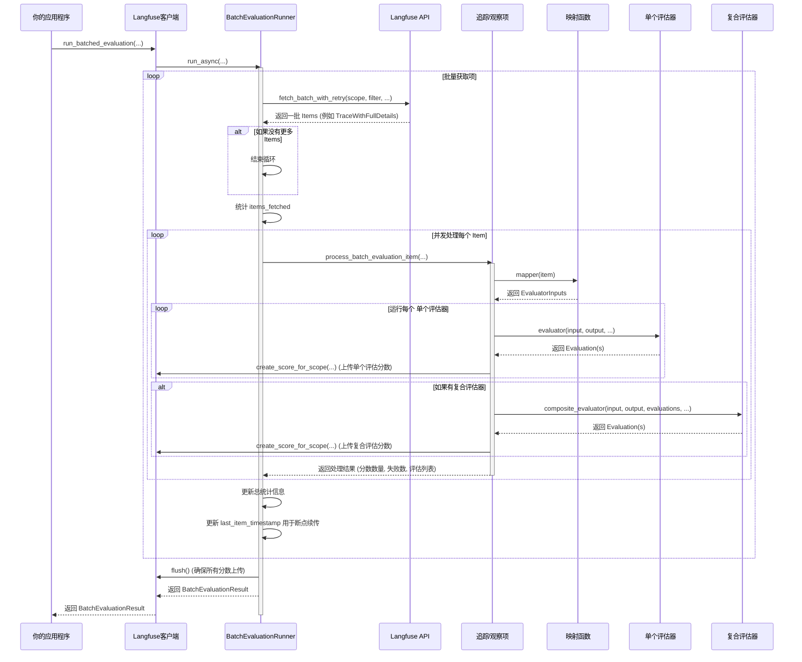

# Chapter 5: 批处理评估器

欢迎回到Langfuse教程！在上一章 [OpenAI集成](04_openai集成_.md) 中，我们学习了如何通过简单地修改导入语句，就能自动追踪所有通过OpenAI SDK发起的LLM调用。这使得我们能够轻松地监控每一次模型交互的性能和成本。

现在，你已经收集了大量的追踪数据，包括LLM的输入、输出、成本和延迟。下一步是什么？仅仅是收集数据还不够，你需要**评估**这些数据，了解你的AI应用表现如何。例如，你可能想知道：
*   我的LLM回答准确吗？
*   它是否产生了有害或不恰当的内容？
*   它是否遵循了特定的格式要求？
*   我的检索器返回的文档是否相关？

手动检查成千上万条历史记录显然是不现实的。这就是**批处理评估器**发挥作用的地方。它就像一个“AI质量检测主管”，能自动化地对你AI应用的历史运行数据（比如历史对话或生成结果）进行大规模的质量评估。你可以设定不同的评估标准，它会逐一检查，并生成详细的报告，帮助你发现问题、改进模型。

## 什么是批处理评估器？

批处理评估器是Langfuse提供的一个强大工具，用于对大量历史追踪（Traces）或观察（Observations）进行自动化的、可编程的评估。它允许你：
1.  **定义评估标准**：编写Python函数来检查LLM的输出是否符合你的预期。
2.  **批量运行**：将这些评估函数应用到成千上万条历史记录上。
3.  **收集结果**：将评估结果（分数、评论、元数据）自动上传到Langfuse，以便可视化和分析。
4.  **支持断点续传**：即使评估过程中断，也能从上次停止的地方继续。

批处理评估器的核心思想是让你能够定义自己的评估逻辑，然后将这个逻辑大规模地应用到你的所有AI交互数据上。

## 批处理评估器的核心组件

为了实现批处理评估，Langfuse定义了一些关键概念和组件：

### 1. 评估器输入 (`EvaluatorInputs`)

在进行评估之前，你需要告诉评估器应该评估哪些数据。`EvaluatorInputs`是一个标准化数据结构，它包含了评估器所需的基本信息：
*   `input`: 产生待评估输出的原始输入。
*   `output`: 待评估的实际输出。
*   `expected_output`: 可选的预期输出或“黄金标准”（ground truth），用于比较。
*   `metadata`: 任何额外的上下文信息，例如用户ID、模型参数等。

无论你的原始数据是完整的追踪（Trace）还是单个观察（Observation），最终都需要被转换成`EvaluatorInputs`格式才能被评估器处理。

```python
from langfuse.batch_evaluation import EvaluatorInputs

# 示例：一个简单的EvaluatorInputs
eval_input = EvaluatorInputs(
    input="请用一个词总结Langfuse。",
    output="LLM可观测性平台",
    expected_output="可观测性",
    metadata={"model_version": "gpt-3.5-turbo"}
)

print(f"评估输入: {eval_input.input}")
print(f"待评估输出: {eval_input.output}")
print(f"预期输出: {eval_input.expected_output}")
print(f"元数据: {eval_input.metadata}")
```
**代码解释：**
*   `EvaluatorInputs`用于封装待评估的数据。所有参数都必须通过关键字传入。
*   它提供了一个统一的接口，让后续的评估器可以轻松访问所需数据。

### 2. 映射函数 (`MapperFunction`)

你的历史数据（例如Langfuse上的追踪或观察）的原始格式可能不直接是`EvaluatorInputs`。**映射函数**的作用就是将这些原始数据结构转换成`EvaluatorInputs`。

映射函数必须：
*   接受一个`item`参数，这个`item`可以是`TraceWithFullDetails`（一个完整的追踪）或`ObservationsView`（一个观察）。
*   返回一个`EvaluatorInputs`实例。
*   可以是同步的，也可以是异步的。

```python
from langfuse.batch_evaluation import MapperFunction, EvaluatorInputs
from langfuse.api.resources.commons.types import TraceWithFullDetails, ObservationsView
from typing import Union, Dict, Any, Optional

# 示例：为追踪数据定义一个映射函数
def trace_to_eval_inputs(
    *, 
    item: Union[TraceWithFullDetails, ObservationsView], 
    **kwargs: Dict[str, Any]
) -> EvaluatorInputs:
    # 假设追踪（Trace）有一个顶层输入和输出字段
    # 实际情况可能需要从追踪的子观察中提取
    
    # 强制类型转换，假设我们知道item是一个TraceWithFullDetails
    trace = item # type: TraceWithFullDetails 

    # 从追踪中提取输入、输出和元数据
    # 注意：trace.input 和 trace.output 可能是复杂的对象，这里简化为字符串
    trace_input = trace.input.get("input") if trace.input else None
    trace_output = trace.output.get("output") if trace.output else None
    
    return EvaluatorInputs(
        input=trace_input,
        output=trace_output,
        expected_output=None, # 如果有预期输出，可以从 trace.tags 或 trace.metadata 中获取
        metadata={
            "trace_id": trace.id,
            "user_id": trace.user_id,
            "tags": trace.tags,
            "version": trace.version
        }
    )

print("映射函数已定义。")
```
**代码解释：**
*   `trace_to_eval_inputs`函数接收一个`item`（这里我们期望它是一个`TraceWithFullDetails`）。
*   它从`item`中提取相关字段，并将其封装到`EvaluatorInputs`对象中。
*   这个例子假设追踪的输入和输出直接存储在`trace.input`和`trace.output`中。在实际应用中，你可能需要遍历追踪中的`generations`或`spans`来找到你想要评估的特定LLM调用或操作的输入输出。

### 3. 评估器函数 (`EvaluatorFunction`)

这是批处理评估的核心逻辑。**评估器函数**接收`EvaluatorInputs`提供的数据，然后计算一个或多个评估分数。

评估器函数必须：
*   接受`input`、`output`、`expected_output`和`metadata`作为关键字参数。
*   返回一个`Evaluation`对象或一个`Evaluation`对象列表。
*   可以是同步的，也可以是异步的。

`Evaluation`对象用于封装评估结果：
*   `name`: 评估指标的名称（例如“准确性”、“相关性”）。
*   `value`: 评估分数（可以是数值、字符串或布尔值）。
*   `comment`: 可选的评论，提供更多上下文。
*   `metadata`: 可选的元数据。
*   `data_type`: 分数的数据类型（例如`NUMERIC`、`CATEGORICAL`、`BOOLEAN`）。

```python
from langfuse.experiment import Evaluation, EvaluatorFunction
from typing import List

# 示例：定义一个检查输出是否包含某个关键词的评估器
def keyword_presence_evaluator(
    *, 
    input: Any, 
    output: Any, 
    expected_output: Any, 
    metadata: Optional[Dict[str, Any]], 
    **kwargs: Dict[str, Any]
) -> Evaluation:
    
    keyword = "Langfuse" # 假设我们要检查是否包含“Langfuse”这个词
    
    if output is None:
        return Evaluation(name="包含关键词", value=False, comment="输出为空")

    contains_keyword = keyword.lower() in str(output).lower()
    
    return Evaluation(
        name="包含关键词",
        value=contains_keyword,
        comment=f"输出中{'包含' if contains_keyword else '不包含'}关键词 '{keyword}'。",
        data_type="BOOLEAN",
        metadata={"keyword_checked": keyword}
    )

# 示例：定义一个检查输出长度的评估器
def output_length_evaluator(
    *, 
    input: Any, 
    output: Any, 
    expected_output: Any, 
    metadata: Optional[Dict[str, Any]], 
    **kwargs: Dict[str, Any]
) -> Evaluation:
    
    length = len(str(output)) if output else 0
    
    return Evaluation(
        name="输出长度",
        value=length,
        comment=f"输出包含 {length} 个字符。",
        data_type="NUMERIC",
        metadata={"unit": "characters"}
    )

print("评估器函数已定义。")
```
**代码解释：**
*   `keyword_presence_evaluator`检查输出中是否包含特定关键词，并返回一个布尔类型的`Evaluation`。
*   `output_length_evaluator`计算输出的长度，并返回一个数值类型的`Evaluation`。
*   这些评估器函数将作为列表传递给批处理评估器。

### 4. 复合评估器 (`CompositeEvaluatorFunction`) (可选)

有时，你可能需要根据多个独立的评估结果来计算一个**综合评分**。例如，你可能想根据“准确性”和“相关性”评估来计算一个加权平均分。**复合评估器**就是为此设计的。

复合评估器函数必须：
*   接受`input`、`output`、`expected_output`、`metadata`以及一个`evaluations`列表（包含了所有单个评估器返回的结果）作为关键字参数。
*   返回一个`Evaluation`对象或一个`Evaluation`对象列表。
*   可以是同步的，也可以是异步的。

```python
from langfuse.batch_evaluation import CompositeEvaluatorFunction

# 示例：定义一个计算加权平均分的复合评估器
def weighted_average_composite_evaluator(
    *, 
    input: Any, 
    output: Any, 
    expected_output: Any, 
    metadata: Optional[Dict[str, Any]], 
    evaluations: List[Evaluation], 
    **kwargs: Dict[str, Any]
) -> Evaluation:
    
    weights = {
        "包含关键词": 0.6, # 如果包含关键词，权重为0.6
        "输出长度": 0.4    # 如果输出长度符合预期，权重为0.4
    }
    
    total_score = 0.0
    total_weight = 0.0
    
    for eval_item in evaluations:
        if eval_item.name in weights and isinstance(eval_item.value, (int, float, bool)):
            # 将布尔值转换为数值：True -> 1.0, False -> 0.0
            value = float(eval_item.value) if isinstance(eval_item.value, bool) else eval_item.value
            total_score += value * weights[eval_item.name]
            total_weight += weights[eval_item.name]
            
    final_score = total_score / total_weight if total_weight > 0 else 0.0
    
    return Evaluation(
        name="综合质量评分",
        value=final_score,
        comment=f"基于关键词和长度的加权平均分。",
        data_type="NUMERIC"
    )

print("复合评估器已定义。")
```
**代码解释：**
*   `weighted_average_composite_evaluator`接收一个`evaluations`列表，其中包含之前单个评估器（如`keyword_presence_evaluator`和`output_length_evaluator`）的结果。
*   它根据预设的权重计算出一个最终的`综合质量评分`。

## 如何使用批处理评估器？

现在我们已经定义了所有组件，让我们看看如何使用Langfuse客户端来运行批处理评估。

首先，确保你已经初始化了Langfuse客户端（如果你忘记了，可以回顾 [Langfuse客户端](01_langfuse客户端_.md) 章节）。

```python
import os
from langfuse import Langfuse
import asyncio

# 假设你已经设置了环境变量或直接提供了密钥
# 在实际应用中，请使用安全的方式管理你的API密钥
langfuse = Langfuse(
    public_key=os.environ.get("LANGFUSE_PUBLIC_KEY"),
    secret_key=os.environ.get("LANGFUSE_SECRET_KEY"),
    base_url=os.environ.get("LANGFUSE_BASE_URL", "https://cloud.langfuse.com"),
)

print("Langfuse客户端已成功初始化！")
```

接下来，我们将模拟一些追踪数据，并运行批处理评估。

```python
# 模拟一些历史追踪数据
# 在实际应用中，这些数据将从Langfuse平台获取
mock_traces = [
    TraceWithFullDetails(
        id="trace-1",
        timestamp="2023-01-01T10:00:00Z",
        input={"input": "请总结一下Langfuse。"},
        output={"output": "Langfuse是一个LLM可观测性平台。"},
        user_id="user-a",
        version="v1.0",
        tags=["production", "summarization"],
        name="Summarization Trace 1"
    ),
    TraceWithFullDetails(
        id="trace-2",
        timestamp="2023-01-01T10:05:00Z",
        input={"input": "什么是人工智能？"},
        output={"output": "人工智能是计算机科学的一个分支，旨在创建智能机器。"},
        user_id="user-b",
        version="v1.0",
        tags=["production", "qa"],
        name="QA Trace 1"
    ),
    TraceWithFullDetails(
        id="trace-3",
        timestamp="2023-01-01T10:10:00Z",
        input={"input": "用一句话描述海洋。"},
        output={"output": "地球上最大的水体。"},
        user_id="user-a",
        version="v1.0",
        tags=["production", "summarization"],
        name="Summarization Trace 2"
    ),
]

# 异步函数来运行批处理评估
async def run_my_batch_evaluation():
    print("\n开始运行批处理评估...")
    
    # 运行批处理评估
    result = await langfuse.run_batched_evaluation(
        # 评估范围：这里我们评估的是追踪（"traces"），也可以是观察（"observations"）
        scope="traces", 
        # 映射函数，将追踪转换为评估器输入
        mapper=trace_to_eval_inputs, 
        # 评估器列表
        evaluators=[keyword_presence_evaluator, output_length_evaluator],
        # 可选的复合评估器
        composite_evaluator=weighted_average_composite_evaluator,
        # 可以添加一个过滤器，例如只评估带有特定标签的追踪
        # filter=json.dumps([{"field": "tags", "operator": "contains", "value": "production"}]),
        # 模拟从API获取的items，实际应用中会从Langfuse平台获取
        items=mock_traces, 
        # 设置最大并发数
        max_concurrency=5,
        # 打印详细进度
        verbose=True
    )
    
    print("\n批处理评估完成！")
    print(result) # 打印评估结果的摘要

# 运行异步主函数
asyncio.run(run_my_batch_evaluation())

# 确保所有追踪数据都已发送
langfuse.flush()
```
**代码解释：**
*   `mock_traces`是我们为了演示而创建的模拟追踪数据。在实际使用中，你会通过Langfuse API从平台获取这些数据，或者通过`items`参数直接提供。
*   `langfuse.run_batched_evaluation()`是Langfuse客户端提供的核心方法，用于启动批处理评估。
    *   `scope="traces"`指定了我们评估的是追踪。
    *   `mapper=trace_to_eval_inputs`指定了如何将追踪数据转换成`EvaluatorInputs`。
    *   `evaluators=[keyword_presence_evaluator, output_length_evaluator]`传入了我们定义的两个评估器。
    *   `composite_evaluator=weighted_average_composite_evaluator`传入了复合评估器。
    *   `items=mock_traces`直接提供了要评估的项，这在测试或小规模运行时很有用。如果你不提供`items`，`run_batched_evaluation`将从Langfuse平台根据`scope`和`filter`自动获取数据。
    *   `verbose=True`会打印评估的详细进度。
*   `result`是一个`BatchEvaluationResult`对象，包含了评估的统计信息和每个项的评估结果。`print(result)`会打印一个格式化的摘要。

运行上述代码后，Langfuse会：
1.  遍历`mock_traces`中的每个追踪。
2.  对每个追踪应用`trace_to_eval_inputs`映射函数，将其转换为`EvaluatorInputs`。
3.  对每个`EvaluatorInputs`运行`keyword_presence_evaluator`和`output_length_evaluator`，生成两个分数。
4.  然后，将这两个分数传递给`weighted_average_composite_evaluator`，生成一个综合评分。
5.  所有这些分数都会自动上传到Langfuse平台，并与原始追踪关联起来。

你可以在Langfuse UI中查看这些追踪，每个追踪都会有相应的评估分数，帮助你直观地了解模型表现。

## 批处理评估器的内部工作原理

批处理评估器 (`BatchEvaluationRunner`) 的内部逻辑相当复杂，它需要处理数据获取、并发执行、错误处理、断点续传以及结果聚合。

### 流程图：批处理评估器核心流程



**流程解释：**
1.  **你的应用程序**调用`langfuse.run_batched_evaluation()`。
2.  **Langfuse客户端**将调用委托给内部的`BatchEvaluationRunner`的`run_async`方法。
3.  `BatchEvaluationRunner`进入一个主循环，**批量获取**待评估的追踪或观察。它会使用你提供的`filter`和`scope`来调用Langfuse API。
4.  它会检查是否达到`max_items`限制或没有更多数据。
5.  对于获取到的每一个批次，它会**并发地处理**每个项（`item`）。
6.  对于每个`item`：
    *   首先调用**映射函数**（`Mapper`），将`item`转换成`EvaluatorInputs`。
    *   然后，它会遍历你提供的所有**单个评估器**（`Evaluator`），对`EvaluatorInputs`进行评估。每个评估器返回的`Evaluation`结果会立即通过`langfuse_client.create_score_for_scope()`上传到Langfuse平台。
    *   如果提供了**复合评估器**（`CompositeEvaluator`），它会在所有单个评估器运行完毕后被调用，接收所有单个评估结果，并计算综合评分。综合评分也会被上传。
    *   过程中会统计成功、失败的运行次数和创建的分数数量。
7.  `BatchEvaluationRunner`会跟踪`last_item_timestamp`和`last_item_id`，以便在评估中断时可以生成**断点续传令牌** (`BatchEvaluationResumeToken`)。
8.  所有项处理完毕后，`BatchEvaluationRunner`会调用`langfuse.flush()`确保所有异步上传的分数都已发送到Langfuse。
9.  最后，它聚合所有统计信息，并返回一个`BatchEvaluationResult`对象给**你的应用程序**。

### 代码片段：`BatchEvaluationRunner` 的核心

`langfuse/batch_evaluation.py`文件包含了`BatchEvaluationRunner`类的定义。

**1. `run_async` 方法 (简化):**
这是批处理评估的入口点，负责协调整个流程。

```python
# langfuse/batch_evaluation.py (简化)
class BatchEvaluationRunner:
    # ... __init__ 方法 ...

    async def run_async(
        self,
        *,
        scope: str,
        mapper: MapperFunction,
        evaluators: List[EvaluatorFunction],
        filter: Optional[str] = None,
        fetch_batch_size: int = 50,
        max_items: Optional[int] = None,
        max_concurrency: int = 50,
        composite_evaluator: Optional[CompositeEvaluatorFunction] = None,
        metadata: Optional[Dict[str, Any]] = None,
        max_retries: int = 3,
        verbose: bool = False,
        resume_from: Optional[BatchEvaluationResumeToken] = None,
        items: Optional[List[Union[TraceWithFullDetails, ObservationsView]]] = None, # 新增的items参数
    ) -> BatchEvaluationResult:
        start_time = time.time()
        # ... 初始化统计变量 ...

        effective_filter = self._build_timestamp_filter(filter, resume_from)
        semaphore = asyncio.Semaphore(max_concurrency)

        # 主要循环：获取和处理批次
        while has_more:
            # 1. 获取批次数据 (如果提供了items，则直接使用，否则从API获取)
            if items is not None: # 如果直接提供了items，则只处理一次
                current_batch = items
                has_more = False
            else:
                current_batch = await self._fetch_batch_with_retry(...) # 从API获取
            
            if not current_batch: # 没有更多数据
                has_more = False
                break

            # 2. 并发处理批次中的每个项
            tasks = [self._process_item_concurrently(item, semaphore, ...) for item in current_batch]
            results = await asyncio.gather(*tasks)

            # 3. 处理结果并更新统计信息
            for item, (item_id, result) in zip(current_batch, results):
                if isinstance(result, Exception):
                    # 记录失败项
                else:
                    # 更新成功项的统计信息，并存储评估结果
                    # ...
            # ... 检查是否需要继续下一页 ...

        # 4. 确保所有分数上传
        self.client.flush()

        # 5. 构建并返回最终结果
        return self._build_result(...)
```
**代码解释：**
*   `run_async`负责整个评估流程的调度。
*   它使用`_build_timestamp_filter`处理断点续传逻辑，通过修改过滤条件来只获取上次未处理的项。
*   它使用`asyncio.Semaphore`来控制并发处理的项数，避免过载。
*   `items`参数是我们为了简化示例而添加的，在实际SDK中，它主要通过`filter`从Langfuse平台获取数据。
*   `_fetch_batch_with_retry`负责从Langfuse API获取数据，并包含重试逻辑。
*   `asyncio.gather(*tasks)`并发地运行所有项的`_process_batch_evaluation_item`任务。
*   最后，它调用`self.client.flush()`来确保所有分数都已发送，并构建`BatchEvaluationResult`。

**2. `_process_batch_evaluation_item` 方法 (简化):**
这个方法是处理单个项的核心，它将映射、评估和分数创建整合在一起。

```python
# langfuse/batch_evaluation.py (简化)
    async def _process_batch_evaluation_item(
        self,
        item: Union[TraceWithFullDetails, ObservationsView],
        scope: str,
        mapper: MapperFunction,
        evaluators: List[EvaluatorFunction],
        composite_evaluator: Optional[CompositeEvaluatorFunction],
        metadata: Optional[Dict[str, Any]],
        evaluator_stats_dict: Dict[str, EvaluatorStats],
    ) -> Tuple[int, int, int, List[Evaluation]]:
        # ... 初始化分数计数器 ...

        # 1. 运行映射函数
        evaluator_inputs = await self._run_mapper(mapper, item)

        # 2. 运行所有单个评估器
        evaluations: List[Evaluation] = []
        for evaluator in evaluators:
            # ... 更新评估器统计 ...
            try:
                eval_results = await self._run_evaluator_internal(evaluator, **evaluator_inputs.__dict__)
                # ... 更新统计，添加结果到 evaluations 列表 ...
            except Exception as e:
                # ... 记录评估器失败 ...

        # 3. 为单个评估器创建分数并上传
        item_id = self._get_item_id(item, scope)
        for evaluation in evaluations:
            self._create_score_for_scope(
                scope=scope,
                item_id=item_id,
                evaluation=evaluation,
                additional_metadata=metadata,
            )
            # ... 更新 scores_created ...

        # 4. 如果有复合评估器，则运行并创建分数
        if composite_evaluator and evaluations:
            try:
                composite_evals = await self._run_composite_evaluator(
                    composite_evaluator,
                    **evaluator_inputs.__dict__,
                    evaluations=evaluations,
                )
                for composite_eval in composite_evals:
                    self._create_score_for_scope(...) # 创建并上传复合分数
                # ... 更新 composite_scores_created ...
            except Exception as e:
                # ... 记录复合评估器失败 ...

        return (
            scores_created,
            composite_scores_created,
            evaluations_failed,
            evaluations, # 返回所有评估结果列表
        )
```
**代码解释：**
*   `_process_batch_evaluation_item`是处理单个项的逻辑单元。
*   它首先调用`await self._run_mapper(mapper, item)`来获取`EvaluatorInputs`。
*   然后循环调用`await self._run_evaluator_internal`来运行每个评估器。
*   `_create_score_for_scope`负责将评估结果包装成Langfuse分数，并通过Langfuse客户端上传。
*   如果存在复合评估器，它会在所有单个评估器完成后运行。
*   它返回该项处理后产生的总分数数量、复合分数数量、失败的评估器数量以及所有评估结果列表。

通过这种精细的编排，批处理评估器能够在保证效率和可靠性的同时，对你的AI应用历史数据进行全面的质量检查。

## 总结

在本章中，我们深入探讨了Langfuse的**批处理评估器**。我们学习了它如何作为一个“AI质量检测主管”，帮助我们自动化地对大规模历史追踪或观察数据进行评估。我们了解了其核心组件：`EvaluatorInputs`（标准化输入）、`MapperFunction`（数据转换）、`EvaluatorFunction`（单个评估逻辑）和可选的`CompositeEvaluatorFunction`（综合评分）。

我们还通过一个完整的示例，演示了如何定义这些组件，并使用`langfuse.run_batched_evaluation()`方法来运行批处理评估，将评估结果自动上传到Langfuse平台。最后，我们深入了解了其内部工作原理，包括数据获取、并发处理、错误处理和分数上传的流程。

掌握批处理评估器，意味着你不仅可以收集AI应用的数据，还能对其进行深入的质量分析，从而持续改进你的模型和应用。

接下来，我们将学习如何利用 [Prompt缓存](06_prompt缓存_.md) 来优化你的LLM应用，减少延迟和成本。

---

Generated by [AI Codebase Knowledge Builder](https://github.com/The-Pocket/Tutorial-Codebase-Knowledge)