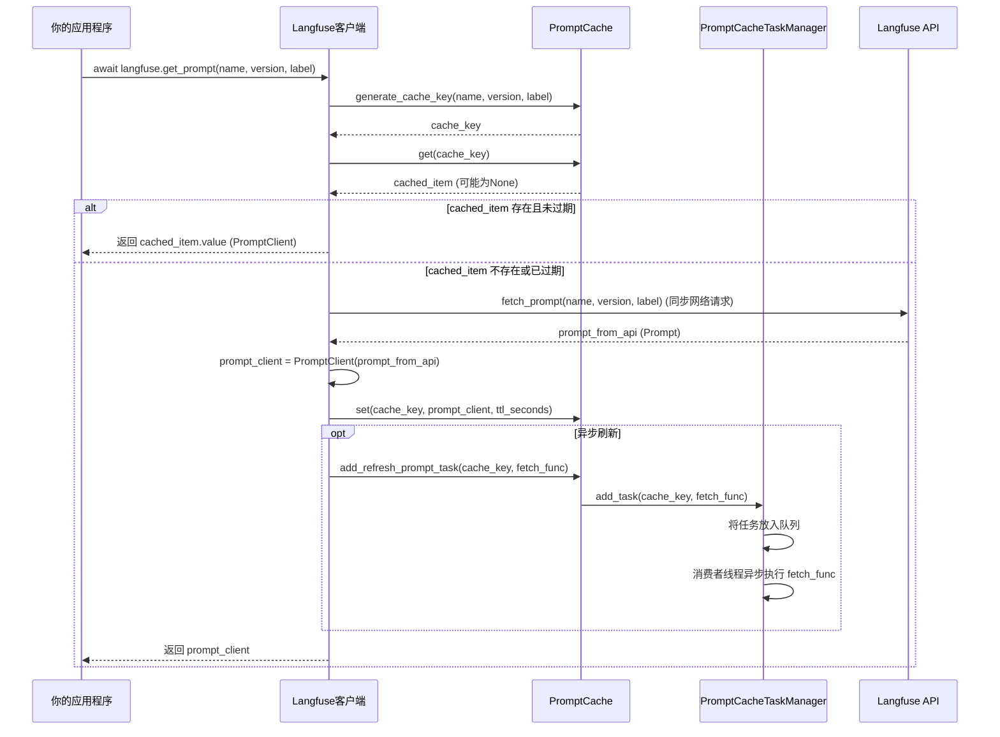

# Chapter 6: Prompt缓存


欢迎回到Langfuse教程！在上一章 [批处理评估器](05_批处理评估器_.md) 中，我们深入探讨了如何自动化地对AI应用的历史数据进行大规模质量评估。现在，你不仅能够追踪你的LLM应用，还能够评估它的表现。

在实际的LLM应用开发中，你可能会遇到这样的情况：你的应用程序反复使用相同的或非常相似的Prompt（提示词），尤其是在生产环境中，你可能通过Langfuse UI发布并管理这些Prompt。每次你的应用需要一个Prompt时，它都需要向Langfuse API发送请求来获取最新的Prompt定义及其配置。

想象一下，如果你的应用每秒钟发出数百个LLM请求，每个请求都需要先去Langfuse获取Prompt。这会带来两个问题：
1.  **延迟**：每次额外的网络请求都会增加LLM调用的总延迟。
2.  **API调用成本/限制**：频繁地调用Langfuse API会消耗你的API配额，并且可能因为请求量过大而达到速率限制。

这就是**Prompt缓存**发挥作用的地方。它就像一个“记忆库”，存储了最近使用过的Prompt及其配置。当你的应用再次请求相同的Prompt时，它可以直接从缓存中快速获取，而无需重新向Langfuse API请求，从而显著提高了性能并降低了API调用的开销。它还包含一个后台任务管理器，用于异步刷新过期或即将过期的Prompt，确保你总能使用到最新的Prompt，而不会影响应用的响应速度。

## 什么是Prompt缓存？

Prompt缓存是`langfuse-python`客户端的一个内置功能，旨在优化Prompt的获取效率。它在本地维护一个Prompt的副本，当你请求一个Prompt时：
1.  **首先检查缓存**：如果缓存中有所需的Prompt且未过期，就直接返回缓存中的版本。
2.  **如果缓存未命中或过期**：客户端会向Langfuse API请求最新的Prompt。
3.  **异步刷新**：缓存还会智能地在后台异步刷新即将过期或已过期的Prompt，确保缓存中的数据尽可能保持最新，同时不阻塞主线程。

这样，你的应用程序在大多数情况下都能获得极低的Prompt获取延迟，并且减少了对Langfuse API的直接依赖。

## Prompt缓存的核心组件

Prompt缓存由几个关键部分组成：

### 1. `PromptCacheItem`：缓存项

每个存储在缓存中的Prompt都是一个`PromptCacheItem`对象。它不仅仅包含Prompt本身，还包含了一个过期时间戳。

```python
# langfuse/_utils/prompt_cache.py (简化)
class PromptCacheItem:
    def __init__(self, prompt: PromptClient, ttl_seconds: int):
        self.value = prompt # 存储实际的PromptClient实例
        self._expiry = ttl_seconds + self.get_epoch_seconds() # 计算过期时间

    def is_expired(self) -> bool:
        # 判断缓存项是否过期
        return self.get_epoch_seconds() > self._expiry

    @staticmethod
    def get_epoch_seconds() -> int:
        # 获取当前时间戳（秒）
        return int(datetime.now().timestamp())
```
**代码解释：**
*   `PromptCacheItem`封装了`PromptClient`实例（即实际的Prompt内容和配置）。
*   `ttl_seconds`是该Prompt在缓存中保持有效的秒数。
*   `_expiry`是在初始化时计算出的过期时间戳。
*   `is_expired()`方法用于检查当前时间是否超过了`_expiry`，从而判断缓存项是否过期。

### 2. `PromptCacheRefreshConsumer`：缓存刷新消费者

这是一个后台线程，负责从队列中取出刷新任务并执行它们。它使得Prompt的异步刷新成为可能。

```python
# langfuse/_utils/prompt_cache.py (简化)
class PromptCacheRefreshConsumer(Thread):
    # ... __init__ 方法 ...
    running: bool = True # 控制线程是否运行

    def run(self) -> None:
        while self.running:
            try:
                task = self._queue.get(timeout=1) # 从队列中获取任务
                # ... 执行任务 ...
                task()
                self._queue.task_done() # 标记任务完成
            except Empty:
                pass # 队列为空时等待
            except Exception as e:
                self._log.warning(f"PromptCacheRefreshConsumer encountered an error: {e}")

    def pause(self) -> None:
        self.running = False # 停止线程
```
**代码解释：**
*   `PromptCacheRefreshConsumer`继承自`threading.Thread`，是一个独立的执行线程。
*   它的`run()`方法在一个循环中不断从内部队列`_queue`中获取任务并执行。
*   `timeout=1`确保线程不会无限期地阻塞在`get()`调用上，从而可以响应`running`状态的变化。
*   `task_done()`通知队列该任务已处理，这对于队列的`join()`方法很重要。
*   `pause()`方法用于优雅地停止消费者线程。

### 3. `PromptCacheTaskManager`：任务管理器

这个类管理一个或多个`PromptCacheRefreshConsumer`线程，并提供添加刷新任务的接口。它确保同一个Prompt的刷新任务不会被重复提交。

```python
# langfuse/_utils/prompt_cache.py (简化)
class PromptCacheTaskManager(object):
    # ... __init__ 方法 ...
    
    def __init__(self, threads: int = 1):
        self._queue = Queue() # 任务队列
        self._consumers = [] # 消费者线程列表
        self._threads = threads # 线程数量
        self._processing_keys = set() # 记录正在处理的Prompt键，防止重复刷新

        for i in range(self._threads):
            consumer = PromptCacheRefreshConsumer(self._queue, i)
            consumer.start() # 启动消费者线程
            self._consumers.append(consumer)

        atexit.register(self.shutdown) # 注册程序退出时的清理函数

    def add_task(self, key: str, task: Callable[[], None]) -> None:
        if key not in self._processing_keys: # 避免重复任务
            self._processing_keys.add(key)
            wrapped_task = self._wrap_task(key, task) # 包装任务以处理清理
            self._queue.put((wrapped_task)) # 将任务放入队列
        else:
            self._log.debug(f"Prompt cache refresh task already submitted for key: {key}")

    def _wrap_task(self, key: str, task: Callable[[], None]) -> Callable[[], None]:
        def wrapped() -> None:
            try:
                task() # 执行实际的刷新任务
            finally:
                self._processing_keys.remove(key) # 任务完成后从处理中移除
        return wrapped

    def shutdown(self) -> None:
        # ... 停止所有消费者线程并等待它们完成 ...
        pass
```
**代码解释：**
*   `PromptCacheTaskManager`在初始化时会根据`threads`参数启动相应数量的`PromptCacheRefreshConsumer`线程。
*   `atexit.register(self.shutdown)`确保在Python程序退出时，所有后台线程都能被正确关闭，避免资源泄露或程序僵死。
*   `add_task()`方法用于添加一个Prompt刷新任务。它首先检查`_processing_keys`，确保同一个`key`（即同一个Prompt）的刷新任务不会被重复添加到队列中。
*   `_wrap_task()`是一个内部辅助函数，它会包装原始的刷新函数，确保无论刷新成功与否，`_processing_keys`中的对应`key`都会被移除。

### 4. `PromptCache`：主缓存管理类

这是提供给外部使用的主要接口，它负责存储和检索Prompt，并与`PromptCacheTaskManager`交互来管理刷新任务。

```python
# langfuse/_utils/prompt_cache.py (简化)
class PromptCache:
    _cache: Dict[str, PromptCacheItem] # 存储PromptCacheItem的字典

    _task_manager: PromptCacheTaskManager # 任务管理器实例

    def __init__(
        self, max_prompt_refresh_workers: int = DEFAULT_PROMPT_CACHE_REFRESH_WORKERS
    ):
        self._cache = {}
        self._task_manager = PromptCacheTaskManager(threads=max_prompt_refresh_workers)
        self._log.debug("Prompt cache initialized.")

    def get(self, key: str) -> Optional[PromptCacheItem]:
        # 从缓存中获取PromptCacheItem
        return self._cache.get(key, None)

    def set(self, key: str, value: PromptClient, ttl_seconds: Optional[int]) -> None:
        # 设置Prompt到缓存中
        if ttl_seconds is None:
            ttl_seconds = DEFAULT_PROMPT_CACHE_DEFAULT_TTL_SECONDS
        self._cache[key] = PromptCacheItem(value, ttl_seconds)

    def add_refresh_prompt_task(self, key: str, fetch_func: Callable[[], None]) -> None:
        # 向任务管理器添加刷新任务
        self._task_manager.add_task(key, fetch_func)

    def generate_cache_key(
        name: str, *, version: Optional[int], label: Optional[str]
    ) -> str:
        # 根据Prompt的名称、版本和标签生成唯一的缓存键
        # ... 生成逻辑 ...
        pass
```
**代码解释：**
*   `PromptCache`维护一个字典`_cache`来存储`PromptCacheItem`。
*   它包含一个`_task_manager`实例，用于管理后台刷新任务。
*   `get()`和`set()`方法提供了基本的缓存操作。
*   `add_refresh_prompt_task()`方法是`PromptCache`与`PromptCacheTaskManager`交互的桥梁，用于提交刷新任务。
*   `generate_cache_key()`是一个静态方法，用于标准化地生成缓存中Prompt的唯一标识符。

## 如何使用Prompt缓存？

Prompt缓存是Langfuse客户端的一个**自动启用的内部功能**。当你使用`langfuse.get_prompt()`方法时，Langfuse客户端会自动利用这个缓存机制。你无需手动管理缓存，只需要在初始化Langfuse客户端时，可以通过环境变量或参数来配置缓存的行为。

**用例：获取和编译Prompt**

首先，确保你已经初始化了Langfuse客户端（如果你忘记了，可以回顾 [Langfuse客户端](01_langfuse客户端_.md) 章节）。

```python
import os
import time
from langfuse import Langfuse

# 假设你已经设置了环境变量或直接提供了密钥
# 在实际应用中，请使用安全的方式管理你的API密钥
langfuse = Langfuse(
    public_key=os.environ.get("LANGFUSE_PUBLIC_KEY"),
    secret_key=os.environ.get("LANGFUSE_SECRET_KEY"),
    base_url=os.environ.get("LANGFUSE_BASE_URL", "https://cloud.langfuse.com"),
    # 可以通过环境变量 LANGFUSE_PROMPT_CACHE_TTL_SECONDS 配置缓存TTL
    # 也可以通过 Langfuse(..., prompt_cache_ttl_seconds=...) 配置
)

print("Langfuse客户端已成功初始化！")
```

现在，让我们模拟从Langfuse获取Prompt并编译它：

```python
# 假设你在Langfuse UI中创建了一个名为 "my-greeting-prompt" 的文本Prompt
# 内容为 "你好，{{name}}！今天过得怎么样？"

async def get_and_compile_prompt_example():
    prompt_name = "my-greeting-prompt"
    
    print(f"\n第一次获取Prompt '{prompt_name}'...")
    start_time = time.time()
    # 第一次获取，会从Langfuse API请求并存入缓存
    prompt_client = await langfuse.get_prompt(name=prompt_name)
    end_time = time.time()
    print(f"第一次获取耗时: {end_time - start_time:.4f}秒")
    
    # 编译Prompt
    compiled_prompt = prompt_client.compile(name="Alice")
    print(f"编译后的Prompt: {compiled_prompt}")

    print(f"\n第二次获取Prompt '{prompt_name}'...")
    start_time = time.time()
    # 第二次获取，如果缓存有效，会直接从缓存中取
    prompt_client_cached = await langfuse.get_prompt(name=prompt_name)
    end_time = time.time()
    print(f"第二次获取耗时: {end_time - start_time:.4f}秒 (理论上会更快)")
    
    compiled_prompt_cached = prompt_client_cached.compile(name="Bob")
    print(f"编译后的Prompt (缓存): {compiled_prompt_cached}")

# 运行异步函数
import asyncio
asyncio.run(get_and_compile_prompt_example())

# 确保所有后台任务完成
langfuse.flush()
```
**代码解释：**
*   `langfuse.get_prompt(name=prompt_name)`是获取Prompt的主要接口。
*   第一次调用时，它会向Langfuse API发送请求。Prompt被获取后，会被存储在本地缓存中，并设置一个过期时间（默认为60秒）。
*   第二次调用时，如果缓存中的Prompt尚未过期，`langfuse.get_prompt()`会直接从本地缓存中返回，避免了网络请求，因此耗时会显著减少。
*   `prompt_client.compile(name="Alice")`用于将Prompt模板中的变量替换为实际值。

运行这段代码时，你会观察到第一次获取Prompt的耗时会包含网络延迟，而第二次获取的耗时会非常短，因为它是从本地缓存中直接读取的。

### 配置Prompt缓存的TTL（Time-To-Live）

你可以通过两种方式配置Prompt在缓存中的存活时间（TTL）：

1.  **环境变量**：设置`LANGFUSE_PROMPT_CACHE_TTL_SECONDS`。

    ```bash
    export LANGFUSE_PROMPT_CACHE_TTL_SECONDS=300 # 设置为300秒（5分钟）
    ```

2.  **`Langfuse`客户端初始化参数**：在创建`Langfuse`实例时传递`prompt_cache_ttl_seconds`参数。

    ```python
    langfuse = Langfuse(
        public_key=os.environ.get("LANGFUSE_PUBLIC_KEY"),
        secret_key=os.environ.get("LANGFUSE_SECRET_KEY"),
        base_url=os.environ.get("LANGFUSE_BASE_URL", "https://cloud.langfuse.com"),
        prompt_cache_ttl_seconds=120 # 设置为120秒（2分钟）
    )
    ```
    **注意**：如果同时设置了环境变量和初始化参数，初始化参数会优先。

## Prompt缓存的内部工作原理

当你调用`langfuse.get_prompt()`方法时，Langfuse客户端会协调`PromptCache`和`PromptCacheTaskManager`来高效地获取和管理Prompt。

### 流程图：`langfuse.get_prompt()`的工作流程



**流程解释：**
1.  **你的应用程序**调用`langfuse.get_prompt()`来获取一个Prompt，并提供其名称、可选的版本或标签。
2.  **Langfuse客户端**首先根据这些参数生成一个唯一的`cache_key`。
3.  它尝试从**`PromptCache`**中获取与`cache_key`对应的`PromptCacheItem`。
4.  **如果缓存命中且未过期**：`PromptCache`直接返回`PromptCacheItem`，`Langfuse客户端`从中取出`PromptClient`实例并返回给**你的应用程序**。这个过程非常快，没有网络请求。
5.  **如果缓存未命中或已过期**：
    *   `Langfuse客户端`会向**Langfuse API**发起一个**同步网络请求**，以获取最新的Prompt定义。
    *   一旦获取到Prompt，它会将其封装成一个`PromptClient`实例。
    *   然后，它会调用`PromptCache.set()`将这个新的`PromptClient`实例及其`ttl_seconds`存储到缓存中。
    *   同时，`Langfuse客户端`会创建一个**刷新任务**（一个包含重新获取Prompt逻辑的函数）。
    *   它会将这个刷新任务通过`PromptCache.add_refresh_prompt_task()`提交给**`PromptCacheTaskManager`**。
    *   `PromptCacheTaskManager`会将任务放入其内部队列，并由一个后台的**`PromptCacheRefreshConsumer`**线程异步地执行这个刷新任务。这意味着Prompt会在后台自动刷新，而不会阻塞当前的`get_prompt()`调用。
    *   最后，`Langfuse客户端`将新获取的`PromptClient`实例返回给**你的应用程序**。

通过这种机制，Langfuse客户端实现了对Prompt的智能缓存和异步刷新，在保证数据新鲜度的同时，极大地提升了应用程序的性能。

## 总结

在本章中，我们深入学习了Langfuse的**Prompt缓存**机制。我们理解了它如何作为一个“记忆库”，通过本地缓存和后台异步刷新来解决频繁获取Prompt带来的延迟和API调用开销问题。我们探讨了其核心组件，包括`PromptCacheItem`、`PromptCacheRefreshConsumer`、`PromptCacheTaskManager`和`PromptCache`，并了解了它们如何协同工作。

我们还演示了如何使用`langfuse.get_prompt()`方法，并观察到缓存带来的性能提升，以及如何通过环境变量或初始化参数配置缓存的TTL。掌握Prompt缓存，可以帮助你构建更高效、响应更快的LLM应用。

接下来，我们将学习如何使用 [媒体管理器](07_媒体管理器_.md) 来处理和上传你的AI应用中的多媒体内容（如图片、音频）。

---

Generated by [AI Codebase Knowledge Builder](https://github.com/The-Pocket/Tutorial-Codebase-Knowledge)