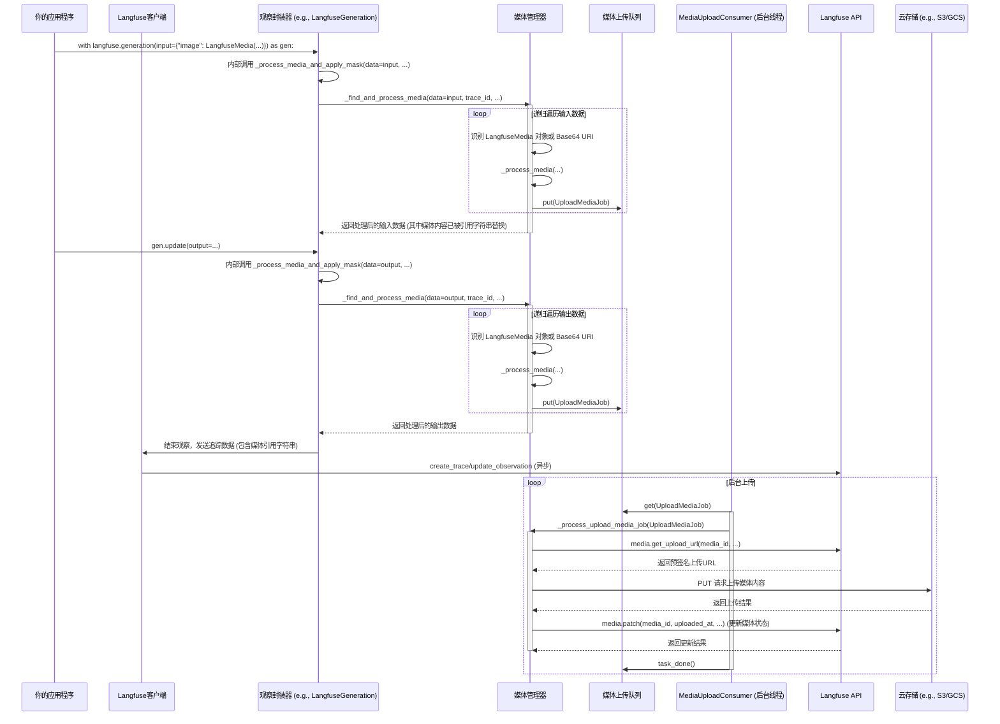

# Chapter 7: 媒体管理器

欢迎回到Langfuse教程！在上一章 [Prompt缓存](06_prompt缓存_.md) 中，我们学习了如何利用Prompt缓存来优化LLM应用的性能和成本，确保能够高效地获取和管理Prompt。

在现代AI应用中，文本不再是唯一的交互形式。例如，一个多模态AI应用可能需要处理图片（图像识别）、音频（语音转录）、视频（行为分析）等各种**媒体内容**。当你的AI应用生成或接收这些媒体内容时，你可能希望将它们也记录下来，以便在Langfuse平台进行全面的追踪和分析。

然而，直接上传这些媒体文件可能会遇到挑战：
1.  **文件大小**：媒体文件通常比文本大得多，同步上传可能会阻塞你的应用程序，影响用户体验。
2.  **网络可靠性**：上传大文件容易受到网络波动的影响，可能需要重试机制。
3.  **统一管理**：你需要一个统一的方式来管理不同类型和来源的媒体文件。

这就是**媒体管理器**发挥作用的地方。它就像一个“媒体快递员”，专门负责将你的AI应用中涉及到的图片、音频、视频等媒体文件安全、异步地上传到Langfuse平台。它会智能地处理文件的大小、类型，甚至在上传失败时自动重试，确保你的多模态数据也能被完整、可靠地追踪和分析，而不会拖慢你的应用程序。

## 什么是媒体管理器？

媒体管理器是`langfuse-python`客户端的一个后台组件，它专注于处理媒体内容的上传。它的主要职责是：
*   **识别媒体**：自动检测你的输入/输出数据中包含的媒体内容（例如`LangfuseMedia`对象、Base64数据URI等）。
*   **异步上传**：将这些媒体内容放入一个后台队列，由专门的线程异步上传到Langfuse平台。
*   **生成引用**：在你的追踪数据中，媒体管理器会用一个特殊的“引用字符串”来替代实际的媒体内容。这个引用字符串包含了媒体的ID和类型，Langfuse UI会根据这个引用字符串在需要时加载和显示媒体内容。
*   **错误处理与重试**：在上传过程中遇到网络问题或其他错误时，它会进行自动重试。

通过媒体管理器，你只需要将媒体内容以特定格式（或使用`LangfuseMedia`对象）传递给Langfuse客户端，剩下的上传工作都会在后台自动完成。

## 媒体管理器的核心组件

媒体管理器依赖于几个内部组件来高效地工作：

### 1. `LangfuseMedia`：媒体封装类

`LangfuseMedia`是一个方便的类，用于封装各种形式的媒体内容（例如文件路径、Base64字符串、原始字节），并提供标准化的接口供媒体管理器处理。

```python
from langfuse.media import LangfuseMedia
import os
import base64

# 示例1：从文件路径创建LangfuseMedia
# 假设你有一个名为 "example.png" 的图片文件
# with open("example.png", "wb") as f:
#     f.write(b"fake image data")

# media_from_file = LangfuseMedia(file_path="example.png", content_type="image/png")
# print(f"从文件创建的媒体引用: {media_from_file._reference_string}")

# 示例2：从Base64数据URI创建LangfuseMedia
# 一个简单的红色像素图片的Base64数据URI
red_pixel_uri = "data:image/png;base64,iVBORw0KGgoAAAANSUhEUgAAAAEAAAABCAQAAAC1HAwCAAAAC0lEQVR42mNkYAAAAAYAAjCB0C8AAAAASUVORK5CYII="
media_from_base64 = LangfuseMedia(base64_data_uri=red_pixel_uri)
print(f"从Base64 URI创建的媒体引用: {media_from_base64._reference_string}")

# 示例3：从原始字节和内容类型创建LangfuseMedia
fake_image_bytes = b"\x89PNG\r\n\x1a\n\x00\x00\x00\rIHDR\x00\x00\x00\x01\x00\x00\x00\x01\x08\x06\x00\x00\x00\x1f\x15\xc4\x89\x00\x00\x00\x0cIDATx\xda\xed\xc1\x01\x01\x00\x00\x00\xc2\xa0\xf7Om\x00\x00\x00\x00IEND\xaeB`\x82"
media_from_bytes = LangfuseMedia(content_bytes=fake_image_bytes, content_type="image/png")
print(f"从原始字节创建的媒体引用: {media_from_bytes._reference_string}")
```
**代码解释：**
*   `LangfuseMedia`类允许你以多种方式指定媒体内容。
*   它会自动解析内容并生成一个唯一的`_media_id`和一个特殊的`_reference_string`。
*   这个`_reference_string`就是最终会被记录到Langfuse追踪中的内容，它是一个占位符，指向实际上传的媒体文件。

### 2. `UploadMediaJob`：上传任务数据结构

这是一个简单的`TypedDict`，定义了每个媒体上传任务所需的信息。

```python
from typing import Optional, TypedDict

class UploadMediaJob(TypedDict):
    media_id: str
    content_type: str
    content_length: int
    content_bytes: bytes
    content_sha256_hash: str
    trace_id: str
    observation_id: Optional[str]
    field: str # 媒体所在的字段 (例如 "input", "output")

print("\nUploadMediaJob数据结构已定义。")
```
**代码解释：**
*   `UploadMediaJob`包含了媒体的唯一ID、类型、大小、原始字节、SHA256哈希值，以及它所属的追踪和观察ID等信息。
*   这个数据结构确保了媒体管理器在后台上传时拥有所有必要的信息。

### 3. `MediaManager`：核心媒体处理逻辑

`MediaManager`是整个媒体管理功能的核心。它负责：
*   **递归查找媒体**：在你的输入/输出数据中递归地寻找`LangfuseMedia`对象或Base64数据URI。
*   **创建上传任务**：将找到的媒体封装成`UploadMediaJob`，并将其添加到上传队列。
*   **执行上传**：从队列中取出任务，向Langfuse API请求预签名URL，然后将媒体内容上传到云存储（如AWS S3、GCP GCS、Azure Blob Storage）。
*   **重试机制**：使用指数退避算法在上传失败时自动重试。

### 4. `MediaUploadConsumer`：后台上传线程

这是一个独立的后台线程，它不断地从上传队列中取出`UploadMediaJob`并调用`MediaManager`来执行实际的上传操作。

```python
import logging
import threading
from queue import Queue

# 模拟一个简化的MediaManager，只包含process_next_media_upload方法
class MockMediaManager:
    _log = logging.getLogger("MockMediaManager")
    _queue: Queue

    def __init__(self, queue: Queue):
        self._queue = queue

    def process_next_media_upload(self) -> None:
        try:
            upload_job = self._queue.get(block=True, timeout=1)
            self._log.info(
                f"模拟上传: 正在处理 media_id={upload_job['media_id']} (trace_id={upload_job['trace_id']})"
            )
            # 实际的上传逻辑会在这里
            # time.sleep(0.5) # 模拟网络延迟
            self._log.info(f"模拟上传: media_id={upload_job['media_id']} 上传成功。")
            self._queue.task_done()
        except Empty:
            pass # 队列为空，继续等待
        except Exception as e:
            self._log.error(f"模拟上传错误: {e}")
            self._queue.task_done()

class MediaUploadConsumer(threading.Thread):
    _log = logging.getLogger("MediaUploadConsumer")
    _identifier: int
    _media_manager: MockMediaManager
    running: bool = True

    def __init__(self, identifier: int, media_manager: MockMediaManager):
        super().__init__()
        self.daemon = True
        self._identifier = identifier
        self._media_manager = media_manager

    def run(self) -> None:
        self._log.debug(f"线程: 媒体上传消费者线程 #{self._identifier} 已启动。")
        while self.running:
            self._media_manager.process_next_media_upload()
        self._log.debug(f"线程: 媒体上传消费者线程 #{self._identifier} 已停止。")

    def pause(self) -> None:
        self._log.debug(f"线程: 正在暂停媒体上传消费者线程 #{self._identifier}。")
        self.running = False

print("\nMediaUploadConsumer已定义。")
```
**代码解释：**
*   `MediaUploadConsumer`继承自`threading.Thread`，在后台独立运行。
*   它的`run()`方法会循环调用`_media_manager.process_next_media_upload()`，从队列中取出并处理上传任务。
*   `self.daemon = True`设置线程为守护线程，这意味着当主程序退出时，即使这个线程还在运行，它也会被强制终止，避免阻塞程序退出。

## 如何使用媒体管理器？

媒体管理器是Langfuse客户端的一个**自动启用的内部功能**。你无需手动调用它。当你将`LangfuseMedia`对象或Base64数据URI包含在Langfuse追踪的输入或输出中时，媒体管理器会自动检测并处理它们。

**用例：追踪带有图片输入的LLM调用**

假设你正在构建一个图像描述AI，它接收一张图片作为输入，并生成图片的文字描述。

首先，确保你已经初始化了Langfuse客户端（如果你忘记了，可以回顾 [Langfuse客户端](01_langfuse客户端_.md) 章节）。

```python
import os
from langfuse import Langfuse
from langfuse.media import LangfuseMedia
import asyncio
import time

# 假设你已经设置了环境变量或直接提供了密钥
# 在实际应用中，请使用安全的方式管理你的API密钥
# 注意：媒体上传功能默认是开启的，可以通过环境变量 LANGFUSE_MEDIA_UPLOAD_ENABLED=false 关闭
langfuse = Langfuse(
    public_key=os.environ.get("LANGFUSE_PUBLIC_KEY"),
    secret_key=os.environ.get("LANGFUSE_SECRET_KEY"),
    base_url=os.environ.get("LANGFUSE_BASE_URL", "https://cloud.langfuse.com"),
)

print("Langfuse客户端已成功初始化！")

# 模拟一个Base64编码的图片数据URI
# 这是一个非常小的红色像素图片
red_pixel_data_uri = "data:image/png;base64,iVBORw0KGgoAAAANSUhEUgAAAAEAAAABCAQAAAC1HAwCAAAAC0lEQVR42mNkYAAAAAYAAjCB0C8AAAAASUVORK5CYII="

# 模拟一个LLM调用，它接收媒体作为输入
async def call_image_description_llm(image_media: LangfuseMedia) -> str:
    print("模拟LLM正在处理图片...")
    time.sleep(0.5) # 模拟LLM处理时间
    # 实际的LLM调用会在这里发生，可能使用多模态模型
    return "这是一张红色的图片，看起来像一个像素。"

# 追踪带有媒体输入的LLM调用
async def trace_image_llm_call():
    print("\n开始追踪带有媒体输入的LLM调用...")
    # 使用LangfuseMedia封装图片输入
    image_input = LangfuseMedia(base64_data_uri=red_pixel_data_uri)

    with langfuse.generation(
        name="图片描述生成",
        input={"image": image_input}, # 将LangfuseMedia对象作为输入
        model="gpt-4o", # 假设使用了多模态模型
        metadata={"user_id": "user-media-example"}
    ) as gen:
        description = await call_image_description_llm(image_input)
        gen.update(output=description)
        print(f"LLM输出: {description}")

    print("LLM调用已追踪，媒体内容已异步上传。")

# 运行异步函数
asyncio.run(trace_image_llm_call())

# 确保所有后台上传任务都已完成
# 这一步非常重要，因为它会等待所有媒体上传完成
print("\n等待所有媒体上传完成...")
langfuse.flush()
print("所有媒体上传任务已完成。")
```
**代码解释：**
*   我们创建了一个`LangfuseMedia`对象`image_input`来表示图片数据。
*   在`langfuse.generation`的`input`中，我们将这个`image_input`对象作为字典的一个值传递。
*   当`langfuse.generation`上下文管理器退出时，Langfuse客户端会检测到`input`字段中的`LangfuseMedia`对象。
*   它会将这个媒体内容添加到内部的媒体上传队列中。
*   后台的`MediaUploadConsumer`线程会异步地从队列中取出这个媒体，并将其上传到Langfuse平台。
*   在Langfuse UI中，你将看到这个`generation`追踪，并且其输入部分会显示一个可点击的图片，而不是原始的Base64数据。
*   **`langfuse.flush()`**在这里非常重要，它会等待所有后台任务（包括媒体上传）完成，确保所有数据都被发送到Langfuse平台。在生产环境中，你通常会在应用程序关闭前调用它。

### 自动检测Base64数据URI

除了显式使用`LangfuseMedia`对象外，媒体管理器还会自动检测并处理输入/输出中符合特定格式的Base64数据URI（例如`data:image/png;base64,...`）。

```python
# 追踪带有Base64数据URI输入的LLM调用
async def trace_base64_llm_call():
    print("\n开始追踪带有Base64数据URI输入的LLM调用...")

    with langfuse.generation(
        name="Base64图片描述生成",
        input={"raw_image_data": red_pixel_data_uri}, # 直接传递Base64数据URI字符串
        model="gpt-4o",
    ) as gen:
        # 实际的LLM可能需要先解析这个URI
        description = await call_image_description_llm(LangfuseMedia(base64_data_uri=red_pixel_data_uri))
        gen.update(output=description)
        print(f"LLM输出: {description}")

    print("LLM调用已追踪，Base64媒体内容已异步上传。")

asyncio.run(trace_base64_llm_call())
langfuse.flush()
print("所有媒体上传任务已完成。")
```
**代码解释：**
*   在这个例子中，我们直接将`red_pixel_data_uri`字符串作为输入。
*   媒体管理器会递归遍历输入数据，发现这个符合`data:image/png;base64,...`格式的字符串，并将其识别为媒体内容。
*   然后，它会像处理`LangfuseMedia`对象一样，将其添加到上传队列。

## 媒体管理器的内部工作原理

媒体管理器的核心在于`MediaManager`类以及它与`MediaUploadConsumer`线程的协作。

### 流程图：媒体上传流程



**流程解释：**
1.  当你在`LangfuseGeneration`（或其他观察封装器）的`input`或`output`中包含媒体内容时，**观察封装器**会调用**`MediaManager`**的`_find_and_process_media`方法。
2.  `_find_and_process_media`方法会**递归遍历**`input`或`output`数据结构。
3.  一旦它发现一个`LangfuseMedia`对象或符合特定模式的Base64数据URI，它就会调用内部的`_process_media`方法。
4.  `_process_media`会创建一个`UploadMediaJob`，并将其添加到**媒体上传队列**中。
5.  同时，`_find_and_process_media`会将原始的媒体内容替换成一个特殊的**引用字符串**（`@@@langfuseMedia:type=...@@@`），这个字符串最终会被发送到Langfuse平台。
6.  在后台，一个或多个**`MediaUploadConsumer`线程**会不断地从**媒体上传队列**中取出`UploadMediaJob`。
7.  每个`UploadMediaJob`会由`MediaManager`的`_process_upload_media_job`方法处理：
    *   首先，它会向**Langfuse API**请求一个**预签名上传URL**。这个URL允许客户端直接将文件上传到云存储（如AWS S3、GCP GCS），而无需通过Langfuse服务器。
    *   然后，`_process_upload_media_job`会使用这个预签名URL，通过一个HTTP PUT请求将媒体内容的**原始字节**直接上传到**云存储**。
    *   上传完成后，它会再次调用**Langfuse API**，更新媒体的上传状态（例如上传时间、HTTP状态码）。
8.  当你的应用程序调用`langfuse.flush()`时，它会等待所有队列中的媒体上传任务完成。

### 代码片段：`MediaManager` 的核心逻辑

让我们看一些`langfuse/_task_manager/media_manager.py`文件中的代码片段，来理解上述流程是如何实现的。

**1. `_find_and_process_media`：递归检测和任务创建**

```python
# langfuse/_task_manager/media_manager.py (简化)
class MediaManager:
    # ... __init__ 方法 ...

    def _find_and_process_media(
        self,
        *,
        data: Any,
        trace_id: str,
        observation_id: Optional[str],
        field: str,
    ) -> Any:
        if not self._enabled:
            return data

        seen = set() # 用于避免循环引用
        max_levels = 10 # 递归最大深度

        def _process_data_recursively(data: Any, level: int) -> Any:
            if id(data) in seen or level > max_levels:
                return data

            seen.add(id(data))

            # 情况1: 如果数据已经是 LangfuseMedia 对象
            if isinstance(data, LangfuseMedia):
                self._process_media( # 将其添加到上传队列
                    media=data,
                    trace_id=trace_id,
                    observation_id=observation_id,
                    field=field,
                )
                return data._reference_string # 返回引用字符串

            # 情况2: 如果数据是 Base64 数据 URI 字符串
            if isinstance(data, str) and data.startswith("data:"):
                media = LangfuseMedia(obj=data, base64_data_uri=data) # 封装成 LangfuseMedia
                self._process_media(media=media, trace_id=trace_id, observation_id=observation_id, field=field)
                return media._reference_string # 返回引用字符串

            # 情况3: 处理各种多模态模型特有的媒体格式 (Anthropic, VertexAI)
            # ... (代码中省略了Anthropic和VertexAI的特定处理逻辑) ...

            # 递归处理列表
            if isinstance(data, list):
                return [_process_data_recursively(item, level + 1) for item in data]

            # 递归处理字典
            if isinstance(data, dict):
                return {
                    key: _process_data_recursively(value, level + 1)
                    for key, value in data.items()
                }

            # 其他类型的数据直接返回
            return data

        return _process_data_recursively(data, 1)
```
**代码解释：**
*   这个方法是递归的，它会遍历传入的`data`（可以是字典、列表或单个值）。
*   `seen`集合和`max_levels`用于防止无限递归和处理循环引用。
*   它会检查`data`是否是`LangfuseMedia`实例、Base64数据URI字符串，或者其他多模态框架（如Anthropic、VertexAI）特有的媒体数据结构。
*   一旦识别出媒体内容，它就会调用`self._process_media`将其添加到队列，并用其`_reference_string`替换原始媒体内容，然后返回。

**2. `_process_media`：添加任务到队列**

```python
# langfuse/_task_manager/media_manager.py (简化)
class MediaManager:
    # ... __init__ 和 _find_and_process_media ...

    def _process_media(
        self,
        *,
        media: LangfuseMedia,
        trace_id: str,
        observation_id: Optional[str],
        field: str,
    ) -> None:
        # 确保媒体内容有效
        if (
            media._content_length is None
            or media._content_type is None
            or media._content_sha256_hash is None
            or media._content_bytes is None
        ):
            self._log.error("媒体内容不完整，跳过添加上传任务。")
            return

        if media._media_id is None:
            self._log.error("媒体ID为None。跳过上传。")
            return

        try:
            # 创建 UploadMediaJob
            upload_media_job = UploadMediaJob(
                media_id=media._media_id,
                content_bytes=media._content_bytes,
                content_type=media._content_type,
                content_length=media._content_length,
                content_sha256_hash=media._content_sha256_hash,
                trace_id=trace_id,
                observation_id=observation_id,
                field=field,
            )

            self._queue.put(item=upload_media_job, block=False) # 非阻塞地将任务放入队列
            self._log.debug(f"队列: 已将媒体ID {media._media_id} 加入上传队列。")

        except Full:
            self._log.warning(f"队列容量: 媒体队列已满。无法处理媒体ID={media._media_id}。")
        except Exception as e:
            self._log.error(f"媒体处理错误: 无法处理媒体ID={media._media_id}。错误: {str(e)}")
```
**代码解释：**
*   这个方法将`LangfuseMedia`对象中的所有必要信息提取出来，封装成一个`UploadMediaJob`。
*   然后，它尝试将这个`UploadMediaJob`非阻塞地放入内部的`_queue`（媒体上传队列）。
*   如果队列已满，它会记录一个警告，但不阻塞主线程。

**3. `_process_upload_media_job`：执行实际的上传**

```python
# langfuse/_task_manager/media_manager.py (简化)
class MediaManager:
    # ... 其他方法 ...

    def _process_upload_media_job(self, *, data: UploadMediaJob) -> None:
        # 1. 向Langfuse API请求预签名上传URL (带有重试机制)
        upload_url_response = self._request_with_backoff(
            self._api_client.media.get_upload_url,
            request=GetMediaUploadUrlRequest(
                contentLength=data["content_length"],
                contentType=cast(MediaContentType, data["content_type"]),
                sha256Hash=data["content_sha256_hash"],
                field=data["field"],
                traceId=data["trace_id"],
                observationId=data["observation_id"],
            ),
        )

        upload_url = upload_url_response.upload_url

        if not upload_url:
            self._log.debug(f"媒体状态: 媒体ID {data['media_id']} 已上传。跳过重复上传。")
            return

        # 2. 验证媒体ID一致性
        if upload_url_response.media_id != data["media_id"]:
            self._log.error(f"媒体完整性错误: SDK ({data['media_id']}) 与服务器 ({upload_url_response.media_id}) 的媒体ID不匹配。")
            return

        # 3. 准备上传HTTP头
        headers = {"Content-Type": data["content_type"]}
        # ... (根据云存储类型添加特定头部，例如 Azure Blob Type, AWS S3 Checksum) ...

        # 4. 执行PUT请求上传媒体内容到云存储 (带有重试机制)
        upload_start_time = time.time()
        upload_response = self._request_with_backoff(
            requests.put,
            upload_url,
            headers=headers,
            data=data["content_bytes"],
        )
        upload_time_ms = int((time.time() - upload_start_time) * 1000)

        # 5. 更新Langfuse API中的媒体状态 (带有重试机制)
        self._request_with_backoff(
            self._api_client.media.patch,
            media_id=data["media_id"],
            request=PatchMediaBody(
                uploadedAt=_get_timestamp(),
                uploadHttpStatus=upload_response.status_code,
                uploadHttpError=upload_response.text,
                uploadTimeMs=upload_time_ms,
            ),
        )

        self._log.debug(f"媒体上传: 成功上传媒体ID={data['media_id']}。")

    def _request_with_backoff(self, func: Callable[P, T], *args: P.args, **kwargs: P.kwargs) -> T:
        # 这是一个装饰器，用于在执行网络请求时应用指数退避重试逻辑
        # ... (内部实现使用了 backoff 库) ...
        pass
```
**代码解释：**
*   这个方法是实际执行上传的核心。
*   它首先调用`self._api_client.media.get_upload_url`从Langfuse API获取一个预签名URL。这个调用通过`_request_with_backoff`进行包装，以处理重试。
*   如果`upload_url`不存在，说明媒体可能已经被上传过，直接返回。
*   它会进行媒体ID的验证，确保SDK和服务器端的一致性。
*   然后，它构造HTTP请求头，并使用`requests.put`将`content_bytes`直接上传到预签名URL。
*   最后，它再次调用Langfuse API的`media.patch`方法，更新媒体在Langfuse平台上的状态，记录上传时间、HTTP状态码和耗时。

通过这种精巧的分工和异步处理，媒体管理器能够在不影响应用程序主线程性能的情况下，可靠地处理和上传各种媒体内容，为你的多模态AI应用提供全面的可观测性。

## 总结

在本章中，我们深入探讨了Langfuse的**媒体管理器**。我们学习了它如何作为一个“媒体快递员”，负责将你的AI应用中生成或接收的图片、音频等媒体内容安全、异步地上传到Langfuse平台。我们了解了其核心组件，包括`LangfuseMedia`（媒体封装）、`UploadMediaJob`（上传任务）、`MediaManager`（核心处理逻辑）和`MediaUploadConsumer`（后台上传线程），以及它们如何协同工作。

我们还通过一个完整的示例，演示了如何将`LangfuseMedia`对象或Base64数据URI包含在LLM调用的输入中，并观察到媒体内容被自动识别并异步上传到Langfuse平台。最后，我们深入了解了其内部工作原理，包括递归检测、任务入队、获取预签名URL、直接上传到云存储以及状态更新的整个流程。

掌握媒体管理器，意味着你的AI应用现在不仅可以追踪文本交互，还能全面覆盖多模态数据，为你的AI可观测性提供了更广阔的视角。

接下来，我们将学习 [事件序列化器](08_事件序列化器_.md)，了解Langfuse如何处理和转换各种数据类型以进行存储和分析。

---

Generated by [AI Codebase Knowledge Builder](https://github.com/The-Pocket/Tutorial-Codebase-Knowledge)