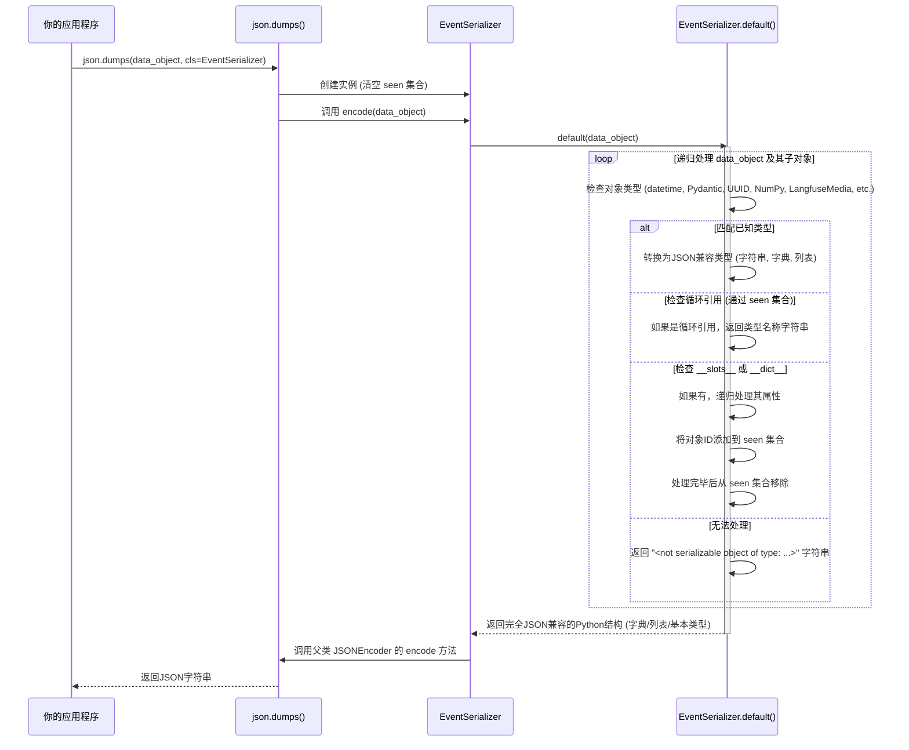

# Chapter 8: 事件序列化器

欢迎回到Langfuse教程！在上一章 [媒体管理器](07_媒体管理器_.md) 中，我们学习了如何利用媒体管理器来处理和上传你的AI应用中的多媒体内容（如图片、音频），确保所有类型的数据都能被完整追踪。

现在，让我们来探讨Langfuse客户端中一个看似幕后、实则至关重要的组件：**事件序列化器**。

想象一下，你的Python应用程序与Langfuse平台之间需要进行数据交换。你的应用程序中可能包含各种各样的数据：标准的字符串、数字、列表、字典，但也可能有日期时间对象、Pydantic模型、NumPy数组，甚至是你自定义的Python类实例。而Langfuse平台在接收这些数据时，通常期望的是一种通用的、跨语言的格式，最常见的就是 **JSON**。

这就是事件序列化器要解决的问题。它就像一个“数据打包员”或“翻译官”。它的核心任务是：**将Python中各种复杂的数据类型转换成标准的JSON格式，以便通过网络可靠地传输到Langfuse服务器**。它不仅要处理常见的数据类型，还要应对一些棘手的问题，比如循环引用（对象相互引用导致无限循环）和不可序列化的对象。

## 什么是事件序列化器？

事件序列化器 (`EventSerializer`) 是 `langfuse-python` 库中的一个自定义 JSON 编码器。它的主要职责是：
*   **统一格式**：将Python对象转换为Langfuse平台能够理解的JSON兼容格式。
*   **处理复杂类型**：自动识别并正确处理日期时间、`UUID`、`Pydantic`模型、`NumPy`数组、`Enum`枚举等非标准JSON类型。
*   **避免循环引用**：智能检测对象之间的循环引用，防止序列化过程无限递归，并用占位符表示。
*   **优雅处理异常**：当遇到无法序列化的对象时，不是直接报错，而是返回一个友好的字符串表示，确保数据传输的健壮性。
*   **特殊转换**：例如，将 `LangfuseMedia` 对象转换为其引用字符串，将超出JavaScript安全整数范围的Python整数转换为字符串。

简而言之，它确保了你的Python应用程序能够顺利地将任何可追踪数据（如LLM的输入、输出、元数据等）发送到Langfuse平台，无论这些数据有多复杂。

## 事件序列化器的核心功能

`EventSerializer` 通过重写Python标准库 `json.JSONEncoder` 的 `default` 方法来实现其功能。`default` 方法是当 `JSONEncoder` 遇到它不知道如何序列化的对象时会调用的方法。

让我们看看它能处理哪些常见的复杂数据类型：

### 1. `datetime` 和 `date` 对象

Python的 `datetime` 和 `date` 对象不能直接序列化为JSON。序列化器会将其转换为ISO 8601格式的字符串。

```python
from datetime import datetime, date
from langfuse._utils.serializer import EventSerializer
import json

# 创建一个EventSerializer实例
serializer = EventSerializer()

# 示例数据
dt_obj = datetime.now()
date_obj = date.today()

# 使用EventSerializer进行序列化
serialized_dt = json.dumps(dt_obj, cls=EventSerializer)
serialized_date = json.dumps(date_obj, cls=EventSerializer)

print(f"原始 datetime: {dt_obj} -> 序列化后: {serialized_dt}")
print(f"原始 date: {date_obj} -> 序列化后: {serialized_date}")
```
**代码解释：**
*   `json.dumps` 函数接受一个 `cls` 参数，用于指定自定义的 JSON 编码器。
*   `EventSerializer` 会将 `datetime` 转换为带有时区信息的ISO 8601字符串，将 `date` 转换为不带时间部分的ISO 8601字符串。

### 2. `Pydantic` 模型

`Pydantic` 是Python中常用的数据验证和设置管理库。`Pydantic` 模型实例也不能直接序列化。序列化器会将其转换为Python字典（通常通过 `.model_dump()` 或 `.dict()` 方法）。

```python
from pydantic import BaseModel
from langfuse._utils.serializer import EventSerializer
import json

class User(BaseModel):
    name: str
    age: int
    email: str

# 创建一个Pydantic模型实例
user_data = User(name="Alice", age=30, email="alice@example.com")

# 使用EventSerializer进行序列化
serialized_user = json.dumps(user_data, cls=EventSerializer)

print(f"原始 Pydantic 模型: {user_data.model_dump()} -> 序列化后: {serialized_user}")
```
**代码解释：**
*   `EventSerializer` 会自动识别 `BaseModel` 实例，并调用其适当的方法将其转换为字典，然后递归序列化。

### 3. `UUID` 对象

Python的 `UUID` 对象表示通用唯一标识符。序列化器会将其转换为标准的字符串表示。

```python
from uuid import uuid4
from langfuse._utils.serializer import EventSerializer
import json

# 创建一个UUID对象
my_uuid = uuid4()

# 使用EventSerializer进行序列化
serialized_uuid = json.dumps(my_uuid, cls=EventSerializer)

print(f"原始 UUID: {my_uuid} -> 序列化后: {serialized_uuid}")
```
**代码解释：**
*   将 `UUID` 对象简单地转换为其字符串形式。

### 4. `NumPy` 数组和标量（如果安装了 `NumPy`）

如果你在AI应用中使用了 `NumPy`（例如，LLM嵌入的向量经常是 `NumPy` 数组），那么这些数组和标量也需要被正确序列化。

```python
# 确保安装了 numpy: pip install numpy
import numpy as np
from langfuse._utils.serializer import EventSerializer
import json

# 创建NumPy数组和标量
np_array = np.array([1.0, 2.5, 3.0])
np_scalar = np.float32(42.0)

# 使用EventSerializer进行序列化
serialized_array = json.dumps(np_array, cls=EventSerializer)
serialized_scalar = json.dumps(np_scalar, cls=EventSerializer)

print(f"原始 NumPy 数组: {np_array} -> 序列化后: {serialized_array}")
print(f"原始 NumPy 标量: {np_scalar} -> 序列化后: {serialized_scalar}")
```
**代码解释：**
*   `EventSerializer` 会检查对象是否为 `np.generic`（NumPy标量）或 `np.ndarray`（NumPy数组）。
*   标量会通过 `.item()` 方法转换为Python原生类型。
*   数组会通过 `.tolist()` 方法转换为Python列表。

### 5. `LangfuseMedia` 对象

在 [媒体管理器](07_媒体管理器_.md) 章节中，我们了解到 `LangfuseMedia` 对象用于表示媒体内容。序列化器会将其转换为一个特殊的引用字符串，而不是媒体内容的原始数据，因为实际的媒体内容是由媒体管理器异步上传的。

```python
from langfuse.media import LangfuseMedia
from langfuse._utils.serializer import EventSerializer
import json

# 创建一个LangfuseMedia对象 (这里只是示例，实际内容由媒体管理器处理)
media_obj = LangfuseMedia(base64_data_uri="data:image/png;base64,iVBORw0KGgoAAAANSUhEUgAAAAEAAAABCAQAAAC1HAwCAAAAC0lEQVR42mNkYAAAAAYAAjCB0C8AAAAASUVORK5CYII=")

# 使用EventSerializer进行序列化
serialized_media = json.dumps(media_obj, cls=EventSerializer)

print(f"原始 LangfuseMedia: {media_obj._reference_string} -> 序列化后: {serialized_media}")
```
**代码解释：**
*   `EventSerializer` 会提取 `LangfuseMedia` 对象的 `_reference_string`，这是Langfuse UI用于加载媒体的占位符。

### 6. 循环引用和不可序列化对象

这是序列化器最复杂但也最重要的功能之一。

**循环引用：**
如果你的Python对象之间存在循环引用（例如对象A引用对象B，对象B又引用对象A），标准的JSON编码器会陷入无限递归并报错。`EventSerializer` 会检测到这种情况，并用对象的类型名称作为占位符来打破循环。

```python
from langfuse._utils.serializer import EventSerializer
import json

class Node:
    def __init__(self, name):
        self.name = name
        self.next = None

# 创建循环引用
node_a = Node("A")
node_b = Node("B")
node_a.next = node_b
node_b.next = node_a # 循环引用

# 尝试序列化
try:
    serialized_cycle = json.dumps(node_a, cls=EventSerializer, indent=2)
    print(f"处理循环引用后的序列化结果:\n{serialized_cycle}")
except Exception as e:
    print(f"错误: {e}")
```
**代码解释：**
*   `EventSerializer` 内部维护一个 `seen` 集合来跟踪已经访问过的对象ID。
*   当它再次遇到 `seen` 集合中的对象时，就意味着发生了循环引用，此时它会返回对象的类型名称字符串（例如 `<Node>`) 而不是继续递归。

**不可序列化对象：**
如果遇到 `EventSerializer` 无法识别或处理的对象类型，它不会直接抛出 `TypeError`，而是返回一个描述性的字符串，例如 `"<not serializable object of type: MyCustomObject>"`。这确保了整个序列化过程的健壮性。

```python
from langfuse._utils.serializer import EventSerializer
import json

class MyCustomObject:
    def __init__(self, value):
        self.value = value

# 创建一个不可序列化的自定义对象
custom_obj = MyCustomObject(123)

# 尝试序列化
serialized_custom = json.dumps(custom_obj, cls=EventSerializer)
print(f"处理不可序列化对象后的结果: {serialized_custom}")
```
**代码解释：**
*   `EventSerializer` 的 `default` 方法有一个 `try...except` 块来捕获任何序列化失败，并返回一个友好的错误字符串。

## 事件序列化器的内部工作原理

`EventSerializer` 的核心是 `EventSerializer.default` 方法和 `EventSerializer.encode` 方法。

### 流程图：事件序列化器的核心流程



**流程解释：**
1.  **你的应用程序**调用 `json.dumps()` 并指定 `cls=EventSerializer`。
2.  `json.dumps()` 会创建一个 `EventSerializer` 实例，并在开始序列化之前**清空**其内部的 `seen` 集合（用于检测循环引用）。
3.  `json.dumps()` 随后会调用 `EventSerializer` 实例的 `encode()` 方法。
4.  `EventSerializer.encode()` 方法会首先调用 `EventSerializer.default()` 方法来递归地处理整个数据对象。
5.  `EventSerializer.default()` 方法是核心：
    *   它会**逐层检查**每个对象的类型。
    *   如果对象是 `datetime`、`Pydantic` 模型、`UUID`、`NumPy` 类型、`LangfuseMedia` 等已知类型，它会将其**转换**为相应的JSON兼容格式（例如，日期时间转换为ISO字符串，Pydantic模型转换为字典）。
    *   如果对象是自定义类实例且具有 `__dict__` 或 `__slots__` 属性，`EventSerializer.default()` 会将其ID添加到 `seen` 集合中，然后**递归**处理其内部属性。处理完成后，会从 `seen` 集合中移除该ID。
    *   如果在此过程中再次遇到已在 `seen` 集合中的对象ID，则表示存在**循环引用**，此时会返回对象的类型名称字符串来中断递归。
    *   如果所有类型检查和递归处理都未能成功序列化对象，或者在处理过程中发生任何异常，`EventSerializer.default()` 会返回一个描述性的错误字符串，而不是抛出异常。
6.  `EventSerializer.default()` 最终会返回一个完全由JSON兼容的Python基本类型（字典、列表、字符串、数字、布尔值、None）组成的结构。
7.  `EventSerializer.encode()` 收到这个结构后，将其传递给其父类 `json.JSONEncoder` 的 `encode()` 方法，由后者将其转换为最终的JSON字符串。
8.  `json.dumps()` 将这个JSON字符串返回给**你的应用程序**。

### 代码片段：`EventSerializer` 的核心

以下是 `langfuse/_utils/serializer.py` 中 `EventSerializer` 的简化版代码片段，展示了其 `default` 方法如何处理各种类型：

```python
# langfuse/_utils/serializer.py (简化)
import json
import math
from datetime import date, datetime
from enum import Enum
from pathlib import Path
from typing import Any
from uuid import UUID

from pydantic import BaseModel
# from langfuse.api.core import pydantic_utilities, serialize_datetime # 辅助函数
# from langfuse.media import LangfuseMedia # LangfuseMedia 类
# import numpy as np # 如果安装了NumPy

class EventSerializer(json.JSONEncoder):
    def __init__(self, *args: Any, **kwargs: Any) -> None:
        super().__init__(*args, **kwargs)
        self.seen: set[int] = set()  # 追踪已见对象ID以检测循环引用

    def default(self, obj: Any) -> Any:
        try:
            # 日期时间对象
            if isinstance(obj, (datetime)):
                return obj.isoformat() + "Z" # 简化版，实际会处理时区

            # LangfuseMedia 对象
            if isinstance(obj, LangfuseMedia):
                return obj._reference_string or f"<LangfuseMedia上传失败: {obj._content_type}>"

            # NumPy 标量和数组
            # if np is not None and isinstance(obj, np.generic): return obj.item()
            # if np is not None and isinstance(obj, np.ndarray): return obj.tolist()

            # 浮点数 NaN 和 Infinity
            if isinstance(obj, float) and math.isnan(obj): return "NaN"
            if isinstance(obj, float) and math.isinf(obj): return "Infinity"

            # 异常对象
            if isinstance(obj, (Exception, KeyboardInterrupt)): return f"{type(obj).__name__}: {str(obj)}"

            # LlamaIndex Streaming 对象 (简化)
            if "Streaming" in type(obj).__name__: return str(obj)

            # 枚举类型
            if isinstance(obj, Enum): return obj.value

            # dataclass
            # if is_dataclass(obj): return asdict(obj)

            # UUID 对象
            if isinstance(obj, UUID): return str(obj)

            # bytes 对象
            if isinstance(obj, bytes):
                try: return obj.decode("utf-8")
                except UnicodeDecodeError: return "<不可序列化的字节>"

            # date 对象
            if isinstance(obj, (date)): return obj.isoformat()

            # Pydantic BaseModel
            if isinstance(obj, BaseModel):
                # obj.model_rebuild() # 实际代码有此行
                return obj.model_dump() # Pydantic V2

            # Path 对象
            if isinstance(obj, Path): return str(obj)

            # Langchain Serializable 对象 (如果可用)
            # if Serializable is not type(None) and isinstance(obj, Serializable): return obj.to_json()

            # 整数 (JavaScript 安全整数范围检查)
            if isinstance(obj, (int)):
                return obj if self.is_js_safe_integer(obj) else str(obj)

            # 标准 JSON 可编码类型 (str, float, None)
            if isinstance(obj, (str, float, type(None))): return obj

            # 集合类型 (转换为列表)
            if isinstance(obj, (tuple, set, frozenset)): return list(obj)

            # 字典 (递归处理键值对)
            if isinstance(obj, dict):
                return {self.default(k): self.default(v) for k, v in obj.items()}

            # 列表 (递归处理元素)
            if isinstance(obj, list):
                return [self.default(item) for item in obj]

            # 序列类型 (在处理str和bytes之后)
            # if isinstance(obj, Sequence): return [self.default(item) for item in obj]

            # 带有 __slots__ 或 __dict__ 的自定义对象 (处理循环引用)
            if hasattr(obj, "__slots__") or hasattr(obj, "__dict__"):
                obj_id = id(obj) # 获取对象的唯一ID

                if obj_id in self.seen:
                    return type(obj).__name__ # 循环引用，返回类型名称
                else:
                    self.seen.add(obj_id) # 标记为已见
                    result = {k: self.default(v) for k, v in (vars(obj).items() if hasattr(obj, "__dict__") else {slot: getattr(obj, slot, None) for slot in obj.__slots__})}
                    self.seen.remove(obj_id) # 处理完后移除
                    return result

            else:
                # 无法处理的类型
                return f"<{type(obj).__name__}>"

        except Exception as e:
            # 捕获任何异常并记录
            return f'"<不可序列化对象类型: {type(obj).__name__}>"'

    def encode(self, obj: Any) -> str:
        self.seen.clear()  # 每次编码前清空 seen 集合
        try:
            return super().encode(self.default(obj))
        except Exception:
            return f'"<不可序列化对象类型: {type(obj).__name__}>"'

    @staticmethod
    def is_js_safe_integer(value: int) -> bool:
        # 检查整数是否在JavaScript安全整数范围内
        max_safe_int = 2**53 - 1
        min_safe_int = -(2**53) + 1
        return min_safe_int <= value <= max_safe_int
```
**代码解释：**
*   `__init__` 初始化 `self.seen` 集合。
*   `default(self, obj: Any)` 方法是序列化逻辑的核心。它包含一系列 `if/elif` 条件，按优先级检查 `obj` 的类型，并进行相应的转换：
    *   首先处理 `datetime`、`LangfuseMedia`、`NumPy` 等特殊类型。
    *   然后处理 `float` 的 `NaN` 和 `Infinity`。
    *   对于 `Pydantic BaseModel`，它调用 `.model_dump()`。
    *   对于 `UUID`、`Path`、`Enum` 等，转换为字符串或其值。
    *   接着处理 `bytes` 类型，尝试解码为 UTF-8。
    *   对于 `int` 类型，会检查是否超出JavaScript的安全整数范围，如果超出则转换为字符串。
    *   对于集合类型（`tuple`, `set`, `frozenset`），转换为 `list`。
    *   对于 `dict` 和 `list`，它会**递归**调用 `self.default` 来处理其内部元素。
    *   最重要的是，它通过 `id(obj)` 和 `self.seen` 集合来检测并处理**循环引用**，如果发现循环，则返回对象的类型名称字符串。
    *   如果所有这些都无法处理，它会返回一个包含对象类型名称的字符串。
*   `encode(self, obj: Any)` 方法在每次调用时都会先清空 `self.seen` 集合，确保每次序列化都是独立的。它会调用 `self.default()` 来获取JSON兼容的Python结构，然后调用父类 `json.JSONEncoder` 的 `encode()` 方法来生成最终的JSON字符串。
*   `is_js_safe_integer` 是一个静态方法，用于判断Python整数是否在JavaScript能够安全处理的范围内。

通过这种细致且健壮的设计，`EventSerializer` 确保了Langfuse客户端能够可靠地将各种复杂的Python数据转换为JSON格式，以便在Langfuse平台进行存储和分析。

## 总结

在本章中，我们深入学习了Langfuse的**事件序列化器**。我们理解了它如何作为一个“数据打包员”，将Python中各种复杂的数据类型（如日期时间、Pydantic模型、NumPy数组，甚至自定义对象）转换成标准的JSON格式，以便通过网络传输到Langfuse服务器。我们探讨了它如何处理循环引用和不可序列化的对象，确保数据传输的可靠性。

事件序列化器是Langfuse客户端在幕后默默工作但至关重要的组件，它保证了你的所有追踪数据都能被正确地格式化和传输，为你在Langfuse平台上的后续分析奠定了基础。理解它的工作原理，能让你对Langfuse数据流的健壮性有更深刻的认识。

至此，我们已经完成了Langfuse核心概念的介绍。感谢你跟随本教程走到了最后！希望这些章节能帮助你更好地理解和使用Langfuse。

---

Generated by [AI Codebase Knowledge Builder](https://github.com/The-Pocket/Tutorial-Codebase-Knowledge)