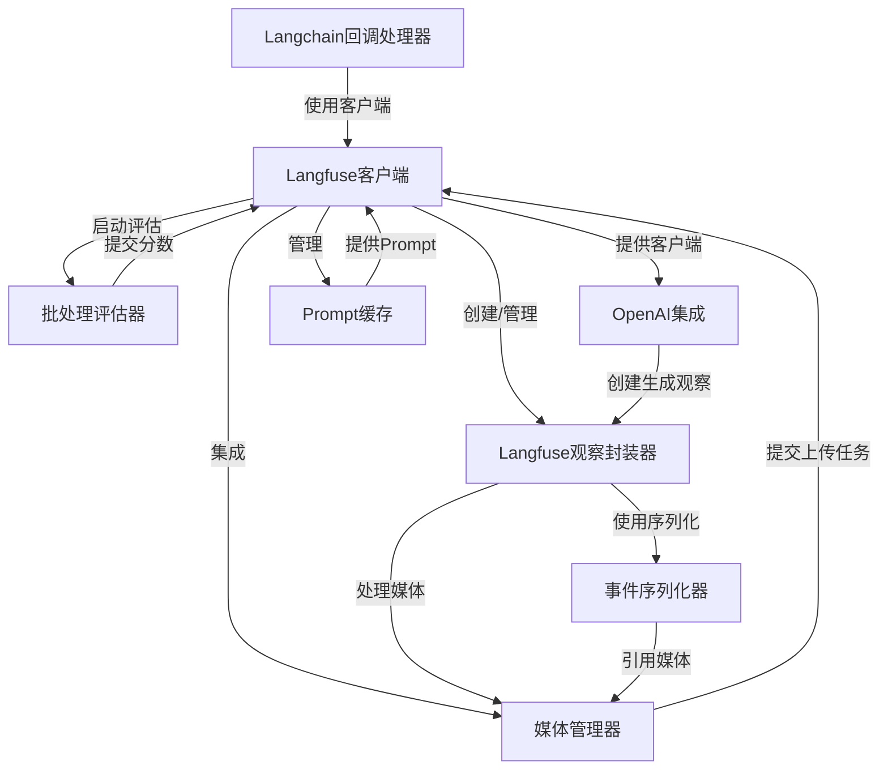

# Tutorial: langfuse-python

`langfuse-python`项目是一个用于**追踪、监控和评估AI应用**的Python SDK。它通过**自动捕获大语言模型（LLM）的调用**、**管理媒体文件上传**以及**支持批量评估**等功能，帮助开发者深入了解其AI系统的运行表现、成本和用户体验。该项目旨在提供一个**全面的可观测性解决方案**，以便于调试、优化和改进AI应用。

**Source Repository:** [None](None)

## Chapters

1. [Langfuse客户端
](01_langfuse客户端_.md)
2. [Langfuse观察封装器
](02_langfuse观察封装器_.md)
3. [Langchain回调处理器
](03_langchain回调处理器_.md)
4. [OpenAI集成
](04_openai集成_.md)
5. [批处理评估器
](05_批处理评估器_.md)
6. [Prompt缓存
](06_prompt缓存_.md)
7. [媒体管理器
](07_媒体管理器_.md)
8. [事件序列化器
](08_事件序列化器_.md)

---

Generated by [AI Codebase Knowledge Builder](https://github.com/The-Pocket/Tutorial-Codebase-Knowledge)